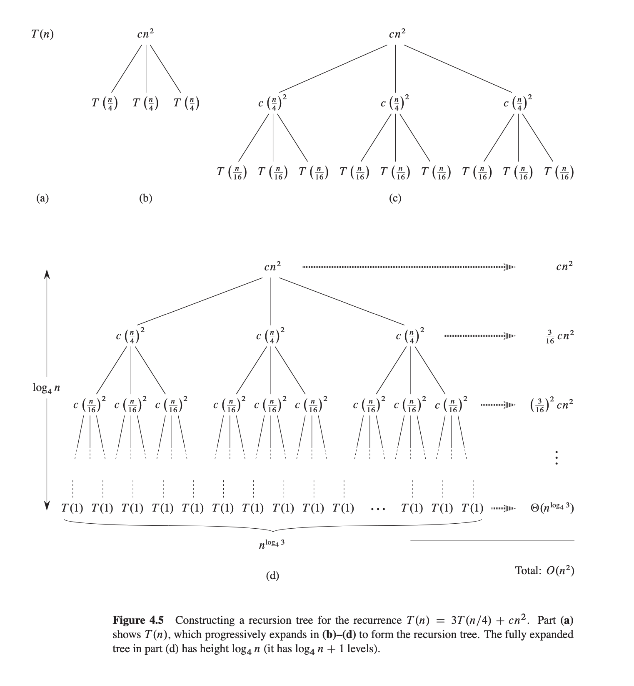
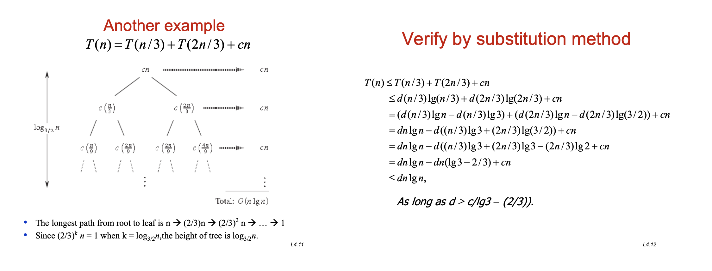
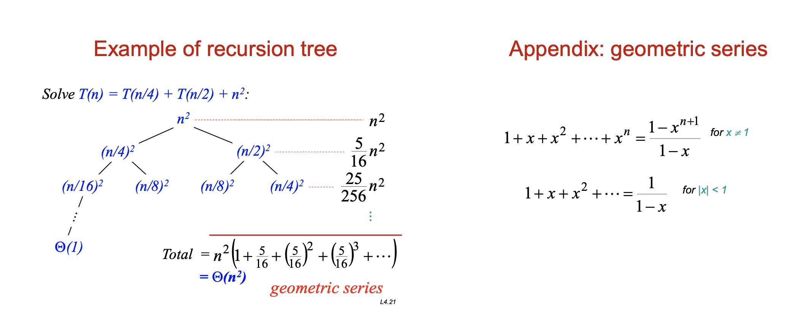

# Recursion Tree II

- T(n) = 3T(n/4) + cn^2

- Base case: T(1), 最后一层全是 T(1) node

- The longest path from root to leaf is:
  - $$m/4 + n/4^2 + n/4^3 + ... + n/4^i $$ 
  - since the last level is T(1) ...
  - $$n/4^i = 1$$
  - $$4^i = n$$
  - $$i = log_4n$$
  - thus, the height is $$log_4n$$
  - the last level is $$long_4n + 1$$

---
## Another example

