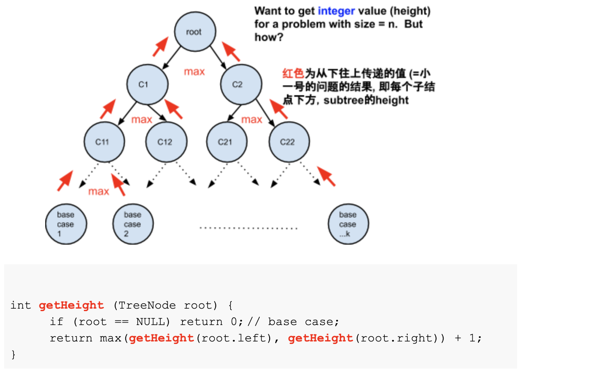
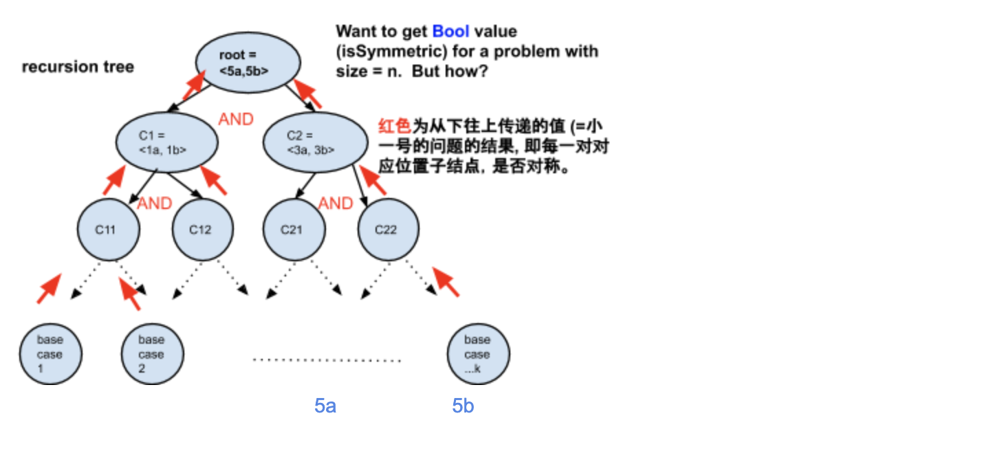

# How to analyze time&&space complexity of recursion?

- 首先你要知道， original tree的定义 不等于 recursion tree的定义

- Example 1:  [Maximum Depth of Binary Tree](https://novemberfall.github.io/LeetCode-NoteBook/#/ch5/getHightTree)


- input tree:

```ruby
        10
       /   \  
      5     15
     / \    / \
    2   7  12  20
```


- Recursion Tree Below:
  



- Time = O(n),  n is the total number of nodes in the tree
- Space = O(n), worst case, or O(height)


### one more example:

- How to judge whether a binary tree is symmetric?


```ruby
                10
            5a  |  5b
    1a      3a  |  3b       1b
 2a 4a   6a 8a  | 8b 6b    4b 2b                n nodes
```




```java
    private boolean isSymmetric(TreeNode one, TreeNode two){
        if(one == null && two == null){
            return true;
        }else if(one == null || two == null){
            return false;
        }else if(one.val != two.val){
            return false;
        }
        
        return isSymmetric(one.left, two.right) && isSymmetric(one.right, two.left);
    }    
```

- Time = n/2 + n/4 + n/8 + ... + 2 + 1 = O(n)
  - the recursion tree (n/2 nodes) is different from the input tree(n nodes)
  - Space = O(height)

- original tree 有多少个node?  n
- recursion tree 有多少个node? 最多 n/2

---

## How to analyze time and space complexity of a recursive function?

- Time complexity: the sum of time complexity of all nodes in the recursion tree
- Space complexity: the sum of space complexity of all nodes on a pink path (a path from top to bottom)
- [具体 examaple: merge sort](https://novemberfall.github.io/LeetCode-NoteBook/#/Array/arraySort)

---

## one more example:

- [110. Check If Binary Tree Is Balanced](https://novemberfall.github.io/LeetCode-NoteBook/#/ch5/checkBalanced)


---

## example:

- [951. Flip Equivalent Binary Trees | Tweaked Identical Binary Trees](https://novemberfall.github.io/LeetCode-NoteBook/#/m2/tweakTree)


