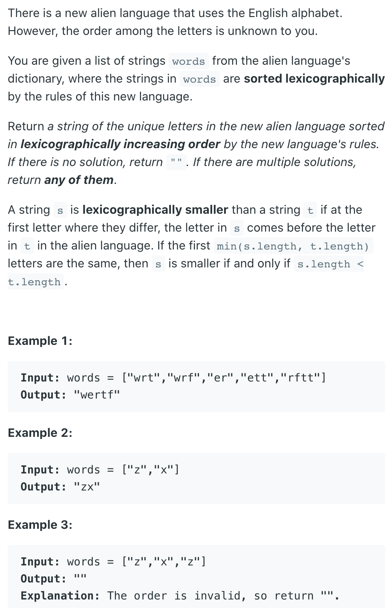
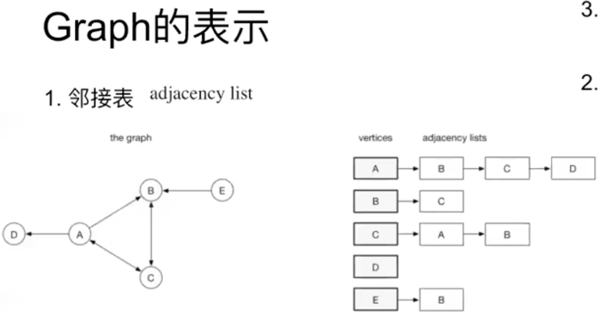
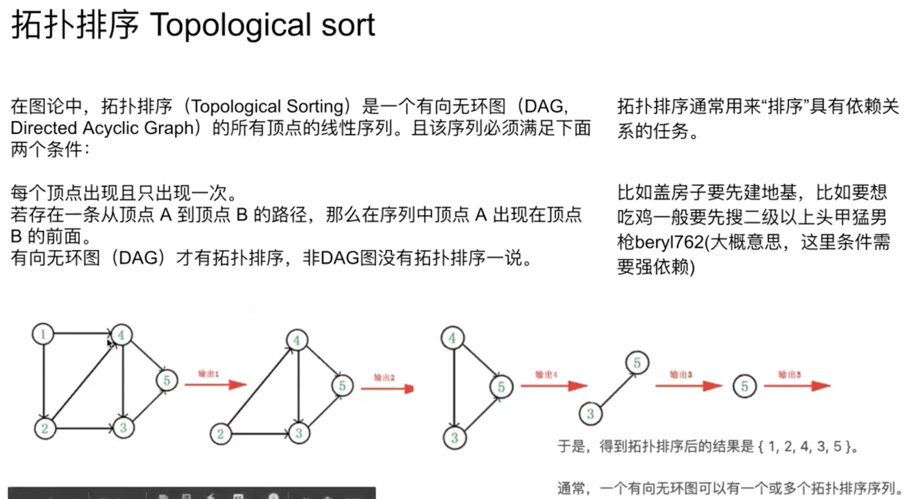
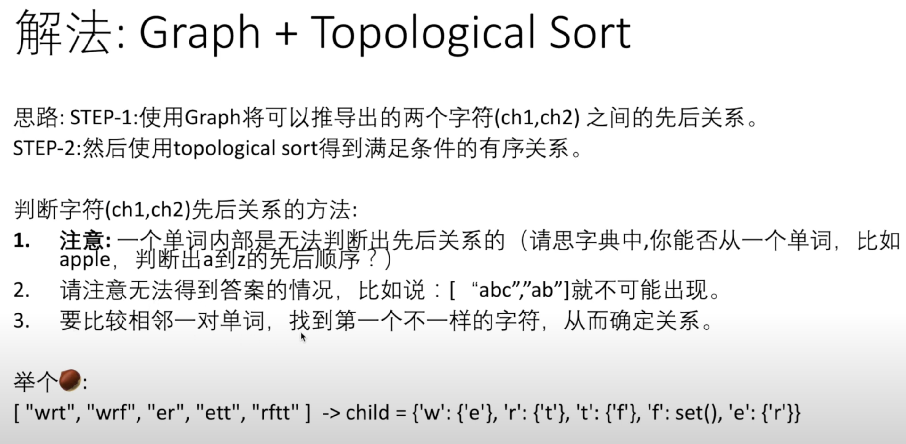

## 269. Alien Dictionary

---
- [youtube video](https://www.youtube.com/watch?v=RIrTuf4DfPE)
---
- First, build a degree map for each character in all the words:

```ruby
w:0
r:0
t:0
f:0
e:0
```

- Then build the hashmap by comparing the adjacent words, the first character that 
  is different between two adjacent words reflect the lexicographical order. 
  For example:

```ruby
"wrt",
"wrf",
# first different character is 3rd letter, so t comes before f

"wrf",
"er",
# first different character is 1rd letter, so w comes before e


#####################################################################################
 "wrt"
 "wrf"
 "er"
 "ett"
 "rftt"

       t -> f
       w -> e


       r -> t -> f
       w -> e


    -----> r -> t -> f
    |________
            |
            |       
       w -> e


 output:  "wertf"
 ####################################################################################

 注意： w -> e   说明 e 的入度 indegree 为 1， w 的出度为 1， 但是 w 的入度为 0

 所以说 w 就可以排在最前面因为它的入度 为 0
```

- The characters in set come after the key. `x -> y` means letter `x` comes before 
  letter `y`.   `x -> set: y,z,t,w` means `x` comes before all the letters in the set. 
  The final HashMap "map" looks like.

```java
t -> set: f    
w -> set: e
r -> set: t
e -> set: r
```

- and final HashMap `"degree"` looks like, the number means `"how many letters come before the key"`:

```ruby
w:0
r:1
t:1
f:1
e:1
```

---





---


- Note: `"ab"` should before `"abc"`, so `["abc", "ab"]` is **impossible**!
  
---

```ruby
Case:
  ac
  ab
  zc
  zb

Case:
  wrt
  wrff
  tf
  ff

## tf is duplicate, so we use Set<>
```


```java
public class alien1 {
    public static String alienOrder(String[] words) {
        int[] indegree = new int[26];
        Map<Character, Set<Character>> graph = new HashMap<>();
        buildGraph(graph, words, indegree);
        return bfs(graph, indegree);
    }

    private static void buildGraph(Map<Character, Set<Character>> graph, String[] words, int[] indegree) {
        for (String word : words) {
            for (char c : word.toCharArray()) {
                graph.putIfAbsent(c, new HashSet<>());
            }
        }
        for (int i = 1; i < words.length; i++) {
            String first = words[i - 1];
            String second = words[i];
            int len = Math.min(first.length(), second.length());
            for (int j = 0; j < len; j++) {
                // ett, rftt
                char out = first.charAt(j);
                char in = second.charAt(j);
                if (out != in) {
                    if (!graph.get(out).contains(in)) {
                        graph.get(out).add(in);
                        indegree[in - 'a']++;
                    }
                    break; // ett, rftt 只有在出现第一个不相同的字符 e, r 才做比较，剩下就不再比较所以 break
                }
                // test case: ["abc","ab"], Expected: ""
                if (j + 1 == len && first.length() > second.length()) {
                    graph.clear();
                    return;
                }
                /*  Why do we need `j + 1 == len`, look at this test case:
                    ["qb","qts","qs","qa","s"]
                    without `j + 1 == len`, qts.len() > qs.len(), it will return "", but "qts" come before "qs", that is correct!
                */                
            }
        }
    }

    private static String bfs(Map<Character, Set<Character>> graph, int[] indegree) {
        StringBuilder sb = new StringBuilder();
        Queue<Character> queue = new ArrayDeque<>();
        int totalChars = graph.size();
        for (char c : graph.keySet()) {
            if (indegree[c - 'a'] == 0) {
                queue.offer(c);
            }
        }

        while (!queue.isEmpty()) {
            char out = queue.poll();
            sb.append(out);
            for (char in : graph.get(out)) {
                indegree[in - 'a']--;
                if (indegree[in - 'a'] == 0) {
                    queue.offer(in);
                }
            }
        }
        return sb.length() == totalChars ? sb.toString() : "";
        // 看这个例子： ["z","x","a","zb","zx"]， 很明显这里有 环 出现了，所以无法用 Topological Sort
        /*
        if the graph contains cycles (e.g., there's a cyclic relationship between characters), 
        your BFS traversal might terminate without visiting all characters, even if there is a valid ordering of 
        characters. In this case, returning just sb.toString() could give you an incorrect result.
        */
    }
    public static void main(String[] args) {
        String[] words = {"abc", "ab"};
        String str = alienOrder(words);
        System.out.println(str);
    }
}
```

