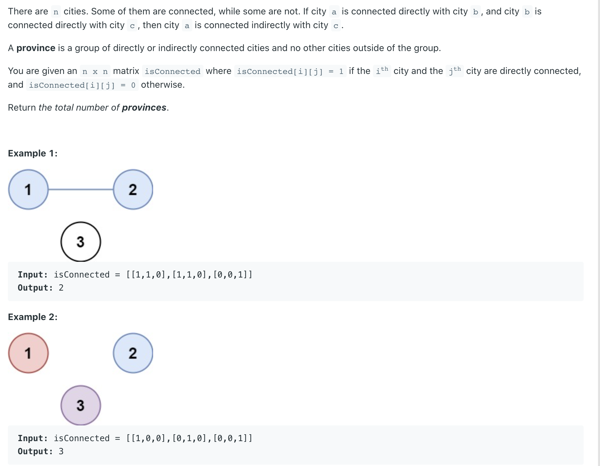
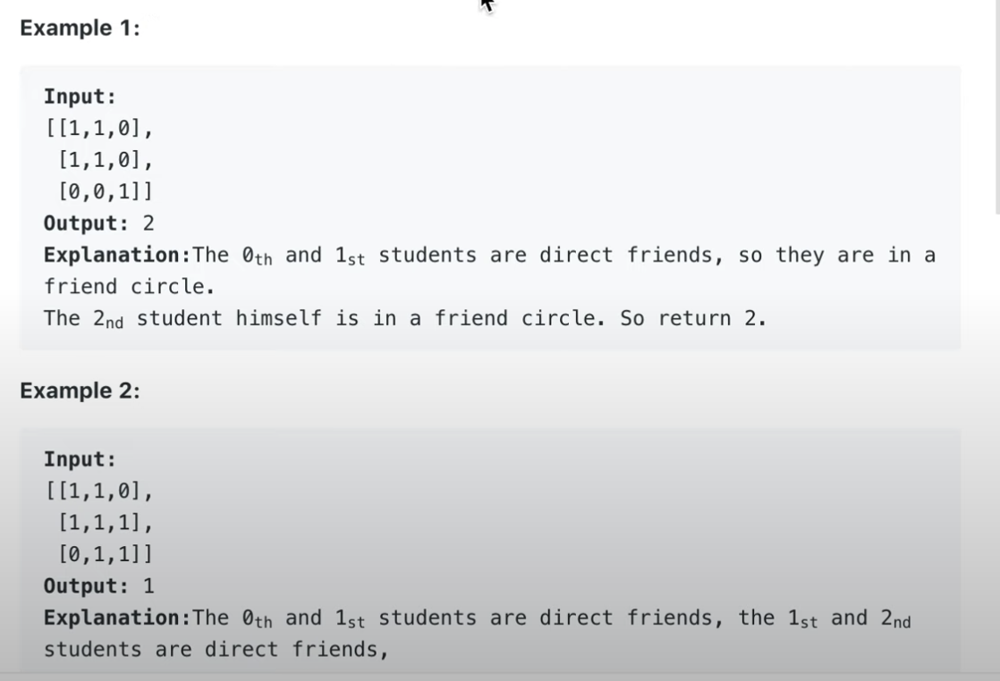

## 547. Number of Provinces



- `1 <= n <= 200`
- `n == isConnected.length`
- `n == isConnected[i].length`
- `isConnected[i][j]` is `1` or `0`.
- `isConnected[i][i] == 1`
- `isConnected[i][j] == isConnected[j][i]`




```java
class Solution {
    public int findCircleNum(int[][] isConnected) {
        int[] visited = new int[isConnected.length];
        int count = 0;
        for (int i = 0; i < isConnected.length; i++) {
            if (visited[i] == 0) {
                dfs(isConnected, visited, i);
                count++;
            }
        }
        return count;
    }
    
    private void dfs(int[][] M, int [] visited, int i) {
        for (int j = 0; j < M.length; j++){
            if (M[i][j] == 1 && visited[j] == 0){
                visited[j] = 1;
                dfs(M, visited, j);
            }
        }
    }
}
```