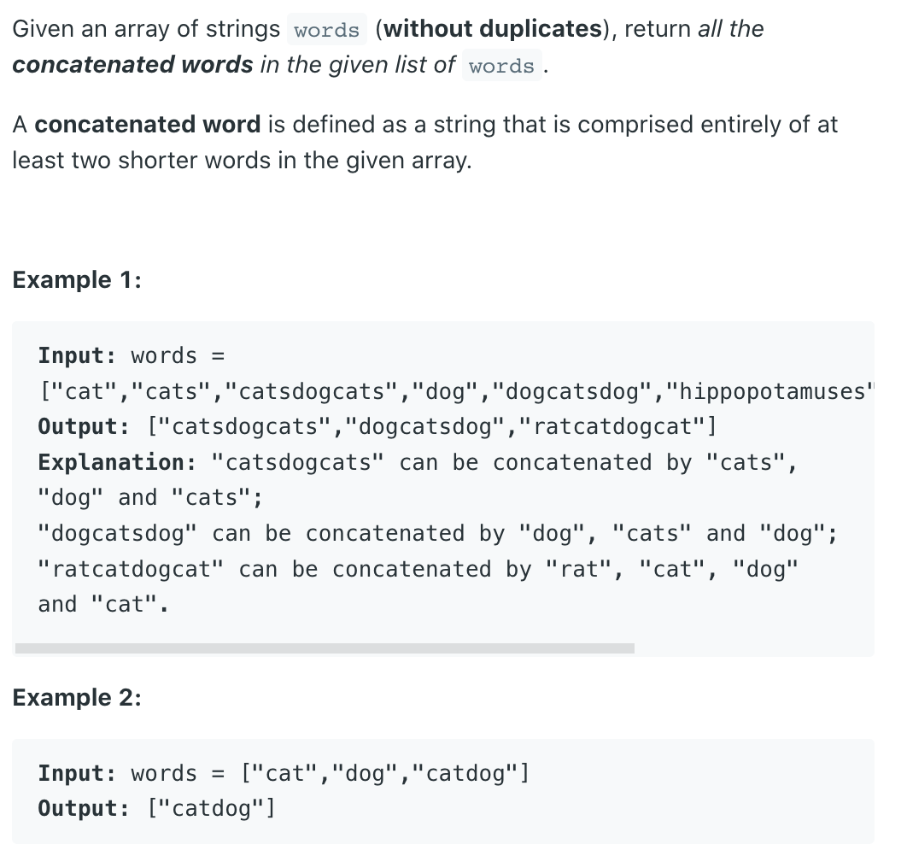

## 472. Concatenated Words


-----

### Trie + DFS

- `"concatenated word"` is a word that can be formed by concatenating at `least two other words` from a given list 
  of words. In other words, a concatenated word is made up of multiple smaller words from the same list, where the 
  order of the smaller words remains the same.

- For example, consider the list of `words: ["cat", "cats", "catsdog", "dog", "dogcat", "dogcatrat"]`. In this list:
  - `"catsdog"` is a `concatenated word` because it can be formed by concatenating `"cats"` and `"dog"`.
  - `"dogcatrat"` is a concatenated word because it can be formed by concatenating "`dog`", "`cat`", and "`rat`".

- On the other hand:
  - "`cat`" is not a concatenated word because it does not require concatenation of other words.
  - "`dog`" is not a concatenated word because it does not require concatenation of other words.

---
- [中文官方解释](https://leetcode.cn/problems/concatenated-words/solutions/1179021/lian-jie-ci-by-leetcode-solution-mj4d/#:~:text=4-,%E8%BF%9E%E6%8E%A5%E8%AF%8D,-%E5%85%B3%E6%B3%A8)


- The approach to determine whether a word is a concatenated word involves searching in a trie. **Starting from the first character of the word** (i.e., the character at index 0), sequentially search each character's corresponding 
  node in the trie. There are several possible scenarios:

  1. **If a character's corresponding node marks the end of a word, a shorter word has been found.** Continue 
   searching for the next shorter word, starting from the character immediately after this one.
  2. If a character's corresponding node does not exist in the trie, the current search result is unsuccessful. 
   Return to the end of the previous word and continue searching.
  3. If a shorter word is found and its last character matches the last character of the current word, 
   then the current word is a concatenated word. Since the words in the array "words" are not duplicated, when 
   determining if a word is a concatenated word, it must not have been added to the trie. This ensures that the 
   condition for identifying a concatenated word is met.

- Since a concatenated word is composed of multiple shorter non-empty words, if one of the components of a longer 
  concatenated word is a shorter concatenated word, then it is certainly possible to replace that shorter 
  concatenated word with multiple shorter non-empty words. As a result, there is no need to add the concatenated 
  words to the trie.
---


```java
class ConcatenatedWords_Trie_dfs {
    TrieNode root = new TrieNode();

    class TrieNode{
        TrieNode[] children;
        boolean isEnd;

        public TrieNode() {
            children = new TrieNode[26];;
            isEnd = false;
        }
    }

    public List<String> findAllConcatenatedWordsInADict(String[] words) {
        List<String> res = new ArrayList<>();
        Arrays.sort(words, (a, b) -> a.length() - b.length());
        for (String word : words) {
            if (word.length() == 0) {
                continue;
            }
            boolean[] visited = new boolean[word.length()];
            if (dfs(word, visited, 0)) {
                res.add(word);
            } else {
                insertWord(word);
            }
        }
        return res;
    }

    public boolean dfs(String word, boolean[] visited, int index) {
        TrieNode cur = root;
        if (index == word.length()) {
            return true;
        }
        if (visited[index]) {
            return false;
        }

        visited[index] = true;
        for (int i = index; i < word.length(); i++) {
            char c = word.charAt(i);
            if (cur.children[c - 'a'] == null) {
                return false;
            }
            cur = cur.children[c - 'a'];
            if (cur.isEnd) {
                if (dfs(word, visited, i + 1)) {
                    return true;
                }
            }
        }
        return false;
    }

    private void insertWord(String word) {
        TrieNode cur = root;
        for (int i = 0; i < word.length(); i++) {
            char c = word.charAt(i);
            if (cur.children[c - 'a'] == null) {
                cur.children[c - 'a'] = new TrieNode();
            }
            cur = cur.children[c - 'a'];
        }
        cur.isEnd = true;
    }
}
```


-----

### DP

- [Do you still remember how did you solve this problem?](https://leetcode.com/problems/word-break/)
  - [139. Word Break](https://leetcode.com/problems/word-break/)

- If you do know one optimized solution for above question is using **DP**, 
  this problem is just one more step further. We iterate through each `word`
  and see if it can be formed by using other `words`.

- Of course it is also obvious that a `word` can only be formed by 
  `words` shorter than it. 
  So we can first sort the input by length of each `word`, 
  and only try to form one `word` by using `words` in front of it.

```java
class Solution {
    public List<String> findAllConcatenatedWordsInADict(String[] words) {
        List<String> res = new ArrayList<>();
        if (words == null || words.length == 0) {
            return res;
        }
        
        Arrays.sort(words, (a, b) -> (
            a.length() - b.length()
        ));
        
        Set<String> preWords = new HashSet<>();
        for (String word : words) {
            if (canForm(word, preWords)) {
                res.add(word);
            }
            preWords.add(word);
        }
        return res;
    }
    
    private boolean canForm(String word, Set<String> dict) {
        if (dict.isEmpty()) {
            return false;
        } 
        int len = word.length();
        boolean [] dp = new boolean [len + 1];
        dp[0] = true; // set empty string to be true
        for (int i = 1; i < dp.length; i++) {
            for (int j = 0; j < i; j++) {
                if (dict.contains(word.substring(j, i)) && dp[j]) {
                    dp[i] = true;
                    break;
                }
            }
        }
        return dp[len];
    }
}
```