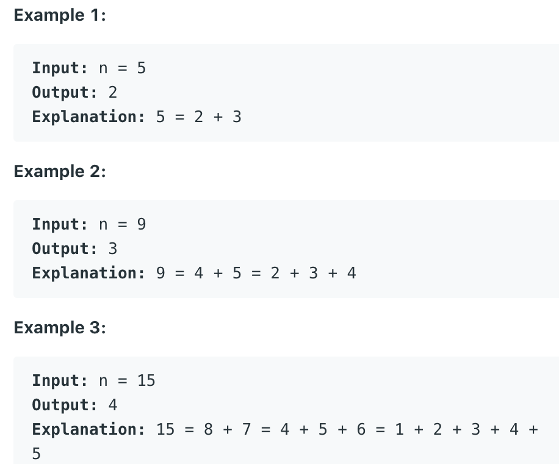
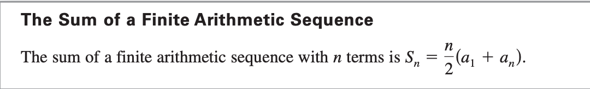

## 829. Consecutive Numbers Sum

- Given an integer `n`, return the number of ways you can write `n` as the sum of 
  consecutive positive integers.

---

### Brute Force

- We enumerate the starting value start of consecutive positive integers and 
  accumulate until the result is greater than or equal to N. If the result is 
  exactly equal to N, we have found one of this set of answers.
  - For example, when `N = 6`, if the starting value is `1`, we will add up to 
    `1 + 2 + 3 = 6`, and get a set of answers; if the starting value is `2`, we 
    will add up to `2 + 3 + 4 = 9`, which `exceeds 6`. And so on, until the 
    starting value `greater than N`.


```java
class Solution {
    public int consecutiveNumbersSum(int n) {
        int ans = 0;
        for (int start = 1; start <= n; i++) {
            int target = n;
            int x = start;

            while (target > 0) {
                target -= x;
                x++;
            }

            if (target == 0) {
                ans++;
            }
        }
        return ans;
    }
}
```
---


```ruby
x + x+1 + x+2 ... + x+m-1 = N

按照公式： Sn = (a1 + an) * n / 2
         N =  (x + x+k-1) * k / 2     {x, k}
         
```
---

- Let's make some observation first.
  - 1. of length k only one consecutive sequence is possible.
    e.g : let's say we want to make `18`
    - `3 4 5 6` sum:`18`
      - if we go left having length k sum will `decrease(2 3 4 5)`
      - if we go to right sum `increase (4 5 6 7)`
      - **So only one consecutive sequence of length k with specific sum is possible.**
    - So now I have to find all possible sequence that starts with `x` , 
      having length `k` and sum equals to `n`.
      - x+ (x+1) + (x+2) ..... (x+k-1) = n
      - => `(x + x+k-1) * k / 2 = n`
      - => `(2x + k-1) * k / 2 = n`
      - => `[(2x + k-1) * k] / 2 = n`
      - => `[2kx + k(k-1)] / 2 = n`
      - => **`kx + k(k-1) / 2 = n`**
    - **K:unknown and also X:unknown**
      - `kx = n - k*(k-1)/2`
      - **k > 0 and x > 0 so LHS always Positive**
      - => `n - k*(k-1)/2 > 0` 
      - => `n > k*(k-1)/2` 
      - => `n > k*(k)/2`  # approximation
      - => `2n > k*(k)`  
      - => `2n > k^2`  
      - => `sqrt(2n) > k`  
    - **Now we have range for k, K > 0 && k < sqrt(2n)**
      - `kx = n - k*(k-1)/2`
        - **left side is mutliple of k**
        - if right side `(n - k*(k-1)/2) % k == 0` **means right side is also a multiple of k**.
        - So if this condition follows increase answer count 1.

---

```java
/**
 n = (x + x + k - 1) * k / 2
 n = [2kx + (k - 1) * k] / 2
 n = kx + (k - 1) * k/2
 kx = n - k*(k-1)/2
*/
class Solution {
    public int consecutiveNumbersSum(int n) {
        int ans = 0;
        for (int k = 1; k < Math.sqrt(2*n); k++) {
            if ((n - k*(k-1)/2) % k == 0) {
                ans++;
            }
        }
        return ans;
    }
}
```
