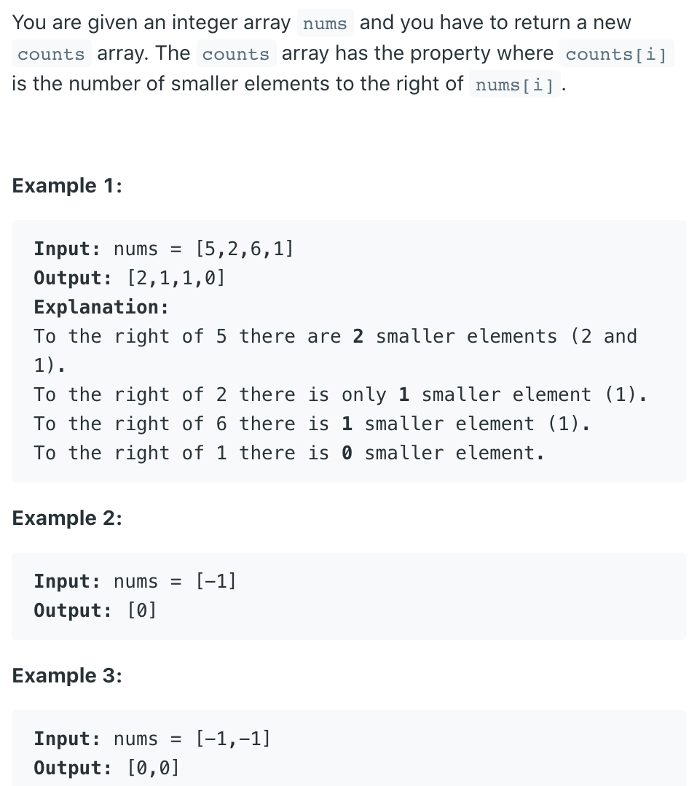
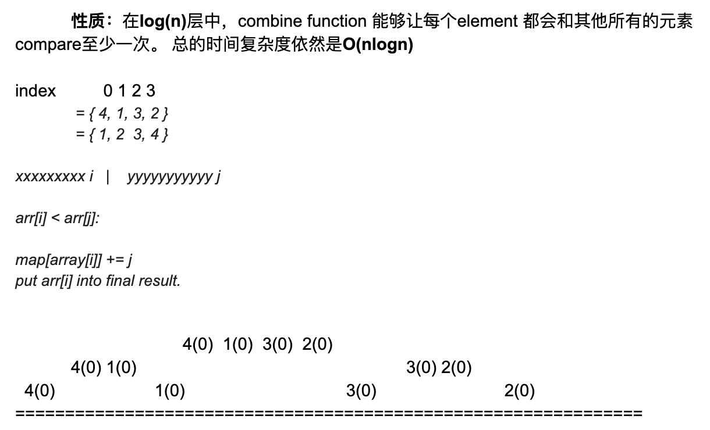
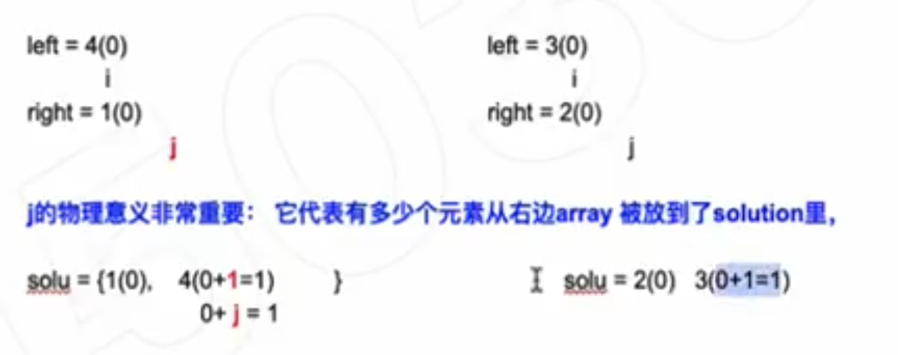

## 315. Count of Smaller Numbers After Self




- note: `4(0) 1(0) 3(0) 2(0)`, 后面的0代表，比他小的后面的元素有几个



- 如果指针 `j` 在right array， 在谁小移谁的过程中，就不需要更新`()` 里的count[也就是value]
- 如果在谁小移谁的过程中，元素从左边数组得来的，那么就要给`()` 里的value 更新为：`val + j`

```ruby
Left = 1(0)  4(1)
        i
Right = 2(0)  3(1)
         j
solu = {}   


Left = 1(0)  4(1)
               i
Right = 2(0)  3(1)
         j
solu = {1(0 + j)}   


Left = 1(0)  4(1)
               i
Right = 2(0)  3(1)
               j
solu = {1(0),  2(0)}


Left = 1(0)  4(1)
               i
Right = 2(0)  3(1)
                    j
solu = {1(0),  2(0),  3(1)}


Left = 1(0)  4(1)
               i
Right = 2(0)  3(1)
                    j
solu = {1(0),  2(0),  3(1), 4(1 + j = 3)}


solu = {1(0),  2(0),  3(1), 4(3)}
```

---

```java
class Solution {
    class Item{
        int val;
        int index;
        public Item(int v, int i) {
            val = v;
            index = i;
        }
    }
    
    public List<Integer> countSmaller(int[] nums) {
        List<Integer> res = new ArrayList<>();
        int n = nums.length;
        int[] count = new int[n];
        Item[] items = new Item[n];
        for (int i = 0; i < n; i++) {
            items[i] = new Item(nums[i], i);
        }
        mergeSort(items, 0, n - 1, count);
        for (int i : count) {
            res.add(i);
        }
        return res;
    }
    
    private void mergeSort(Item[] items,int left,int right, int[] count){
        if (left >= right) {
            return;
        }
        int mid = left + (right - left) / 2;
        mergeSort(items, left, mid, count);
        mergeSort(items, mid + 1, right, count);
        merge(items, left, mid, mid + 1, right, count);
    }
    
    private void merge(Item[] items, 
                int lo, int loEnd, int hi, int hiEnd, int[] count) {
        
        int len = hiEnd - lo + 1;
        int rightCount = 0;
        Item[] sorted = new Item[len];
        int index = 0;
        int loPtr = lo;
        int hiPtr = hi;
        while (loPtr <= loEnd && hiPtr <= hiEnd) {
            if (items[loPtr].val > items[hiPtr].val) {
                rightCount++;
                sorted[index++] = items[hiPtr++];
            } else {
                count[items[loPtr].index] += rightCount;
                sorted[index++] = items[loPtr++];
            }
        }
        
        while (loPtr <= loEnd) {
            count[items[loPtr].index] += rightCount;
            sorted[index++] = items[loPtr++];            
        }
        
        while (hiPtr <= hiEnd) {
            sorted[index++] = items[hiPtr++];
        }
        System.arraycopy(sorted, 0, items, lo, len);
    }
}
```