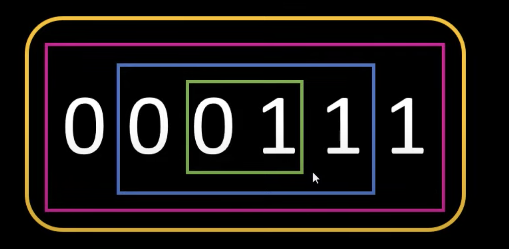
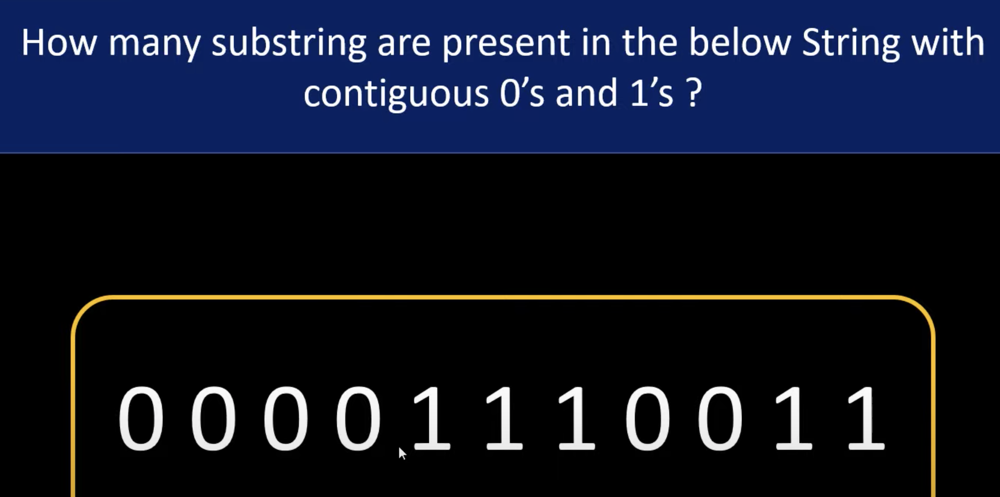

## 696. Count Binary Substrings


- find the substrings that have equal number of 1's and 0's,
  Note: In this substring, the 0's and 1's must be grouped:

```ruby
000111    Grouped
1010    Un-Grouped
```
 

- substrings are grouped
---
- What if I add one more zero:





---

```ruby
        0   0   0   1   1   0

curr    1   2   3   1   2   1   

prev    0   0   0   3   3   2

count   0   0   0   0   0   2
```


```java
class Solution {
    public int countBinarySubstrings(String s) {
        int count = 0, prev = 0, curr = 1;
        for (int i = 1; i < s.length(); i++) {
            if (s.charAt(i - 1) == s.charAt(i)) {
                curr++;
            } else {
                count += Math.min(curr, prev);
                prev = curr;
                curr = 1;
            }
        }
        return count += Math.min(curr, prev);
    }
}
```

