## 207. Course Schedule
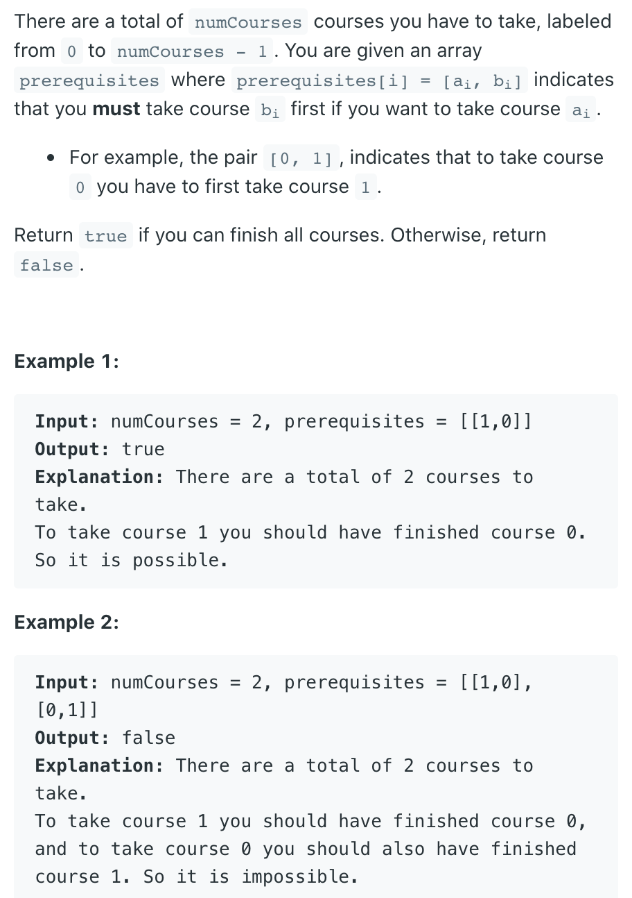
---

- 本题可约化为： 课程安排图是否是 有向无环图(DAG | directed acyclic [ˌeɪˈsaɪklɪk] graph)。
  即课程间规定了前置条件，但不能构成任何环路，否则课程前置条件将不成立。

- the term **indegree** refers to the number of prerequisites (or incoming edges) a course has in a directed graph representation of course dependencies.
- `Nodes` represent **courses**
- `Edges` represent **prerequisites**, where an edge from course A to course B means that **course A is a prerequisite for course B**.

- **Indegree**
  - Indegree of a node (or course) is the number of edges directed into that node. In simpler terms, 
    it is the **count of prerequisite courses** for a particular course.
  - If a course has an **indegree of 0**, it means there are no prerequisites for that course, and it can be taken immediately.  


- **Indegree** Usage in this Problem
  - the goal is to **find an order in which to complete all the courses**, respecting the prerequisite relationships. 
    The indegree is used to `determine which courses can be taken next` in this order:


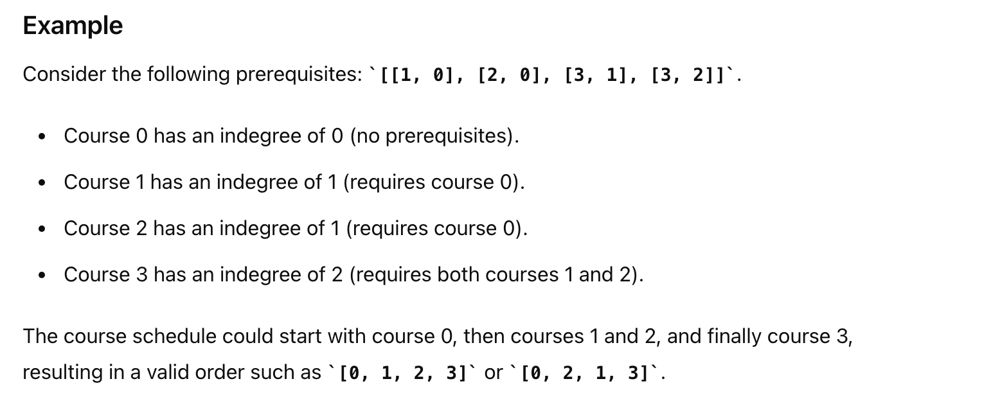
---
- **Map<Integer, List<Integer>> graph**'s usage:

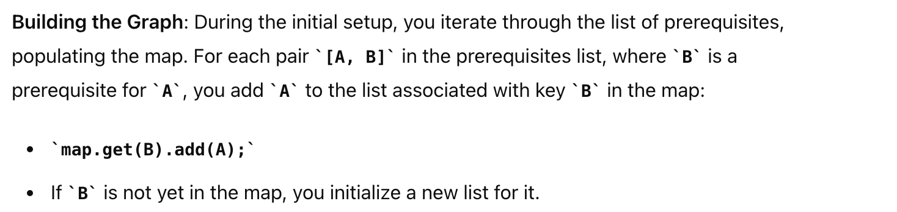

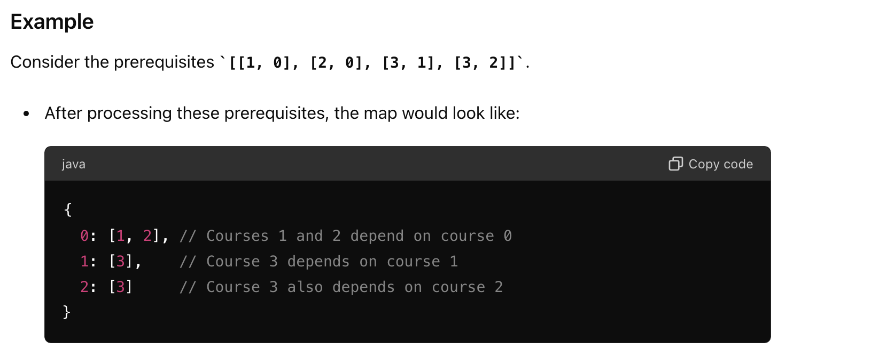
---
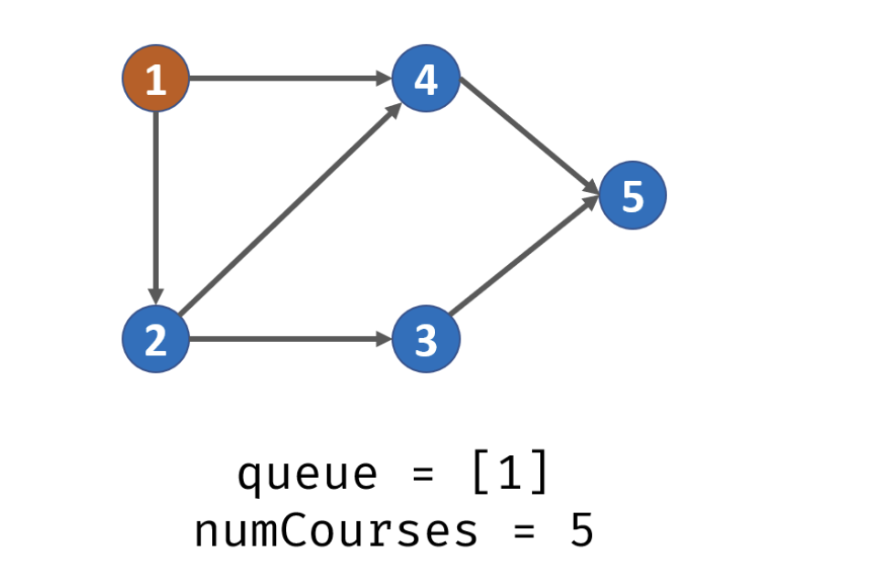
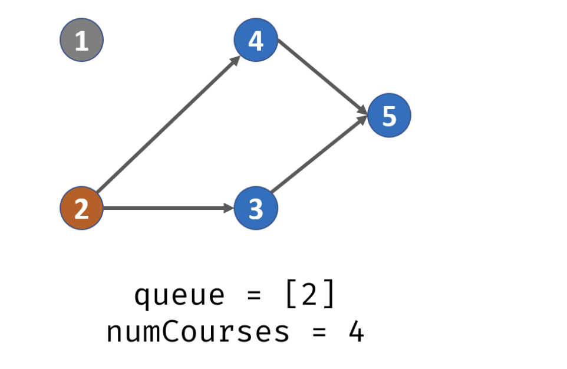
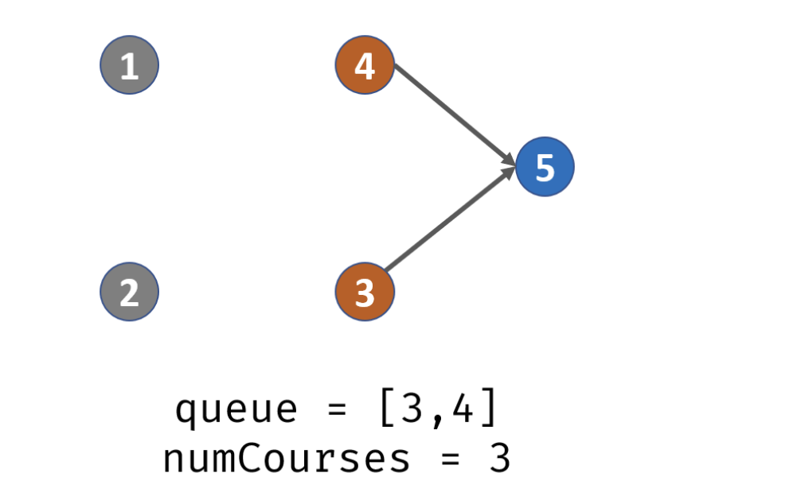
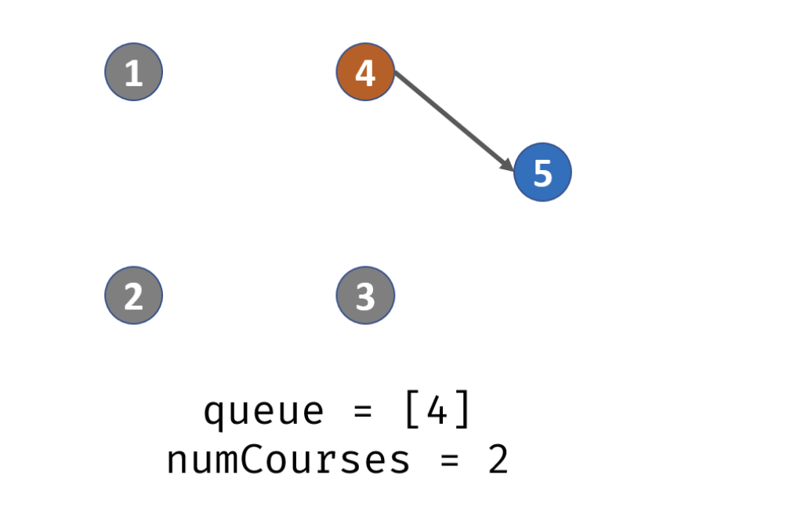
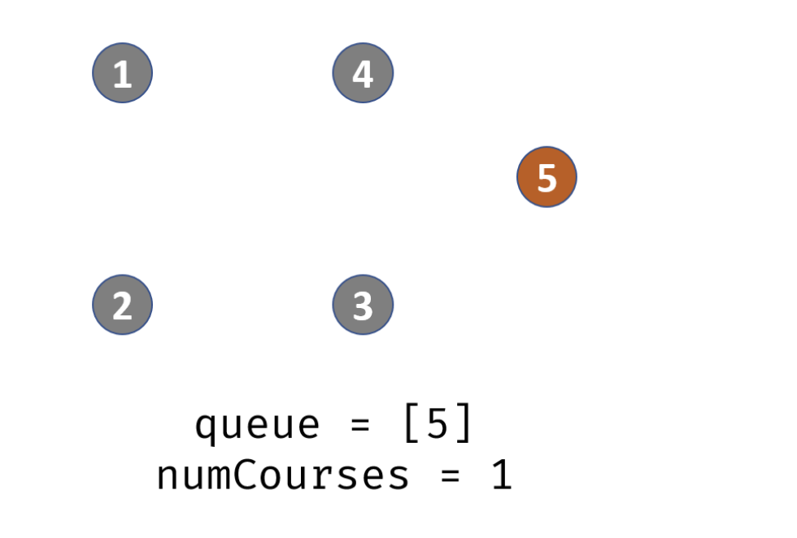
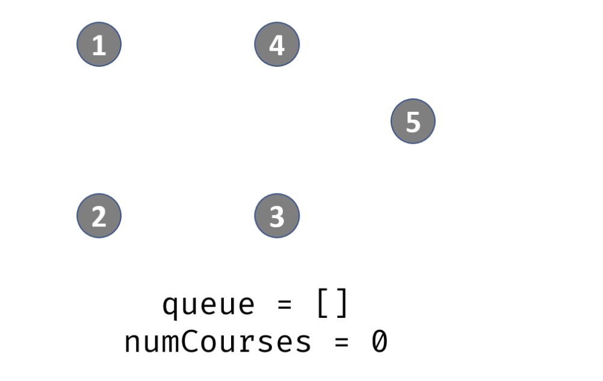

- **T = O(N + M)** :  遍历一个图需要访问所有节点和所有临边，N 和 M 分别为节点数量和临边数量；
- **Space = O(N + M)** : 为建立邻接表所需额外空间，adjacency 长度为 N ，并存储 M 条临边的数据。

---

- 这里先遍历一下数组prerequisites, 然后 `indegree[prerequisites[i][0]]++`

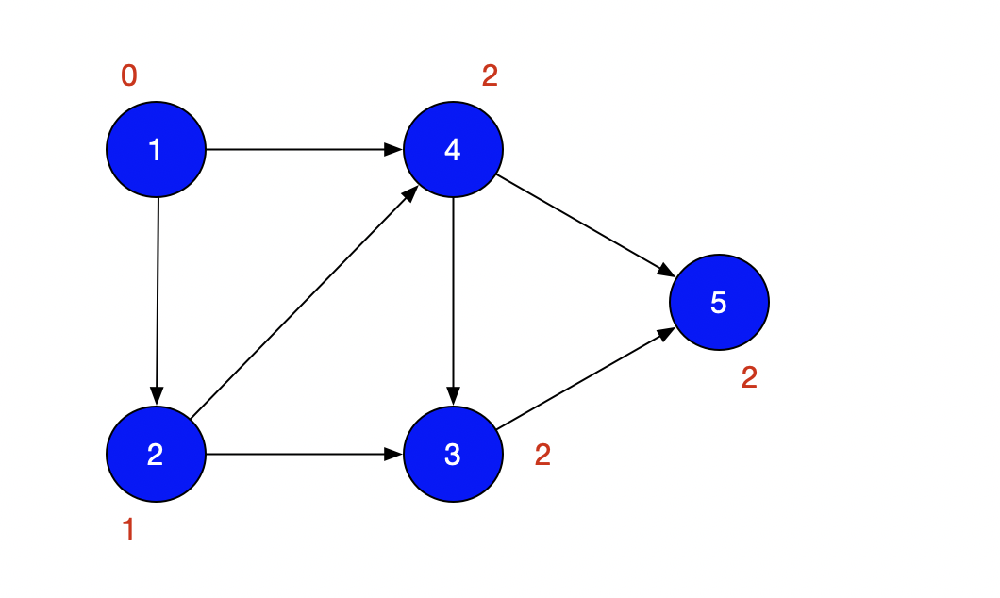

---

```java
class Solution {
    public boolean canFinish(int numCourses, int[][] prerequisites) {
        int[] indegree = new int[numCourses];
        //记录每门课程的先修课   
        Map<Integer, List<Integer>> graph = new HashMap<>();
        buildGraph(graph, prerequisites, indegree);
        return bfs(graph, numCourses, indegree);
    }
    
    private void buildGraph(Map<Integer, List<Integer>> graph, int[][]prerequisites, int[] indegree) {
        for (int i = 0; i < prerequisites.length; i++) {
            graph.putIfAbsent(prerequisites[i][1], new ArrayList<>());
            graph.get(prerequisites[i][1]).add(prerequisites[i][0]); // 把需要上当前这门先修课的所有课程，放进List
            indegree[prerequisites[i][0]]++;
        }
    }
    
    private boolean bfs(Map<Integer, List<Integer>> graph, int numCourses, int[] indegree) {
        Queue<Integer> queue = new LinkedList<>();
        for (int i = 0; i < numCourses; i++) {
            if (indegree[i] == 0) { //没有先修课
                queue.offer(i);
            }
        }
        int count = 0; //统计一共上过的课程数量
        while (!queue.isEmpty()) {
            int course = queue.poll();
            count++;
            List<Integer> list = graph.get(course);
            if (list != null) { 
                //有n门课以当前的course作为先修课，course->n个其他课程
                for (int inCourse : list) {
                    indegree[inCourse]--;
                    if (indegree[inCourse] == 0) {
                        queue.offer(inCourse);
                    }
                }
            }
        }
        return count == numCourses;
    }
}
```
---


#### Python

```py
class Solution:
    def canFinish(self, numCourses: int, prerequisites: List[List[int]]) -> bool:
        indegrees = [0] * numCourses
        graph = defaultdict(list)
        self.buildGraph(graph, prerequisites, indegrees)
        return self.bfs(graph, numCourses, indegrees)

    # Build the graph and calculate indegree for each course
    def buildGraph(self, graph: defaultdict, prerequisites: List[List[int]], indegrees: List[int]) -> None:
        for prereq in prerequisites:
            graph[prereq[1]].append(prereq[0])  # Add course that depends on the current prerequisite
            indegrees[prereq[0]] += 1

    def bfs(self, graph: defaultdict, numCourses: int, indegree: List[int]) -> bool:
        queue = deque()
        # Enqueue courses with no prerequisites
        for i in range(numCourses):
            if indegree[i] == 0:
                queue.append(i)

        count = 0  # Count the number of courses we can take
        while queue:
            course = queue.popleft()
            count += 1
            # Check if current course is a prerequisite for other courses
            for in_course in graph[course]:
                indegree[in_course] -= 1
                if indegree[in_course] == 0:
                    queue.append(in_course)

        return count == numCourses
```

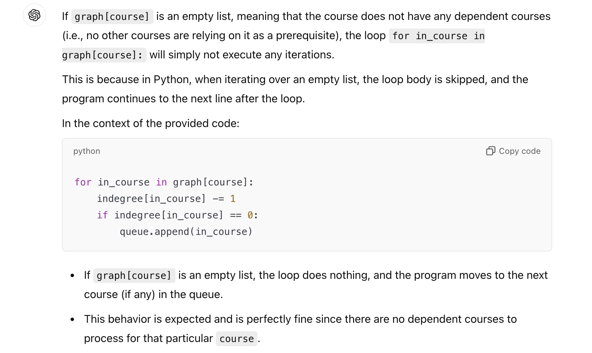