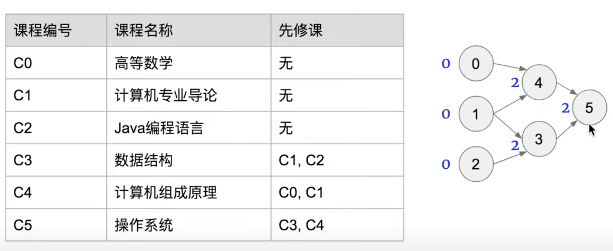
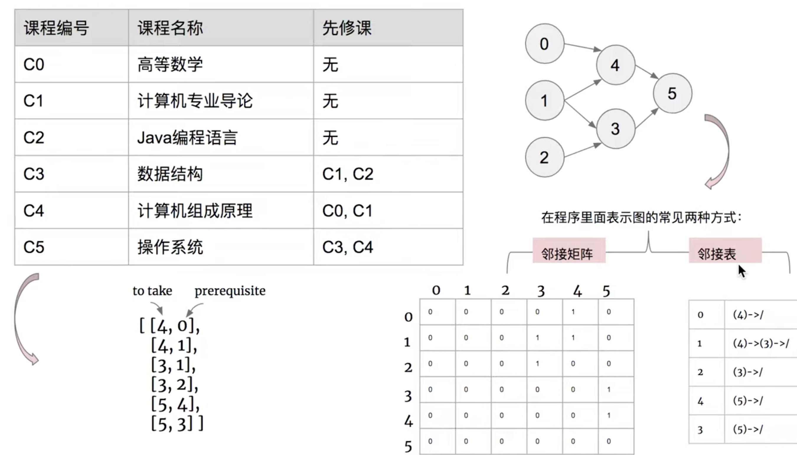

## 207. Course Schedule

---

- 本题可约化为： 课程安排图是否是 有向无环图(DAG | directed acyclic [ˌeɪˈsaɪklɪk] graph)。
  即课程间规定了前置条件，但不能构成任何环路，否则课程前置条件将不成立。

1. 统计课程安排图中每个节点的入度，生成 入度表 `indegrees`。
2. 借助一个队列 `queue`，将所有入度为 0 的节点入队。
3. 当 `queue` 非空时，依次将队首节点出队，在课程安排图中删除此节点 pre：
   - 并不是真正从邻接表中删除此节点 pre，而是将此节点对应所有邻接节点 cur 的入度 -1，
     即 `indegrees[cur] -= 1`。
   - 当入度 -1 后邻接节点 cur 的入度为 0，说明 cur 所有的前驱节点已经被 “删除”，此时将 cur 入队。
4. 在每次 `pre` 出队时，执行 numCourses--；
   - 若整个课程安排图是有向无环图（即可以安排），则所有节点一定都入队并出队过，即完成拓扑排序。换个角度说，
     若课程安排图中存在环，一定有节点的入度始终不为 0。
   - 因此，拓扑排序出队次数等于课程个数，返回 numCourses == 0 判断课程是否可以成功安排。


- T = O(N + M) :  遍历一个图需要访问所有节点和所有临边，N 和 M 分别为节点数量和临边数量；
- Space = O(N + M) : 为建立邻接表所需额外空间，adjacency 长度为 N ，并存储 M 条临边的数据。

---






```java
class Solution {
    public boolean canFinish(int numCourses, int[][] prerequisites) {
        int[] indegree = new int[numCourses];
        // List[] adjacency = new ArrayList[numCourses];
        
        //记录每门课程的先修课        
        Map<Integer, List<Integer>> map = new HashMap<>();

        
        //为每门课开一个list存放它的先修课的课程, pointer
        // for (int i = 0; i < numCourses; i++) {
        //     adjacency[i] = new ArrayList<Integer>();
        // }
        
        //把先修课放到每个课程的list 里 & 统计indegree数量
        for (int i = 0; i < prerequisites.length; i++) {
            //先修课-> 当前课
            if (map.containsKey(prerequisites[i][1])) {
                map.get(prerequisites[i][1]).add(prerequisites[i][0]);
            } else {
                List<Integer> list = new ArrayList<>();
                list.add(prerequisites[i][0]);
                //key是value的先修课
                map.put(prerequisites[i][1], list);
            }
            //current course++
            indegree[prerequisites[i][0]]++;
        }
        
        //BFS
        Queue<Integer> queue = new LinkedList<>();
        for (int i = 0; i < numCourses; i++) {
            if (indegree[i] == 0) {//没有先修课
                queue.offer(i);
            }
        }
        
        int count = 0;//统计一共上过的课程数量
        while (!queue.isEmpty()) {
            int course = queue.poll();
            count++;
            //value
            List<Integer> list = map.get(course);
            if (list != null) {
                //有n门课以当前的course作为先修课，course->n个其他课程
                int n = list.size();
                for (int i = 0; i < n; i++) {
                    int pointer = map.get(course).get(i);
                    indegree[pointer]--;
                    //判断当前课pointer，是否入度为0
                    if (indegree[pointer] == 0) {
                        queue.add(pointer);
                    }
                }                
            }
        }
        return count == numCourses;
    }
}
```