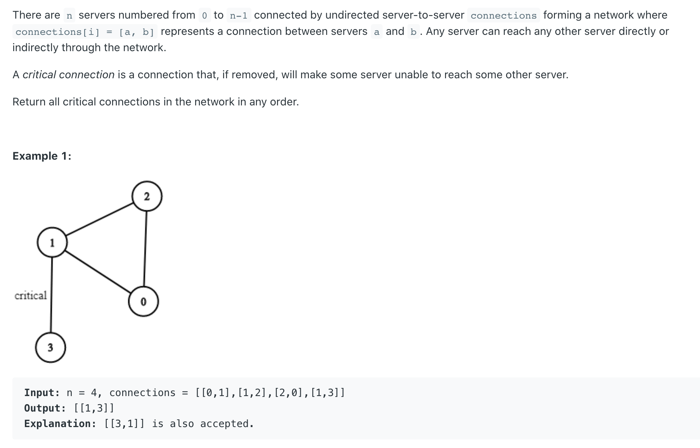
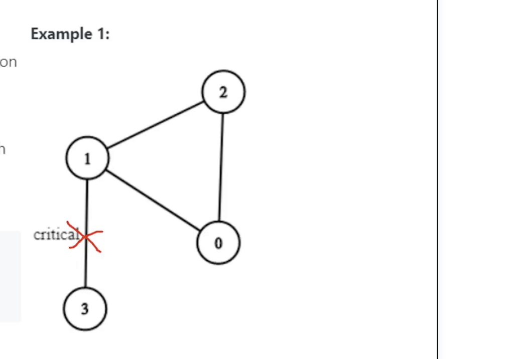
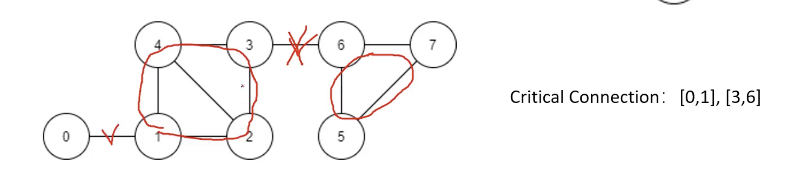
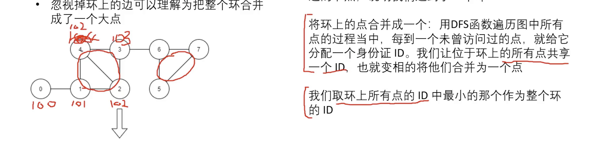
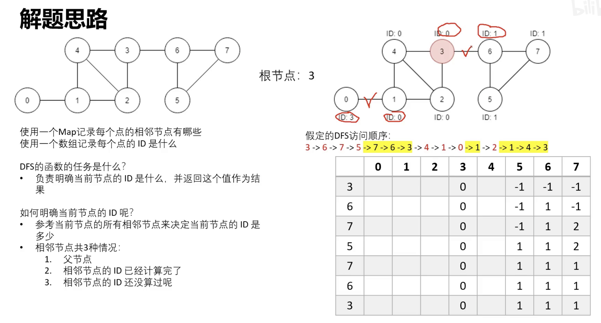
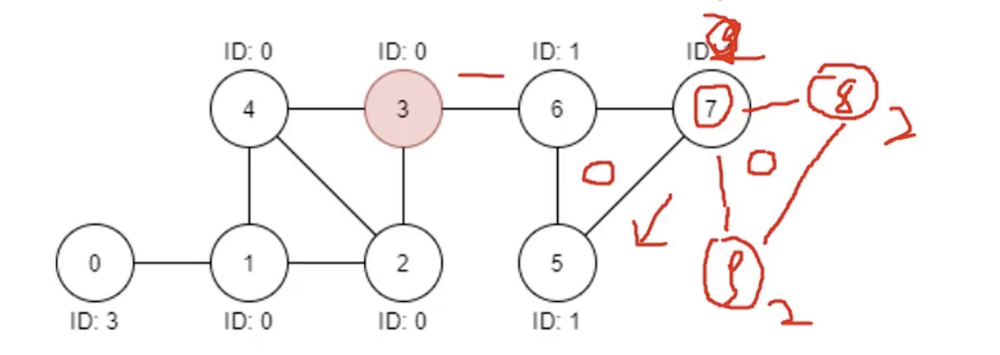

## 1192. Critical Connections in a Network





- 如图，这就是一个 critical connection
  - 如果两个点不在环上，=> 就不是





- 如图，在它遍历整个环的时候，会依次给节点分发ID, 直到回到某一个点，取最小的值作为一个环的全部id
  - 同时，在回溯的过程当中会全部更新为 id = 101
---



- 由于 dfs 顺序不一样，这会造成， [0, 1], [3, 5] 这两个边的 id 是不一样的，for example:



- 假如，从6出发到7 （此时为更新为id=2）, 然后， dfs 函数识别出 [7,8,9] 在一个环上，`id = 2`
  - 接下来再回到7， 发现[5，6，7] 也在一个环上，被更新为1， 所以发现 7 的id前后不一致    


- T(V + E)


```java
class Solution {
    public List<List<Integer>> criticalConnections(int n, List<List<Integer>> connections) {     
        //create a map, store every node's neighbour's nodes
        Map<Integer, Set<Integer>> map = new HashMap<>();
        buildMap(connections, map);
        
        //create a array to store every node's id
        int[] id = new int[n];
        Arrays.fill(id, -1);
        
        //choose a node to be root, dfs function to indentify which edge is critical connection
        List<List<Integer>> res = new ArrayList<>();
        dfs(0, 0, -1, id, map, res);
        
        return res;
    }
    
    
    
    public int dfs(int node, int nodeID, int parent, int[]id, Map<Integer, Set<Integer>>map, List<List<Integer>> res){
        id[node] = nodeID;
        
        Set<Integer> set = map.get(node);
        for (Integer neighbour : set) {
            if (neighbour == parent) {
                continue;
            } else if (id[neighbour] == -1) {
                id[node] = Math.min(id[node], dfs(neighbour, nodeID + 1, node, id, map, res));
            } else {
                id[node] = Math.min(id[node], id[neighbour]);
            }
        }
        
        if (id[node] == nodeID && node != 0) {
            res.add(Arrays.asList(parent, node));
        }    
        
        return id[node];
    }
    
    public void buildMap(List<List<Integer>> con, Map<Integer, Set<Integer>> map) {
        for (List<Integer> edge: con) {
            int n1 = edge.get(0);
            int n2 = edge.get(1);
            
            Set<Integer> n1n = map.getOrDefault(n1, new HashSet<>());
            Set<Integer> n2n = map.getOrDefault(n2, new HashSet<>());
            
            n1n.add(n2);
            n2n.add(n1);
            
            map.put(n1, n1n);
            map.put(n2, n2n);
        }
    }
}
```