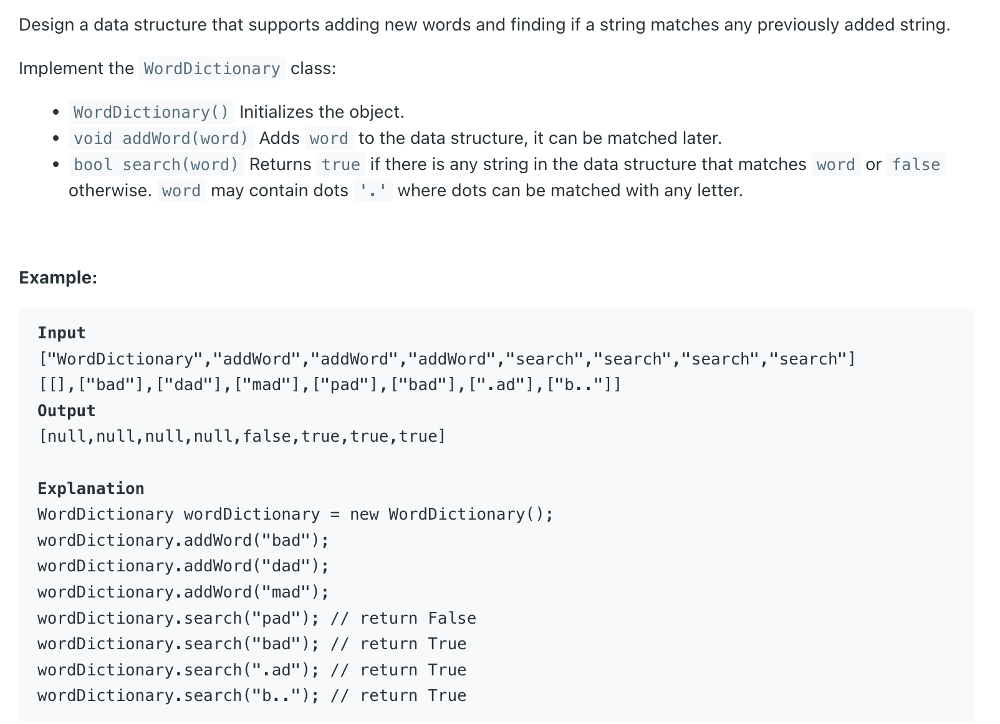

## 211. Design Add and Search Words Data Structure


```java
class WordDictionary {
    TrieNode root;
    class TrieNode {
        boolean isWord;
        TrieNode[] children;

        public TrieNode() {
            isWord = false;
            children = new TrieNode[26];
        }
    }
    public WordDictionary() {
        root = new TrieNode();
    }

    public void addWord(String word) {
        TrieNode cur = root;
        for (char c : word.toCharArray()) {
            if (cur.children[c - 'a'] == null) {
                cur.children[c - 'a'] = new TrieNode();
            }
            cur = cur.children[c - 'a'];
        }
        cur.isWord = true;
    }

    public boolean search(String word) {
        return dfs(word, 0, root);
    }

    private boolean dfs(String word, int index, TrieNode node) {
        if (index == word.length()) {
            return node.isWord;
        }

        char c = word.charAt(index);
        if (c == '.') {
            for (TrieNode tn : node.children) {
                if (tn != null && dfs(word, index + 1, tn)) {
                    return true;
                }
            }
            return false;
        } else {
            TrieNode nextNode = node.children[c - 'a'];
            return nextNode != null && dfs(word, index + 1, nextNode);
        }
    }
}

/**
 * Your WordDictionary object will be instantiated and called as such:
 * WordDictionary obj = new WordDictionary();
 * obj.addWord(word);
 * boolean param_2 = obj.search(word);
 */
```