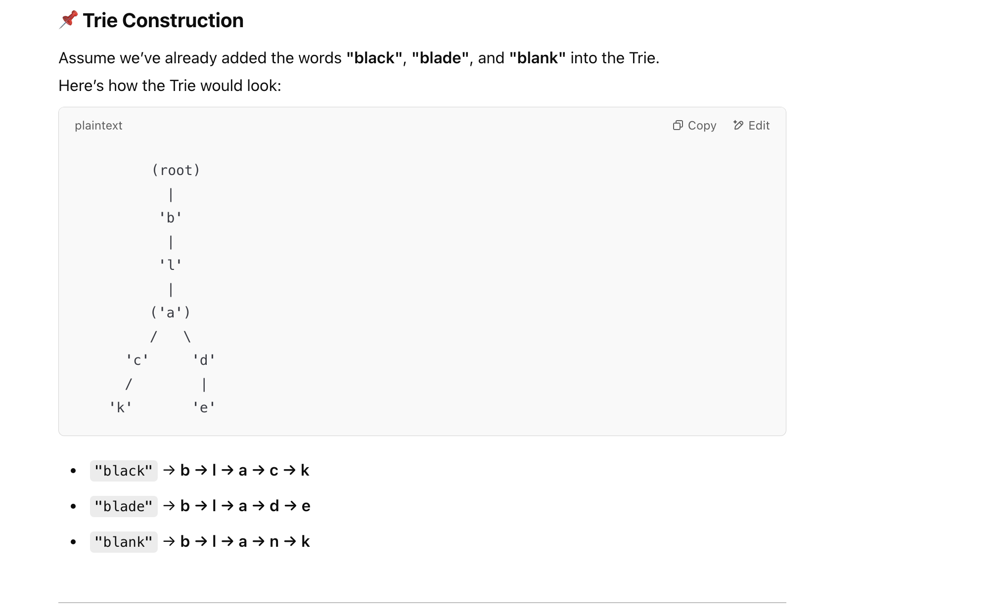
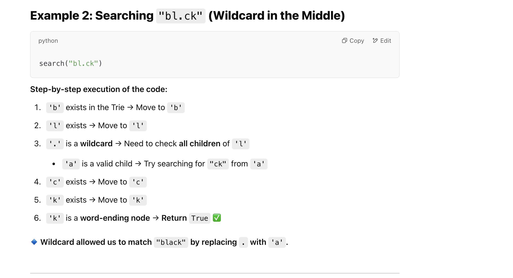

## 211. Design Add and Search Words Data Structure

---



---
```java
class WordDictionary {
    private TrieNode root;
    class TrieNode {
        TrieNode[] children;
        boolean isWord;
        public TrieNode() {
            children = new TrieNode[26];
            isWord = false;
        }
    }
    public WordDictionary() {
        root = new TrieNode();
    }

    public void addWord(String word) {
        TrieNode cur = root;
        for (char c : word.toCharArray()) {
            if (cur.children[c - 'a'] == null) {
                cur.children[c - 'a'] = new TrieNode();
            }
            cur = cur.children[c - 'a'];
        }
        cur.isWord = true;
    }

    public boolean search(String word) {
        return find(word, root, 0);
    }

    private boolean find(String word, TrieNode cur, int index) {
        if (index == word.length()) {
            return cur.isWord;
        }

        char c = word.charAt(index);
        if (c == '.') {
            for (int i = 0; i < 26; i++) {
                if (cur.children[i] != null && find(word, cur.children[i], index + 1)) {
                    return true;
                }
            }
            return false;
        } else {
            return cur.children[c - 'a'] != null && find(word, cur.children[c - 'a'], index + 1);
        }
    }
}

/**
 * Your WordDictionary object will be instantiated and called as such:
 * WordDictionary obj = new WordDictionary();
 * obj.addWord(word);
 * boolean param_2 = obj.search(word);
 */
```
---

#### with hashmap

```py
class TrieNode:
    def __init__(self):
        self.children = {}
        self.isWord = False

class WordDictionary:

    def __init__(self):
        self.root = TrieNode()

    def addWord(self, word: str) -> None:
        cur = self.root
        for c in word:
            if c not in cur.children:
                cur.children[c] = TrieNode()
            cur = cur.children[c]
        cur.isWord = True

    def search(self, word: str) -> bool:
        return self.find(word, self.root, 0)

    def find(self, word: str, cur: TrieNode, index: int) -> bool:
        if index == len(word):
            return cur.isWord

        c = word[index]
        if c == '.':  # If wildcard, check all children
            for child in cur.children.values():
                if self.find(word, child, index + 1):
                    return True
            return False
        else:
            return c in cur.children and self.find(word, cur.children[c], index + 1)
```
---

#### with list:

```py
class TrieNode:
    def __init__(self):
        self.children = [None] * 26
        self.isWord = False

class WordDictionary:

    def __init__(self):
        self.root = TrieNode()

    def addWord(self, word: str) -> None:
        cur = self.root
        for c in word:
            index = ord(c) - ord('a')
            if cur.children[index] is None:
                cur.children[index] = TrieNode()
            cur = cur.children[index]
        cur.isWord = True

    def search(self, word: str) -> bool:
        return self.find(word, self.root, 0)

    def find(self, word: str, cur: TrieNode, index: int) -> bool:
        if index == len(word):
            return cur.isWord

        c = word[index]
        if c == '.':  # If wildcard, check all children
            for child in cur.children:
                if child and self.find(word, child, index + 1):
                    return True
            return False
        else:
            child_index = ord(c) - ord('a')
            return cur.children[child_index] is not None and self.find(word, cur.children[child_index], index + 1)
```