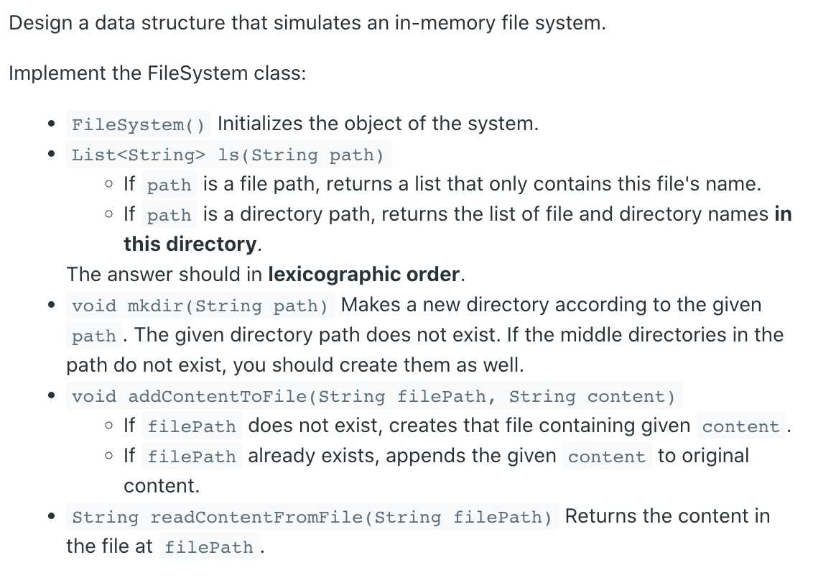
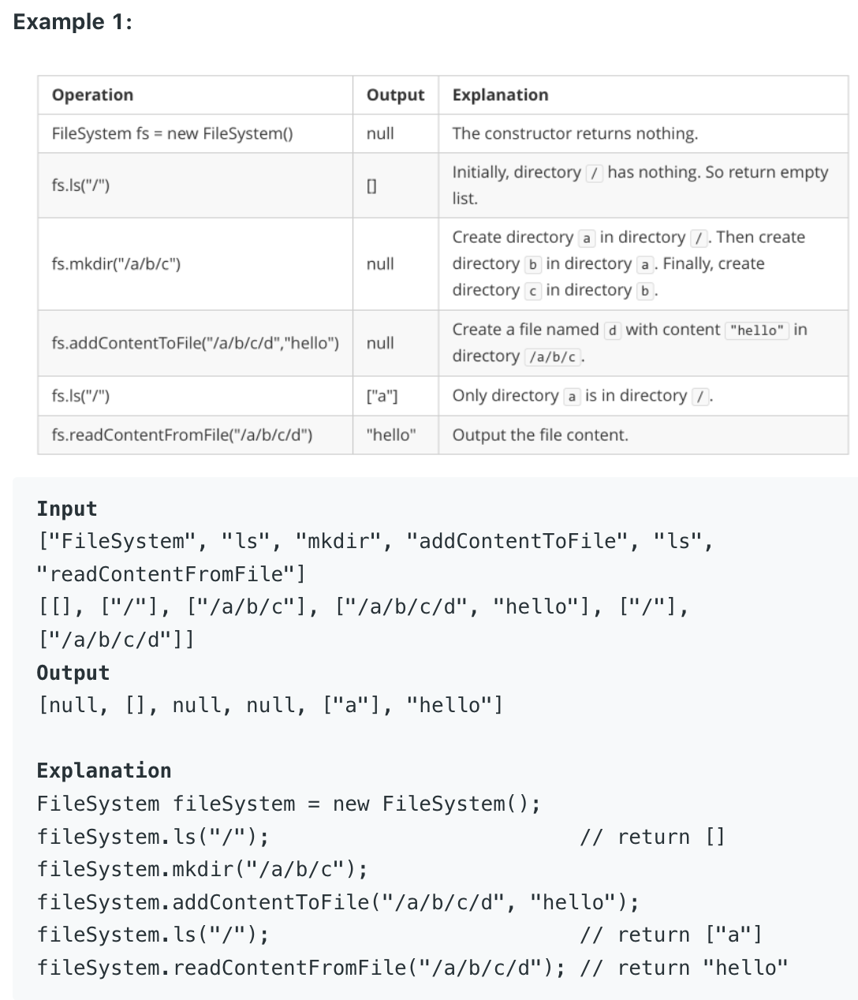

## 588. Design In-Memory File System

- assume `path = /`, 
  - `String[] dirs = path.split("/")`
  - if there is nothing in current path, return null
  - if there is a file, return file's name
  - if there is directories, return directories.
  - that's why 

```java
        String [] dirs = path.split("/");        
        for (String dir : dirs) {
            if (dir.length() == 0) {
                continue;
            }
```



- use `Trie Tree` to implement this:

```java
if (dir.length() == 0) {
    continue;
}

# assume path = "/a/b/c"
String [] dirs = path.split("/");     
/*
    dirs => [, a, b, c]
*/
```

```java
class FileSystem {
    File root;
    
    class File {
        boolean isFile;
        Map<String, File> children;
        String content;
        File () {
            isFile = false;
            children = new HashMap();
            content = "";
        }
    }

    public FileSystem() {
        root = new File();
    }
    
    public List<String> ls(String path) {
        File curFile = root;
        List<String> res = new ArrayList<>();
        String [] dirs = path.split("/");
        String fileName = "";
        for (String dir : dirs) {
            if (dir.length() == 0) {
                continue;
            }
            curFile = curFile.children.get(dir);
            fileName = dir;
        }
        /*
          "/a/b/c/d"    # assume `d` is a file 
           if d.isFile() == true, list.add(d)
        */
        if (curFile.isFile) {
            res.add(fileName);
        } else {
            for (String key : curFile.children.keySet()) {
                res.add(key);
            }
        }
        Collections.sort(res);
        return res;
    }
    
    public void mkdir(String path) {
        File curFile = root;
        String [] dirs = path.split("/");        
        for (String dir : dirs) {
            if (dir.length() == 0) {
                continue;
            }
            if (!curFile.children.containsKey(dir)) {
                File file = new File(); 
                curFile.children.put(dir, file);
            } 
            curFile = curFile.children.get(dir);
        }
    }
    
    public void addContentToFile(String filePath, 
                                    String content) {
        File curFile = root;
        String [] dirs = filePath.split("/");        
        for (String dir : dirs) {
            if (dir.length() == 0) {
                continue;
            }
            if (!curFile.children.containsKey(dir)) {
                File file = new File(); 
                curFile.children.put(dir, file);
            } 
            curFile = curFile.children.get(dir);
        }
        curFile.content += content;
        curFile.isFile = true;
    }
    
    public String readContentFromFile(String filePath){
        File curFile = root;
        String [] dirs = filePath.split("/");        
        for (String dir : dirs) {
            if (dir.length() == 0) {
                continue;
            }
            if (!curFile.children.containsKey(dir)) {
                File file = new File(); 
                curFile.children.put(dir, file);
            } 
            curFile = curFile.children.get(dir);
        }
        return curFile.content;
    }
}
```