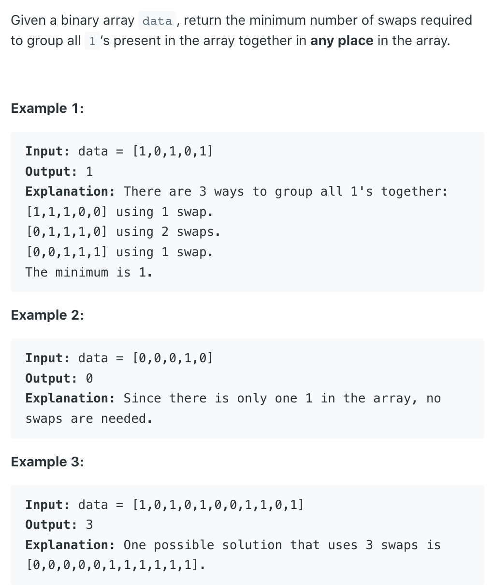
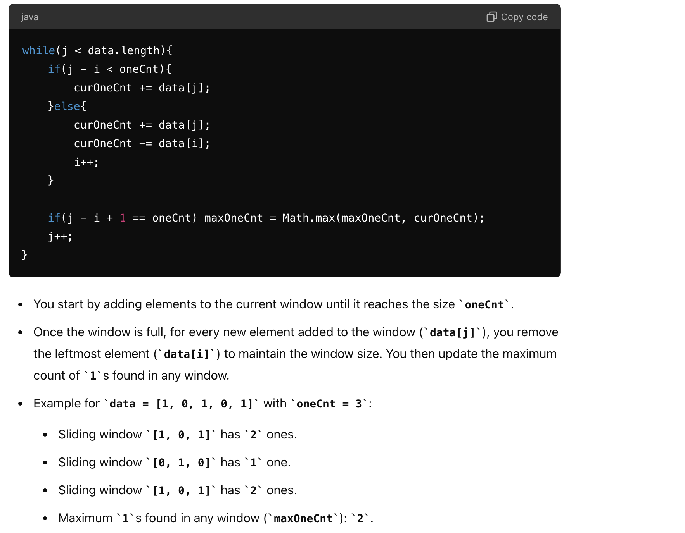

## 1151. Minimum Swaps to Group All 1's Together



```ruby
Firstly, we should count the total number of 1's in the whole array. 
let's call it totalOnes.
[1  0  1  0  1]

The final state of the solution:
         should be a sliding window of array which contains all Ones, 

the sliding window length equals to the totalOnes count.

final state would be frontZeros + 1,1,1 + endZeros

The possible sliding window of totalOnes length would be:
[1  0  1  0  1]
 1  0  1
    0  1  0
       1  0  1


So we need to maintain a sliding window size of totalOnes, and check every possible of it, 

find out the max sliding window contains the mosts ones. 
        The sliding window with max ones would be 1,0,1, 


while(i < arr.length && j <= arr.length)
Total Ones: 3

            0   1   2   3   4
           [1   0   1   0   1]        
                i
                                    j

ones:       1   1   2   1   2   2
maxOnes     0   0   0   2   2   2

Math.max(ones, maxOnes)
```




---
```java
class _1151_MinimumSwapsToGroupAll_ones_Together {
    public int minSwaps(int[] data) {
        if (data.length < 3) {
            return 0;
        }

        // count the total number of 1
        int oneCnt = 0;
        for (int num : data) {
            oneCnt += num;
        }
        int maxOneCnt = 0;
        int curOneCnt = 0;
        int slow = 0, fast = 0;
        while (fast < data.length) {
            // check sliding window size
            // before adding fast, i.e. if the existing number of elements is samller than oneCnt
            if (fast - slow < oneCnt) {
                curOneCnt += data[fast];
            } else {
                // add data[fast], remove data[left]
                curOneCnt += data[fast];
                curOneCnt -= data[slow];
                slow++;
            }

            // if the sliding window is full, update maxOneCnt
            if (fast - slow + 1 == oneCnt) {
                maxOneCnt = Math.max(maxOneCnt, curOneCnt);
            }
            fast++;
        }
        return oneCnt - maxOneCnt;
    }
}
```
---

#### Python

```py
class Solution:
    def minSwaps(self, data: List[int]) -> int:
        if len(data) < 3:
            return 0

        # count the total number of 1
        oneCnt = 0
        for num in data:
            oneCnt += num

        maxOneCnt, curOneCnt = 0, 0
        left, right = 0, 0
        while right < len(data):
            if right - left < oneCnt:
                curOneCnt += data[right]
            else:
                curOneCnt += data[right]
                curOneCnt -= data[left]
                left += 1

            if right - left + 1 == oneCnt:
                maxOneCnt = max(maxOneCnt, curOneCnt)

            right += 1


        return oneCnt - maxOneCnt
```
