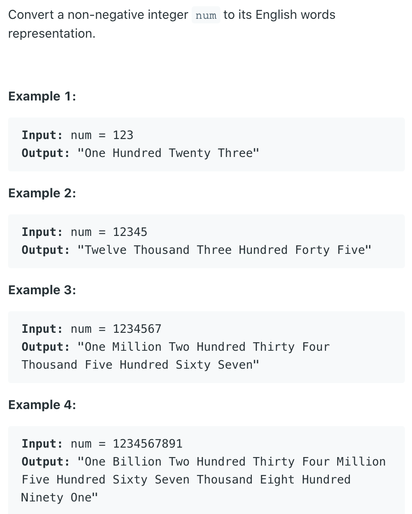

## 273. Integer to English Words


- 1. 先把数字以3个为一个单位分成若干小组
  - 123，456，789，012，345 => 1000

- 2. 在每个小组里单独处理三位数
  - 1) special case: 0 ... 19
  - 2) general double digit: (20 - 99)
  - 3) 3-digit number: (百位以上的数 + 后面两位)
    - 345 => 3 + "Hundred" + 4 + 5
    - 10...12, 13 ... 19
    - 0 - 9


```java
class Solution {
  private final String[] THOUSANDS = {"", "Thousand", "Million", 
    "Billion"};
    
  private final String[] LESS_THAN_TWENTY = {"", "One", "Two", 
    "Three", "Four", "Five", "Six", "Seven", "Eight", "Nine", 
    "Ten", "Eleven", "Twelve", "Thirteen","Fourteen", "Fifteen", 
    "Sixteen", "Seventeen", "Eighteen", "Nineteen"};
    
  private final String[] TENS = {"", "", "Twenty", "Thirty", 
    "Forty", "Fifty","Sixty", "Seventy", "Eighty", "Ninety"};  
  
  public String numberToWords(int num) {
    if (num == 0) {
      return "Zero";
    }
    
    String res = "";
    int i = 0;
    while (num > 0) {
      if (num % 1000 != 0) {
        res = helper(num % 1000) + THOUSANDS[i] + " " + res;
      }
      i++;
      num /= 1000;
    }
    return res.trim();
  }
  
  private String helper(int n) {
    if (n == 0) {
      return "";
    } else if (n < 20) {//1-19
      return LESS_THAN_TWENTY[n] + " ";
    } else if (n < 100) {//20-99
      return TENS[n / 10] + " " + helper(n % 10);
    } else {//100-999
      return LESS_THAN_TWENTY[n/100]+" Hundred "+ helper(n % 100);
    }
  }
}
```