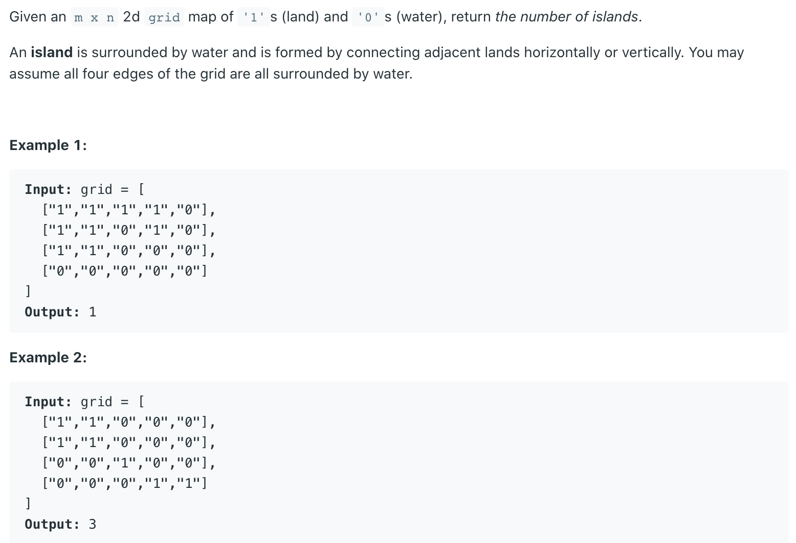
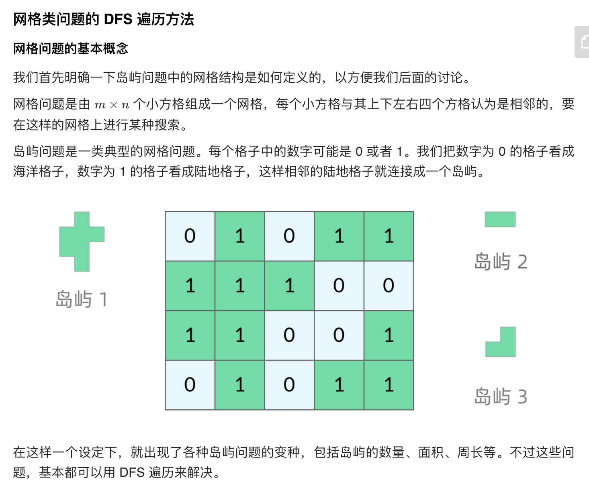
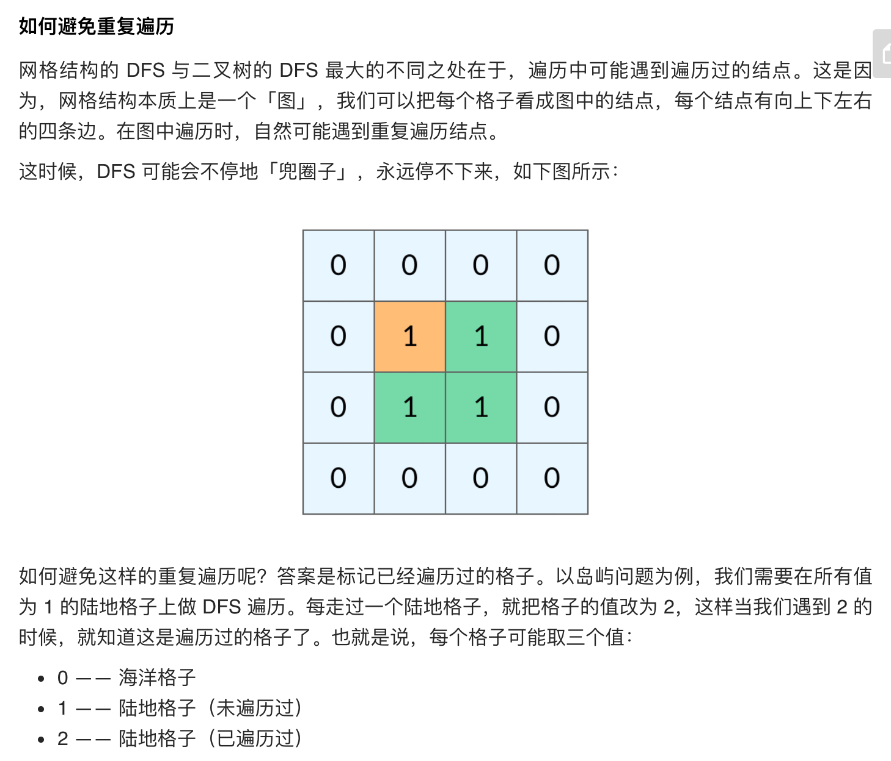

## 200. Number of Islands






- 走过的我们设置为0

```java
class Solution {
    public int numIslands(char[][] grid) {
        int m = grid.length;
        int n = grid[0].length;
        int count = 0;
        for (int i = 0; i < m; i++){
            for (int j = 0; j < n; j++){
                if(grid[i][j] == '1'){
                    dfs(grid, i, j);
                    count++;
                }
            }
        }
        return count;
    }
    
    private void dfs(char[][]grid, int i, int j){
        if (i < 0 || j < 0 || i >= grid.length || j >= grid[0].length || grid[i][j] == '0'){
            return;
        }
        
        grid[i][j] = '0';
        dfs(grid, i + 1, j);
        dfs(grid, i - 1, j);
        dfs(grid, i, j + 1);
        dfs(grid, i, j - 1);
    }
}
```


