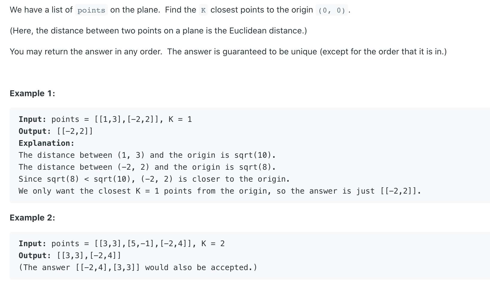
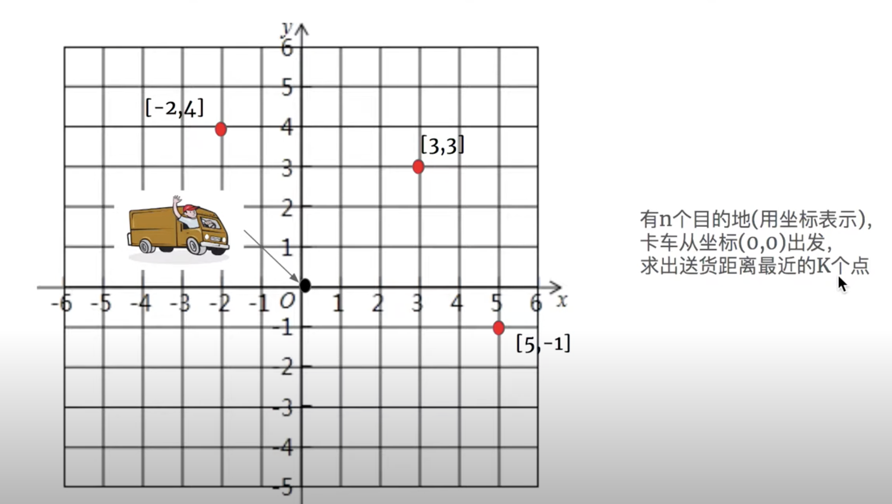
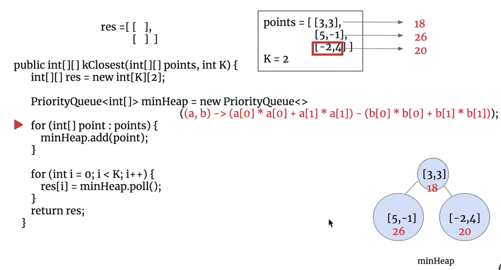
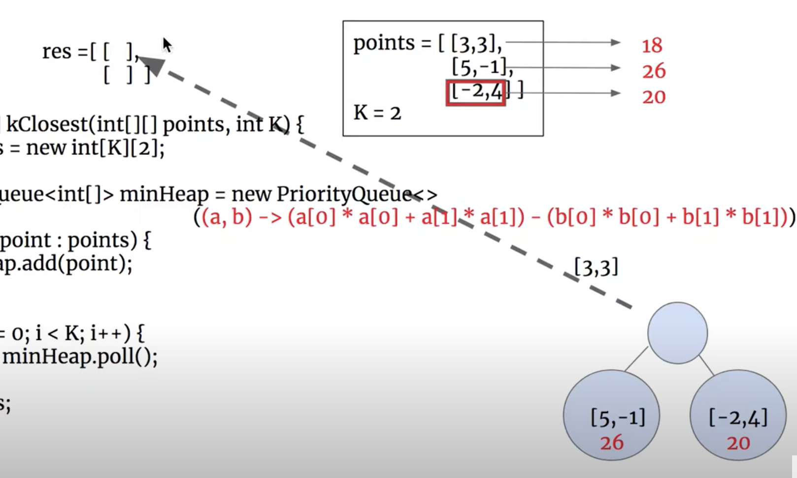

##


---







- 上图，我们把 最小值，pop() 出来，存到reseult 里面去，然后minHeap 会帮我们重新排列

```java
class Solution {
    public int[][] kClosest(int[][] points, int K) {
        int [][] res = new int[K][2];
        PriorityQueue<int[]> minHeap = new PriorityQueue<>(
            (a, b) -> 
                (a[0] * a[0] + a[1] * a[1]) - (b[0] * b[0] + b[1] * b[1])
        );
        
        for (int[] point : points) {
            minHeap.add(point);
        }
        
        for (int i = 0; i < K; i++){
            res[i] = minHeap.poll();
        }
        return res;
    }
}
```


