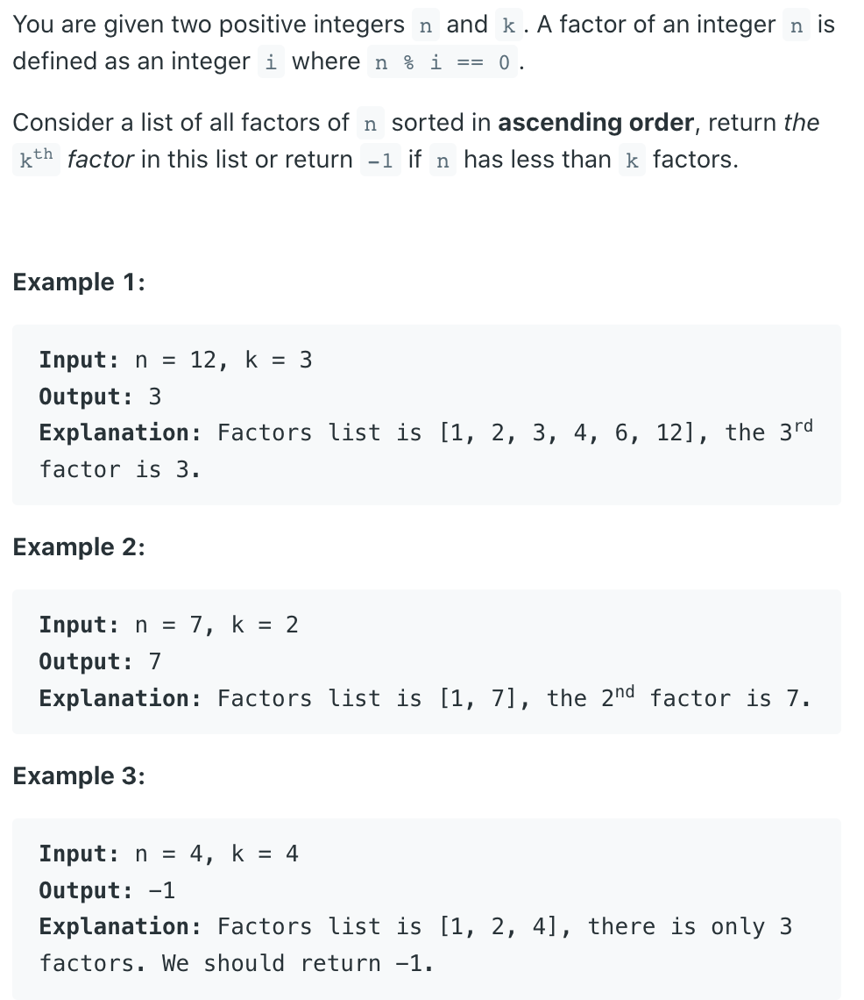
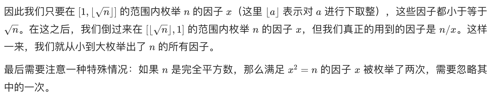

## 1492. The kth Factor of n




- brute force:

```ruby
We can enumerate all numbers in the range [1, n] from small to large,
 and determine whether they are factors of nn.
```

```java
class Solution {
    public int kthFactor(int n, int k) {
        int count = 0;
        for (int i = 1; i <= n; i++) {
            if (n % i == 0) {
                count++;
            }           
            if (count == k) {
                return i;
            }
        }
        return -1;
    }
}
```
---

- optimize:

```ruby
If n=1000, then starting at 501 and ending at 999, 
none of these numbers are factors of n, 
but we have to enumerate all of these numbers.

It can be found that if n has a factor k, then it must have a factor n/k, 
and at least one of these two factors is less than or equal to sqrt(n)

example: 18
[1   2   3   6   9   18]

sqrt(18) = 4.2
since (factor = 4) <= 4.2, 
            4++; # 5
    so factor--

if example: 16
[1  2  4  8  16]
since (factor = 4) <= 4, 
            4++; # 5
    so factor--

but we don't need to calculate (factor = 4) twice,
    so factor-- 
```




```java
class Solution {
    public int kthFactor(int n, int k) {
        int factor, count = 0;
        for (factor = 1; factor * factor <= n; factor++) {
            if (n % factor == 0) {
                count++;
            }
            if (count == k) {
                return factor;
            }
        }
        factor--;
        if (factor * factor == n) {
            factor--;
        }
        for (; factor > 0; factor--) {
            if (n % factor == 0) {
                count++;
            }
            if (count == k) {
                return n / factor;
            }
        }
        return -1;
    }
}
```
