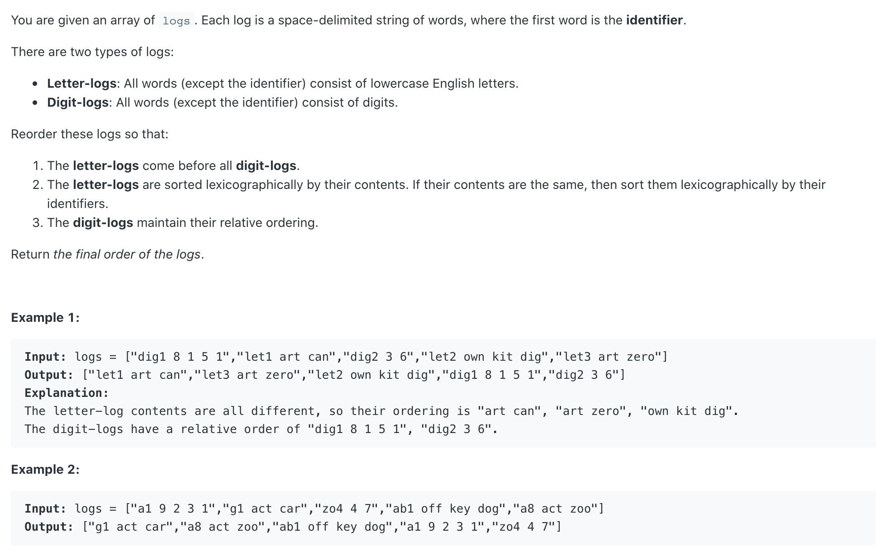
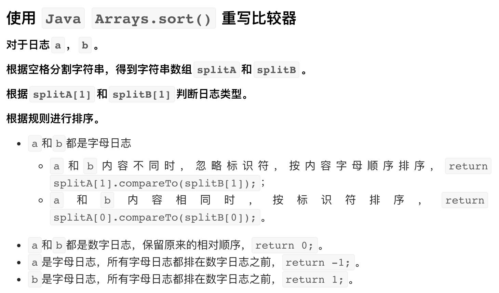

## 937. Reorder Data in Log Files





```java
class Solution {
    public String[] reorderLogFiles(String[] logs) {
      if (logs == null || logs.length == 0) {
        return null;
      }
      Arrays.sort(logs, (a, b)-> {
   //split strings，split(String regex, int limit)，limit表示分割的份数。
        String[] splitStrA = a.split(" ", 2);
        String[] splitStrB = b.split(" ", 2);        
        //determine the type of log: string or digit
        boolean aIsDigit = Character.isDigit(splitStrA[1].charAt(0));
        boolean bIsDigit = Character.isDigit(splitStrB[1].charAt(0)); 
        // if a and b aren't digits
        if (!aIsDigit && !bIsDigit) {
          //while the content are same, sort by identifier
          if (splitStrA[1].equals(splitStrB[1])) {
            return splitStrA[0].compareTo(splitStrB[0]);
          } else {
            //while the content are different, sort by content
            return splitStrA[1].compareTo(splitStrB[1]);
          }
        }
        else if (aIsDigit && bIsDigit) {
          //a and b are both digit, keep relative ordering
          return 0;
        } else if (!aIsDigit) {
          //when a is letter log, letter is first
          return -1;
        } else {
          //when b is letter log, letter is first
          return 1;
        }
      });
      
      return logs;
    }
}
```

-----

### split(reg, int)


```java
public class split {
    public static void main(String[] args) {
        String [] str = {"dig1 8 1 5 1","let1 art can","dig2 3 6","let2 own kit dig","let3 art zero"};
        String [] temp = str[0].split(" ", 2);
        String part1 = temp[0];
        String part2 = temp[1];
        System.out.println(part1); // dig1
        System.out.println(part2); // 8 1 5 1

        boolean isDigit1 = Character.isDigit(part2.charAt(0)); // true
        System.out.println(isDigit1);
    }
}
```