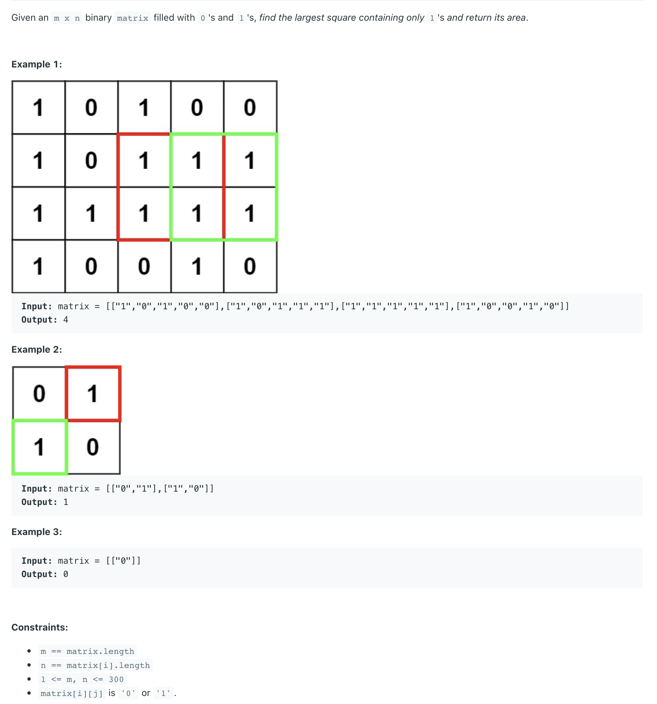

## 221. Maximal Square




```ruby
Example:

Input: 

1 0 1 0 0
1 0 1 1 1
1 1 1 1 1
1 0 0 1 0

Output: 4
```

## Analysis:

- How many `rectangles` are  there in an n x n matrix?
  -       $$cn^2 * cn^2 = n^4$$
- How many `squares` are  there in an n x n matrix?
  -       $$cn^2 * n = n^3$$
  
- M0 : Primitive way
  - Time = O(n^3 * n^2) = O(N^5)

```ruby
0   0   0   0   0

1   1   1   1   0

1   1   1   1   0

1   1   1   0   0

1   1   1   0   0


M1 use DP
size = 1
1


size = 2

1 1
1 1     -> 2 * 2


size = 3

1   1   1

1   1   1

1   1   1 [i][j]        3 * 3


size = 4

1   1   1   1

1   1   1   1

1   1   1   1 [i][j]        4 * 4


M[i][j] 

x   x   x   x

x   x   x   x

x   x   x   x

x   x   x   X = min(左上角，左边，上边) + 1


M[i][j] represents the max size of square with(i, j) as the bottom right corner.

if(A[i][j] == 0)         M[i][j] = 0
otherwise               min(M(i - 1)(j - 1), M[i - 1][j], M[i][j - 1] + 1


0   0   0   0   0

1   1   1   1   0

1   1   1   1   0

1   1   1   0   0

1   1   1   0   0


M[i][j] = 
0   0   0   0   0

1   1   1   1   0

1   2   2   2   0

1   2   3   0   0

1   2   3   0   0

return global max = 3
```

- $$Time = O(n^2)$$
- $$Space = O(n^2) -> optimized to O(n)$$

---

```java
class Solution {
    public int maximalSquare(char[][] matrix) {
        if(matrix == null || matrix.length == 0){
            return 0;
        }
        //之所new int[matrix.length + 1][matrix[0].length + 1], 
        //是因为当你向左上角看的时候, matrix[i-1][j-1] == '1' => 如果条件长度不加1， 
        //就变成了 第一个index是0的时候 0 - 1 = -1
        int[][] dp = new int[matrix.length + 1][matrix[0].length + 1];
        int result = 0;
        for(int i = 1; i<=matrix.length; i++){
            for(int j = 1; j <= matrix[0].length; j++){
                if(matrix[i-1][j-1] == '1'){ 
                //本题精髓是，我们不需要对左上角不是1(是0)的情况下，进行操作
                //换句话说，我们只需要对 左上角 == 1 的情况 进行下一步拆解
                    dp[i][j] = Math.min(dp[i-1][j]+1, dp[i-1][j-1]+1);
                    dp[i][j] = Math.min(dp[i][j-1] + 1, dp[i][j]);
                    result = Math.max(result, dp[i][j]);
                    //这里是精髓所在： 可以发现 左上角，左边，上面 的size一样的情况下，
                    //才可以math induction
                    //if current size is 3, left top == top == left == 2 
                }
            }
        }
        return result * result;
    }
}
```


