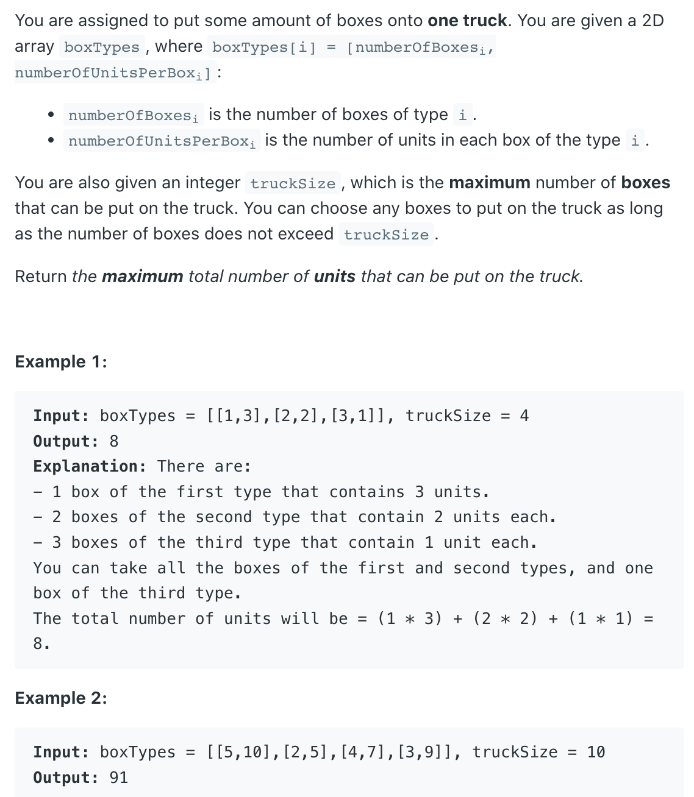

## 1710. Maximum Units on a Truck



- Greedy Algorithm
- Time: O(nlogn), space: O(n) 

- we're sorting our array boxTypes based on descending values of `column 1`

```ruby
Let boxTypes be
[[1,  4],
 [22, 9],  
 [13, 2],
 [9,  1]]
Then After sorting
[[22, 9],
 [1,  4]
 [13, 2], 
 [9,  1]]
```

- Note: It's always better to use `Integer.compare(b[1], a[1])` 
  instead of `b[1] - a[1]` cause **latter** might overflow.

```java
class Solution {
    public int maximumUnits(int[][] boxTypes, int truckSize) {
        if (boxTypes == null || boxTypes.length == 0) {
            return 0;
        }
        Arrays.sort(boxTypes, (a, b) -> (b[1] - a[1]));
        int res = 0;
        for (int [] boxType : boxTypes) {
            if (boxType[0] <= truckSize) {
                res += boxType[0] * boxType[1];
                truckSize -= boxType[0];
            } else {
                res += truckSize * boxType[1];
                return res;
            }
        }
        return res;
    }
}
```