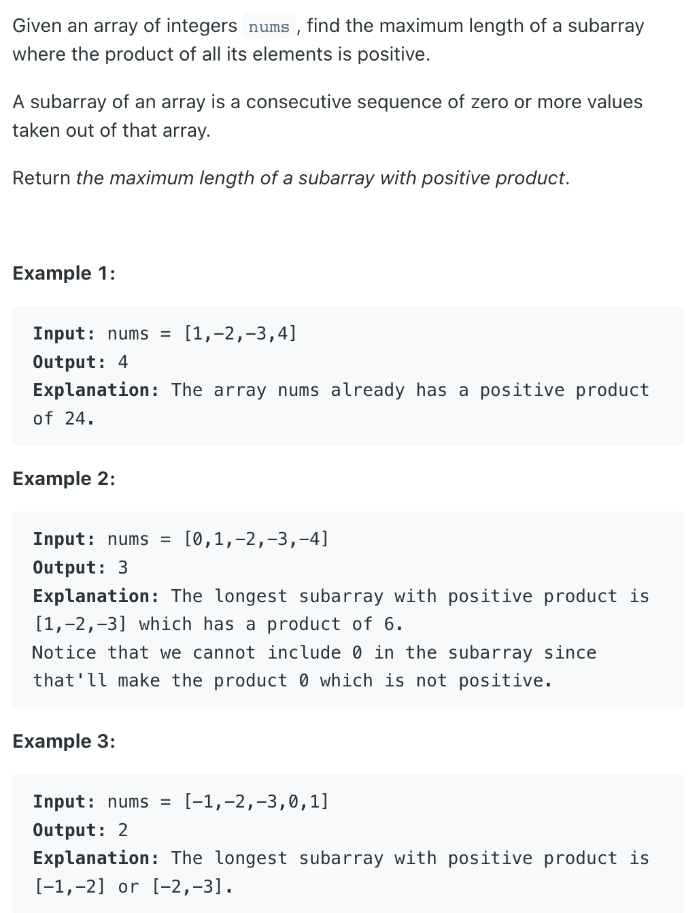
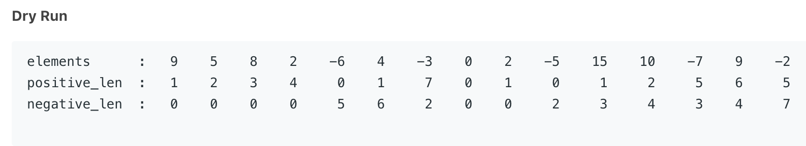

## 1567. Maximum Length of Subarray With Positive Product



- **Intuition**
  At every iteration, tracking maximum length of positive multiplicative result and 
  negative multiplicative result can help.
  Multiplicative Result : result(+ve/-ve) of multiplication of bunch of numbers(some 
  of which can be +ve/-ve)

- **Algorithm**
  - 1. If we see a 0, we gotta start off things again
  - 2. If we see a positive number :
    - 2.1. Increase length of positive mutilpicative result till now.
    - 2.2. Increase length of negative mutilpicative result till now, 
      unless we had not encountered any negative before.
  - 3. If we see a negative number:
    - 3.1. It's time to swap positive and negative multiplicative results' lengths 
      and do similar task as we did in above case.  
  - 4. In each iteration, use the length of positive mutilpicative result 
    to compute answer.



- Answer : Max(all these positive_len values) => 7

```java
class Solution {
    public int getMaxLen(int[] nums) {
        if (nums == null || nums.length == 0) {
            return 0;
        }
        int positive = 0, negative = 0;
        int res = Integer.MIN_VALUE;
        for (int num : nums) {
            if (num == 0) {
                positive = 0;
                negative = 0;
            } else if (num > 0) {
                positive++;
                negative = negative == 0 ? 0 : negative+1;
            } else {
                int temp = positive;
                positive = negative == 0 ? 0 : negative+1;
                negative = temp+1;
            }
            res = Math.max(res, positive);
        }
        return res;
    }
}
```


- [152. Maximum Product Subarray](https://novemberfall.github.io/LeetCode-NoteBook/#/m9/subArrProduct)