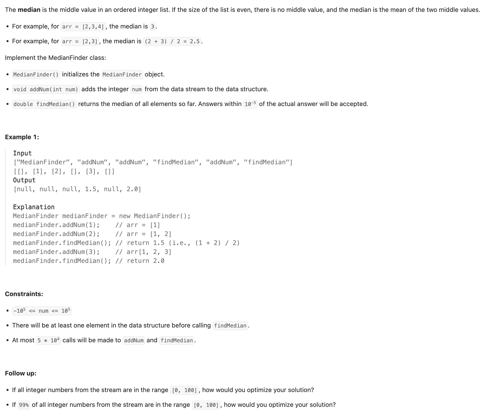
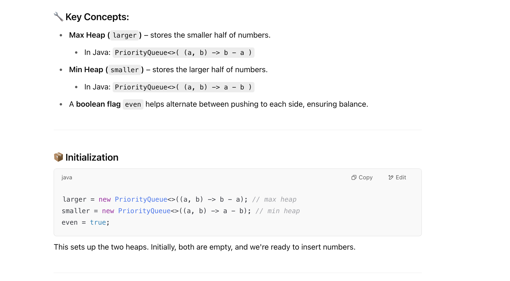
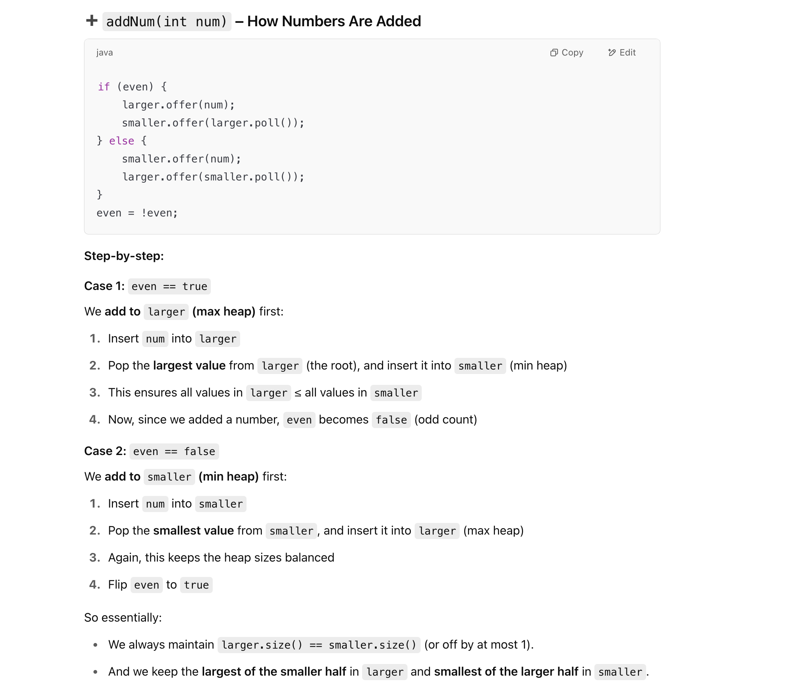

## 295. Find Median from Data Stream

---

- [Java/Python two heap solution, O(log n) add, O(1) find](https://leetcode.com/problems/find-median-from-data-stream/solutions/74047/java-python-two-heap-solution-o-log-n-add-o-1-find/?envType=company&envId=tiktok&favoriteSlug=tiktok-three-months)

- Time: `addNum: O(logN)`, N: the numbers of added interges.  `findMedian: O(1)`
- Space: `O(N)`
---

```java
class MedianFinder {
    private PriorityQueue<Integer> larger;
    private PriorityQueue<Integer> smaller;
    private boolean even = true;

    public MedianFinder() {
        larger = new PriorityQueue<>((a, b) -> b - a);
        smaller = new PriorityQueue<>((a, b) -> a - b);
    }

    public void addNum(int num) {
        if (even) {
            larger.offer(num);
            smaller.offer(larger.poll());
        } else {
            smaller.offer(num);
            larger.offer(smaller.poll());
        }
        even = !even;
    }

    public double findMedian() {
        if (even) {
            return (smaller.peek() + larger.peek()) / 2.0;
        } else {
            return smaller.peek();
        }
    }
}

/**
 * Your MedianFinder object will be instantiated and called as such:
 * MedianFinder obj = new MedianFinder();
 * obj.addNum(num);
 * double param_2 = obj.findMedian();
 */
```



---

```ruby 
       -------------------------------------------------------------
       |        Smaller Half         |       Larger Half           |
       -------------------------------------------------------------
       | Stored in Max-Heap  larger  | Stored in Min-Heap  smaller |
       -------------------------------------------------------------

           Max-Heap (`larger`)          Min-Heap (`smaller`)
      (Stores numbers from the      (Stores numbers from the
            smaller  half)               larger  half)

           peek() -> MaxVal             MinVal <- peek()
           /       \                   /       \
          /_________\                 /_________\
         | All nums  |               | All nums  |
         | <= MaxVal |               | >= MinVal |
         -------------               -------------
               |                           |
               +---------------------------+
                       Always true:
                      MaxVal <= MinVal
```
---

```py
import heapq


class MedianFinder:

    def __init__(self):
        self.larger = []
        self.smaller = []
        self.even = True

    def addNum(self, num: int) -> None:
        if self.even:
            heapq.heappush(self.larger, -num)  # Use negative for max-heap
            top_of_larger = -heapq.heappop(self.larger)
            heapq.heappush(self.smaller, top_of_larger)
        else:
            heapq.heappush(self.smaller, num)
            top_of_smaller = -heapq.heappop(self.smaller)
            heapq.heappush(self.larger, top_of_smaller)
        self.even = not self.even

    def findMedian(self) -> float:
        if self.even:
            return (self.smaller[0] - self.larger[0]) / 2
        else:
            return self.smaller[0]

# Your MedianFinder object will be instantiated and called as such:
# obj = MedianFinder()
# obj.addNum(num)
# param_2 = obj.findMedian()
```

