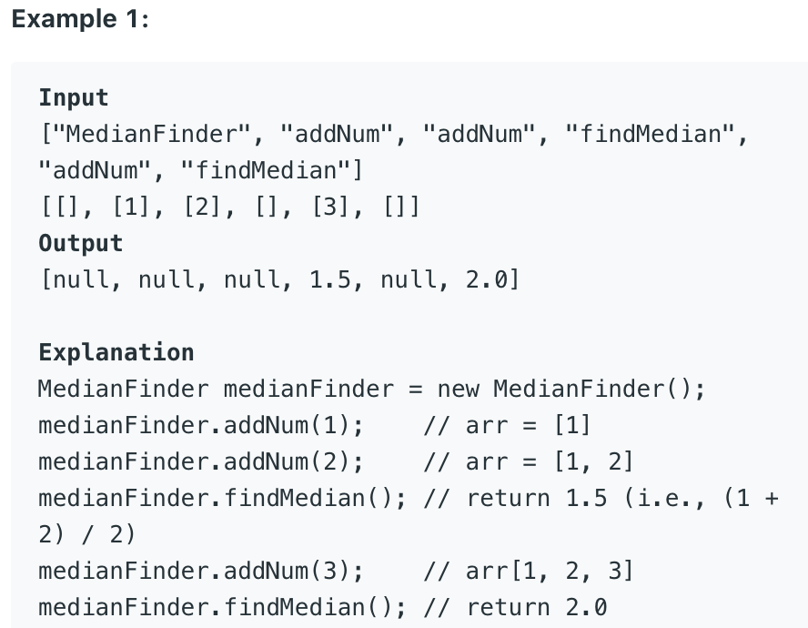
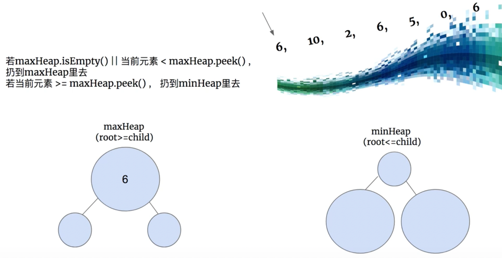
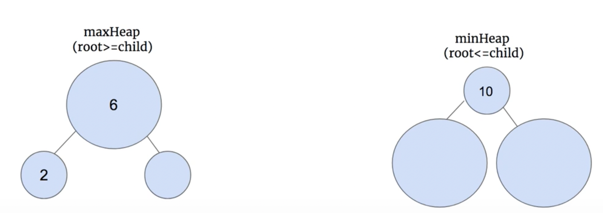
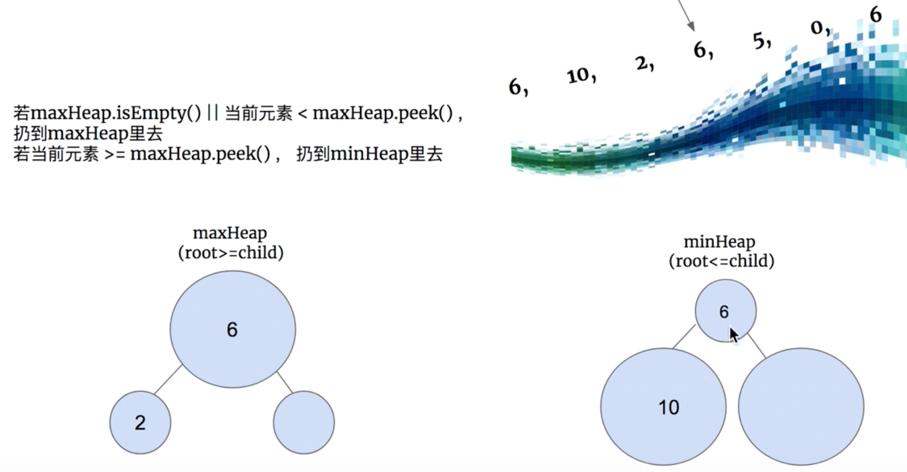
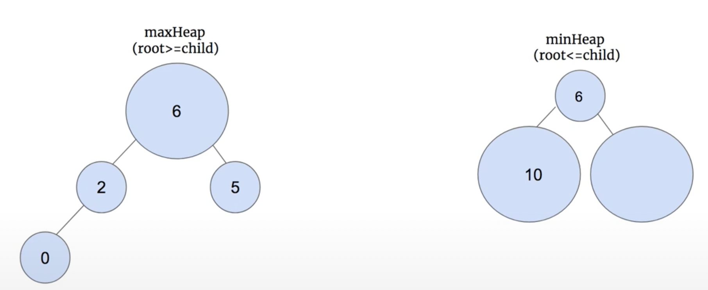
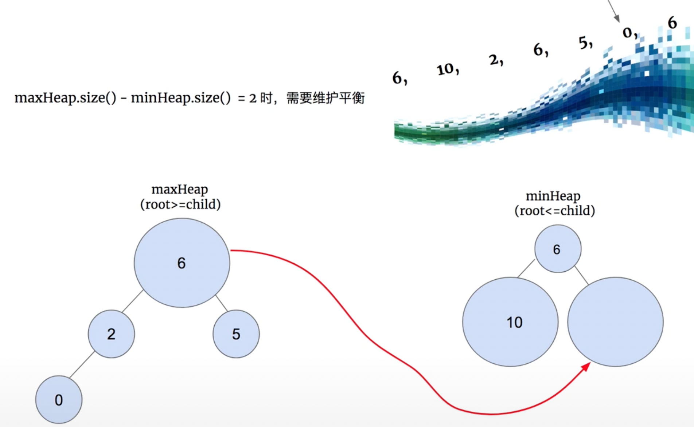
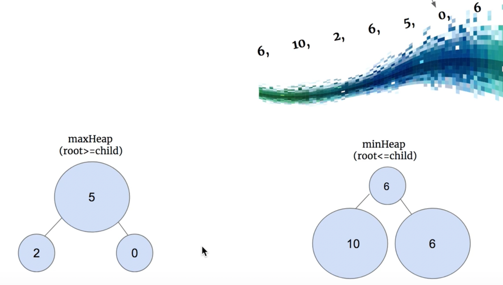
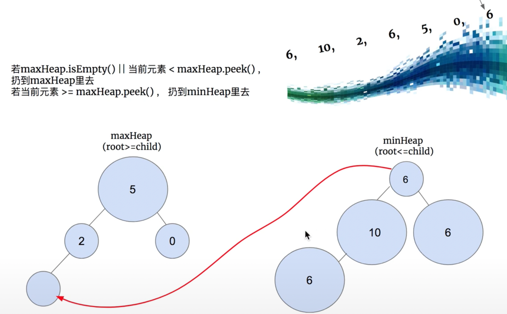
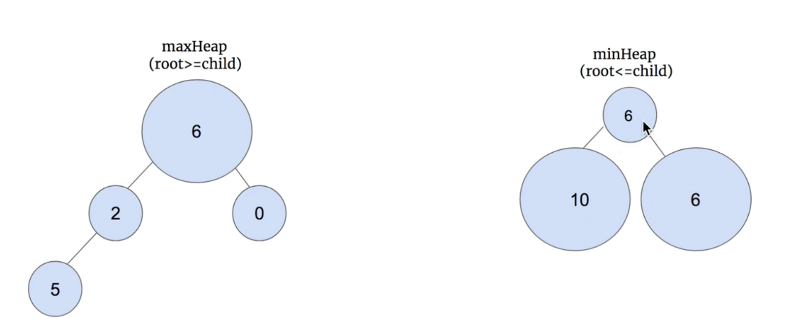

## 295. Find Median from Data Stream

- The **median** is the middle value in an ordered integer list. If the size of 
  the list is even, there is no middle value and the median is the mean of the two 
  middle values.
  - For example, for `arr = [2,3,4]`, the median is `3`.
  - For example, for `arr = [2,3]`, the median is `(2 + 3) / 2 = 2.5`.
- Implement the MedianFinder class:
  - `MedianFinder()` initializes the `MedianFinder object`.
  - `void addNum(int num)` adds the integer `num` from the data stream to the data 
    structure.
  - `double findMedian()` returns the median of all elements so far. 


- First of all, we can not call `arrays.sort(arr)`, since the length of this array
  may be more than one billion!


---

---

---

- Note: we want to maintain the **maxHeap.size() + 1 = minHeap.size()**
  - => When `maxHeap.size() - minHeap.size() = 2`, we need to:


---

---


- Time: `addNum: O(logN)`, N: the numbers of added interges.  `findMedian: O(1)`
- Space: `O(N)`
---

```java
class MedianFinder {
    private PriorityQueue<Integer> maxHeap;
    private PriorityQueue<Integer> minHeap;

    public MedianFinder() {
        maxHeap = new PriorityQueue<>(new Comparator<Integer>() {
            @Override 
            public int compare(Integer e1, Integer e2) {
                if (e1 == e2) {
                    return 0;
                }
                return e1 < e2 ? 1 : -1;
            }
        });

        minHeap = new PriorityQueue<>(new Comparator<Integer>() {
            @Override 
            public int compare(Integer e1, Integer e2) {
                if (e1 == e2) {
                    return 0;
                }
                return e1 < e2 ? -1 : 1;
            }
        });            
    }
    
    public void addNum(int num) {
        if (maxHeap.isEmpty() || num < maxHeap.peek()) {
            maxHeap.offer(num);
        } else {
            minHeap.offer(num);
        }
        if (maxHeap.size() == (minHeap.size() + 2)) {
            minHeap.offer(maxHeap.poll());
        }
        if (minHeap.size() == (maxHeap.size() + 1)) {
            maxHeap.offer(minHeap.poll());
        }        
    }
    
    public double findMedian() {
        if (maxHeap.size() == minHeap.size()) {
            return (maxHeap.peek() + minHeap.peek()) / 2.0;
        } else {
            return maxHeap.peek();            
        }
    }
}

/**
 * Your MedianFinder object will be instantiated and called as such:
 * MedianFinder obj = new MedianFinder();
 * obj.addNum(num);
 * double param_2 = obj.findMedian();
 */
```