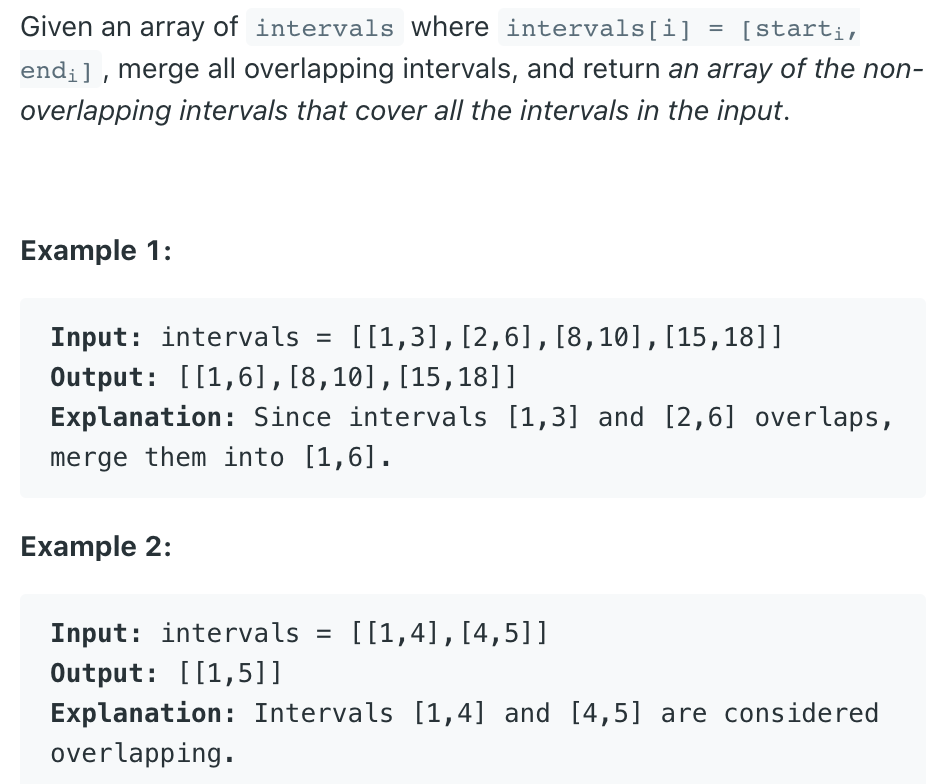
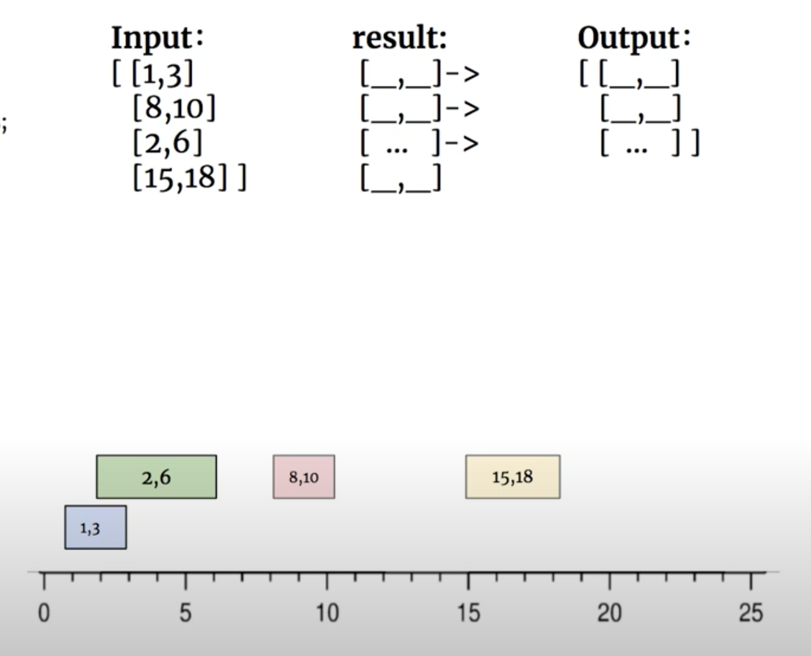
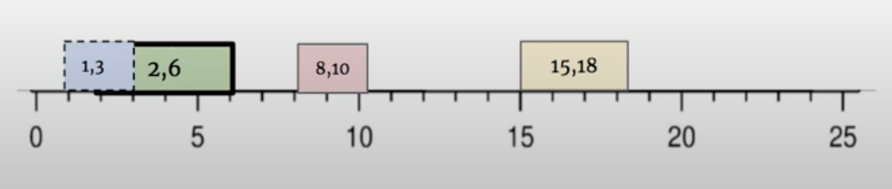
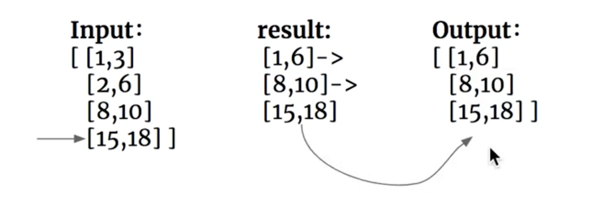

## 56. Merge Intervals








```ruby


special case:


         [3 4]
         ----
   [1             6]         
   ----------------
-------------------------------------------->
   1  2  3  4  5  6

[1, 6] merge [3, 4]   
```


- T = O(N*logN)
- extra space = O(n), 由于多开一个List, 所以额外空间复杂度是 o(N)

- 每一个数组的区间长度一定是`2`

```java
class Solution {
    public int[][] merge(int[][] intervals) {
        if (intervals == null || intervals.length == 0) 
            return null;
        
        List<int[]> res = new ArrayList<>();
        Arrays.sort(intervals, (int[]a, int[]b) -> 
           (a[0] - b[0])
        );
        res.add(intervals[0]);
        
        for (int i = 1; i < intervals.length; i++) {
            int[] lastArr = res.get(res.size() - 1);
            if (lastArr[1] >= intervals[i][0]) {
                lastArr[1] = Math.max(lastArr[1], intervals[i][1]);
            } else {
                res.add(intervals[i]);
            }
        }
        return res.toArray(new int[res.size()][2]);
    }
}
```

