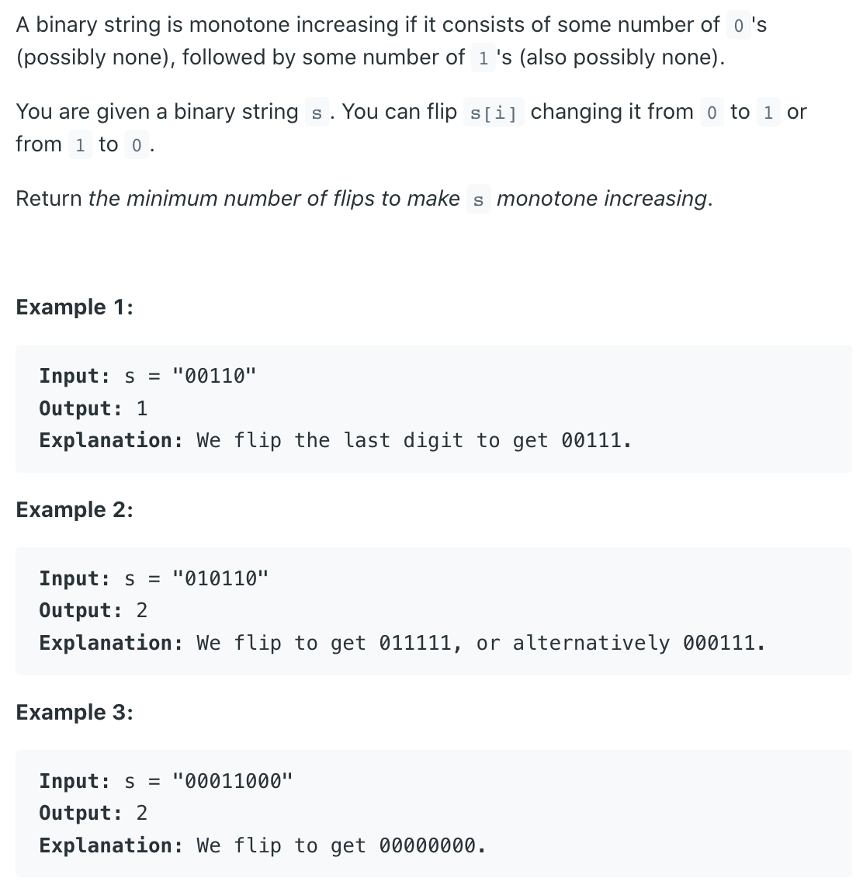

## 	926	Flip String to Monotone Increasing



---

- Eample: Input: s = "00110" two ways can solve this problem, 
  
firs way

| 0 | 0 | 1 | 1 | 0 |
|---|---|---|---|---|

flip 1 times to convert 0 to 1

| 0 | 0 | 1 | 1 | 1 |
|---|---|---|---|---|

second way

| 0 | 0 | 1 | 1 | 0 |
|---|---|---|---|---|

flip 2 times to convert 1 to 0

| 0 | 0 | 0 | 0 | 0 |
|---|---|---|---|---|

take res = Min(1, 2) = 1

finally, they become Monotone Increasing
---

```java
class Solution {
    public int minFlipsMonoIncr(String s) {
        if (s == null || s.length() == 0) {
            return 0;
        }
        int zeroToOnes = 0, oneCount = 0;
        int i = 0;
        while (i < s.length() && s.charAt(i) == '0') {
            i++;
        }
        
        while (i < s.length()) {
            if (s.charAt(i) == '1') {
                oneCount++;
            } else {
                zeroToOnes++;
            }
            if (zeroToOnes > oneCount) {
                zeroToOnes = oneCount;
            }
            i++;
        }
        return zeroToOnes;
    }
}
```