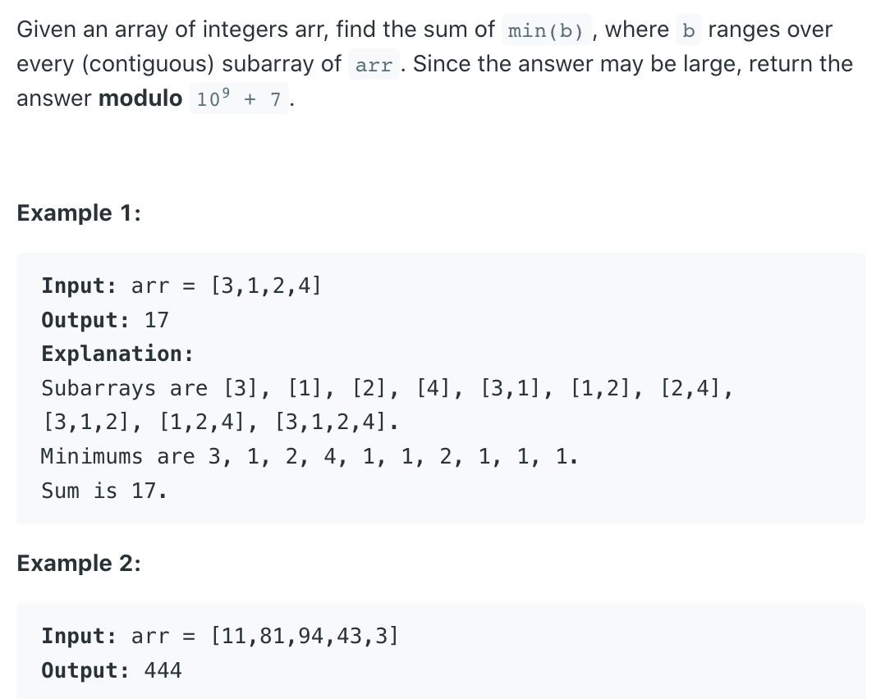
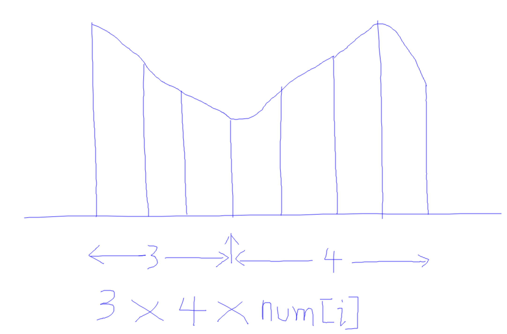
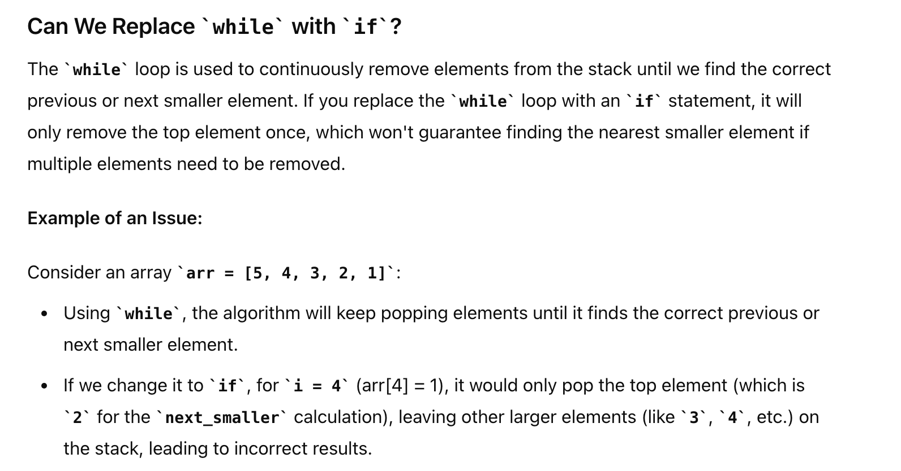

## 907. Sum of Subarray Minimums



---

- [youtube](https://leetcode.com/problems/sum-of-subarray-minimums/discuss/4595335/Beats-100-C%2B%2BJavaPythonJS-Explained-with-Video-Monotonic-Stack)

---
```ruby
        [2, 9, 7, 8, 3, 4, 6, 1]
                     |
the previous less       the next less 
element of 3          element of 3

After finding both NLE and PLE of 3, we can determine the
distance between 3 and 2(previous less) , 
and the distance between 3 and 1(next less).
In this example, the distance is 4 and 3 respectively.
```

---

```ruby
X   0   [3   2   4   5]   1   X   X
             ^
      2 * 3 = 6, # 2 -> 3 , distance = 2
                 # 2 -> 5, distance = 3
      that means there are total 6 subarrays which minimum is 2
      
     result += 2 * 6
            += 4 * ?   # minimum is 4
            += 5 * ?   # minimum is 5

总之，盯准一个数，寻找他的所有subarray # 但是这样做，还是 o(N^2)

prev smaller element # 从左往右扫
next smaller element # 从右往左扫


corner case:
    2   [8   5   6   7   5   6]  2
             ^    # 这里5会被扫两次, 如果不只2个5，比如：3 个 5
```
---


- 维护一个current num, 相邻的数都比它大，因为可以 用 `left * right * num[cur]`


- Can I change **while** operator to **if** statement?
  - **while** loop to determine the prev_smaller and next_smaller arrays, which track the **nearest smaller element** to the left and right of 
    each element in the array, respectively  




- Time complexity: The time complexity of the code is **O(n)**.
- Space complexity: The space complexity of the code is **O(n)**.
---

```java
class _907_SumOfSubarrayMinimums {
    public int sumSubarrayMins(int[] arr) {
        int n = arr.length;
        int[] prev_smaller = new int[n];
        int[] next_smaller = new int[n];
        Arrays.fill(prev_smaller, -1);
        Arrays.fill(next_smaller, n);

        Deque<Integer> stack = new ArrayDeque<>();
        for (int i = 0; i < n; i++) {
            while (!stack.isEmpty() && arr[stack.peek()] >= arr[i]) {
                stack.pop();
            }
            if (!stack.isEmpty()) {
                prev_smaller[i] = stack.peek();
            }
            stack.push(i);
        }

        System.out.println(Arrays.toString(prev_smaller));
        // [-1, -1, -1, -1, 3, 4, 5, 4]

        stack = new ArrayDeque<>();
        for (int i = n - 1; i >= 0; i--) {
            while (!stack.isEmpty() && arr[stack.peek()] > arr[i]) {
                stack.pop();
            }
            if (!stack.isEmpty()) {
                next_smaller[i] = stack.peek();
            }
            stack.push(i);
        }

        int mod = (int) 1e9 + 7;
        long ans = 0;
        for (int i = 0; i < n; i++) {
            ans += (long) (i - prev_smaller[i]) * (next_smaller[i] - i) * arr[i];
            ans %= mod;
        }
        return (int) ans;
    }

    public static void main(String[] args) {
        _907_SumOfSubarrayMinimums sumOfSubarrayMinimums = new _907_SumOfSubarrayMinimums();
        int[] arr = new int[]{10, 9, 8, 3, 4, 5, 6, 5};
        sumOfSubarrayMinimums.sumSubarrayMins(arr);
    }
}
```
---

### Python

```py
class Solution:
    def sumSubarrayMins(self, arr: List[int]) -> int:
        n = len(arr)
        prev_smaller = [-1] * n
        next_smaller = [n] * n

        stack = []
        for i in range(n):
            while stack and arr[stack[-1]] >= arr[i]:
                stack.pop()
            if stack:
                prev_smaller[i] = stack[-1]
            stack.append(i)

        stack = []
        for i in range(n - 1, -1, -1):
            while stack and arr[stack[-1]] > arr[i]:
                stack.pop()
            if stack:
                next_smaller[i] = stack[-1]
            stack.append(i)

        mod = 10**9 + 7
        ans = 0

        for i in range(n):
            ans += (i - prev_smaller[i]) * (next_smaller[i] - i) * arr[i]
            ans %= mod

        return int(ans)
```