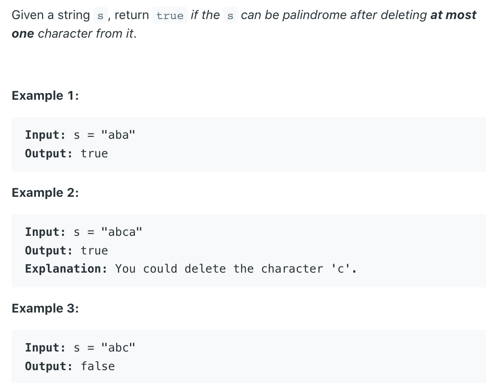

## 680. Valid Palindrome II


```ruby
#
# case 1
    [a  b  c d e  b  a]
     l
                     r
    [a  b  c d e  b  a]
           l
               r
we just need to check arr[++l] == arr[r] ?
if yes, the string is palidrome
#
# case 2
assume the string is palidrome after delete a char:

    [a  b  c e  b  a]
     l
                     r
    [a  b  c e  b  a]
           l r
check arr[++l] == arr[r] ?
Yes, so it is a palindrome.
#
# case 3
    [a  f  b  c  c  b  a]
     l
                       r
    [a  f  b  c  c  b  a]
        l           r

    [a  f  b  c  c  b  a]
           l        r

#
# case 4
    [a  b  c  c  b  f  a]
     l
                       r
    [a  b  c  c  b  f  a]
        l           r

    [a  b  c  c  b  f  a]
        l        r  
```

```java
class Solution {
    public boolean validPalindrome(String s) {
        if(s == null || s.length() == 0) {
            return true;
        }
        int left = 0;
        int right = s.length() - 1;
        while (left < right) {
            if (s.charAt(left) != s.charAt(right)) {
                return isPalindrome(s, left + 1, right) ||
                    isPalindrome(s, left, right - 1);
            }
            left++;
            right--;
        }
        return true;
    }
    
    private boolean isPalindrome(String s, int l, int r) {
        while (l < r) {
            if (s.charAt(l) != s.charAt(r)) {
                return false;
            }
            l++;
            r--;
        }
        return true;
    }
}
```