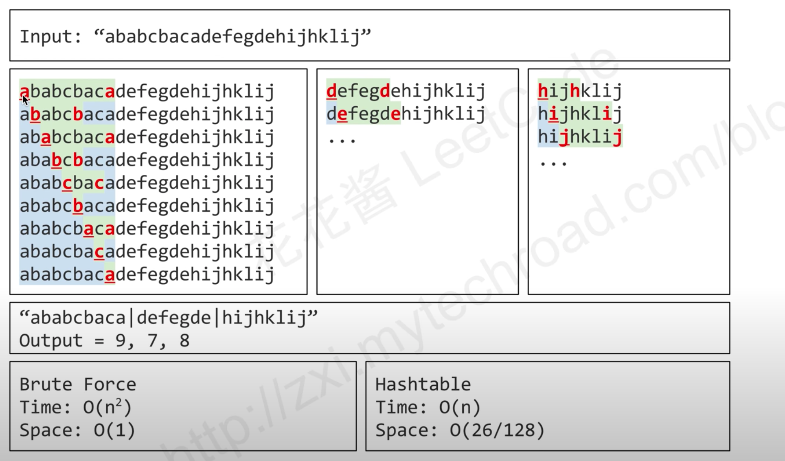
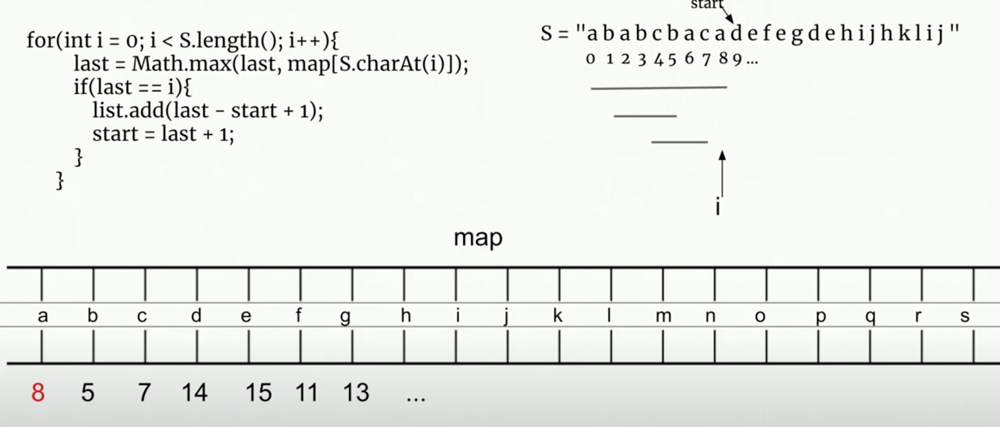

## 

```ruby
A string S of lowercase English letters is given. We want to partition this string into as many parts as possible
so that each letter appears in at most one part, and return a list of integers representing the size of these parts.


Input: S = "ababcbacadefegdehijhklij"
Output: [9,7,8]
Explanation:
The partition is "ababcbaca", "defegde", "hijhklij".
This is a partition so that each letter appears in at most one part.
A partition like "ababcbacadefegde", "hijhklij" is incorrect, because it splits S into less parts.
```

---

## 本题思路：





```java
public class partitionLabels {
    public List<Integer> partitionLabels(String S) {
        if (S == null || S.length() == 0) {
            return null;
        }
        List<Integer> list = new ArrayList<>();
        int[] map = new int[26];

        for (int i = 0; i < S.length(); i++) {
            map[S.charAt(i) - 'a'] = i;
        }

        int start = 0;
        int last = 0;
        for (int i = 0; i < S.length(); i++) {
            last = Math.max(last, map[S.charAt(i) - 'a']);
            if (last == i) {
                list.add(last - start + 1);
                start = last + 1;
            }
        }

        return list;
    }
}
```


