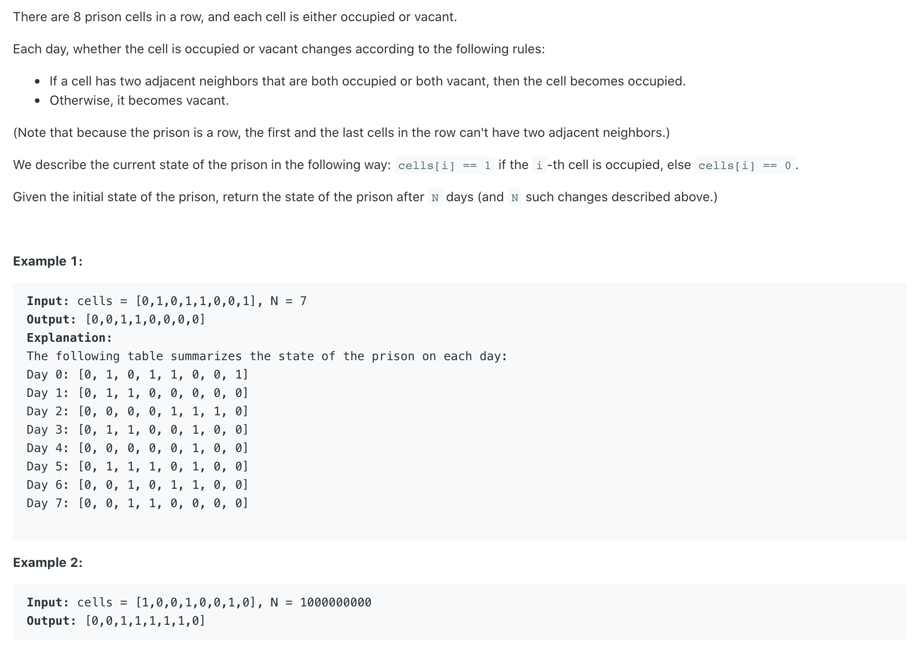
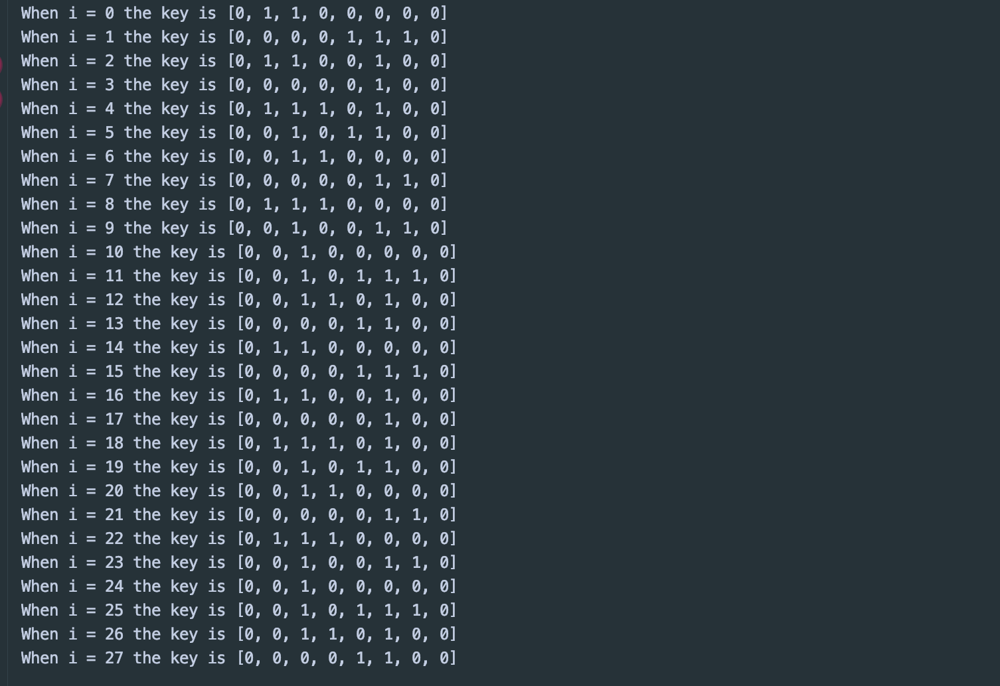

## 957. Prison Cells After N Days


```java
public class PersionCellsAfterNdays {
    public int[] prisonAfterNDays(int[] cells, int N) {
        if(cells == null || cells.length == 0 || N <= 0){
            return cells;
        }

        for (int i = 0; i < N; i++) {
            int[] next = nextDay(cells);
            String key = Arrays.toString(next);
            System.out.println("When i = " + i + " the key is " + key);
            cells = next;
        }
        return cells;
    }

    private int[] nextDay(int[] cells) {
        int[] temp = new int[cells.length];
        for (int i = 1; i < cells.length - 1; i++) {
            temp[i] = cells[i - 1] == cells[i + 1] ? 1 : 0;
        }
        return temp;
    }

    public static void main(String[] args) {
        PersionCellsAfterNdays pcan = new PersionCellsAfterNdays();
        int[] cells = {0, 1, 0, 1, 1, 0, 0, 1};
        pcan.prisonAfterNDays(cells, 28);
    }
}
```

- 假如我们用以上这一段代码，测试我们会发现在第十四个会有循环:



- Time O(2^N)
- Space O(2^N * N)

---

- 由于监狱最多只有 256 种可能的状态，所以状态一定会快速的形成一个循环。
  我们可以当状态循环出现的时候记录下循环的周期 t 然后跳过 t 的倍数的天数。

- 本题，一个数组种的 第一个，和 最后一个元素，可以无视，
  - 假如 左右两边的元素一样，则 => 1, 否则 => 0 
-----


```java
class Solution {
    public int[] prisonAfterNDays(int[] cells, int N) {
        if(cells == null || cells.length == 0 || N <= 0) {
            return cells;
        }
        
        HashSet<String> set = new HashSet();
        boolean hasCycle = false;
        int count = 0;
        for (int i = 0; i < N; i++){
            int [] next = nextDay(cells);
            String key = Arrays.toString(next);
            if(!set.contains(key)){
                set.add(key);
                count++;
            }else{
                hasCycle = true;
                break;
            }
            cells = next;
        }
        
        if (hasCycle) {
            N = N % count;
            for (int i = 0; i < N; i++){                
                cells = nextDay(cells);
            }            
        }
        return cells;
    }
    
    private int [] nextDay(int [] cells) {
        int [] temp = new int [cells.length]; 
        for (int i = 1; i < cells.length - 1; i++){
            temp[i] = cells[i - 1] == cells[i + 1] ? 1 : 0;
        }
        return temp;
    }
}
```


