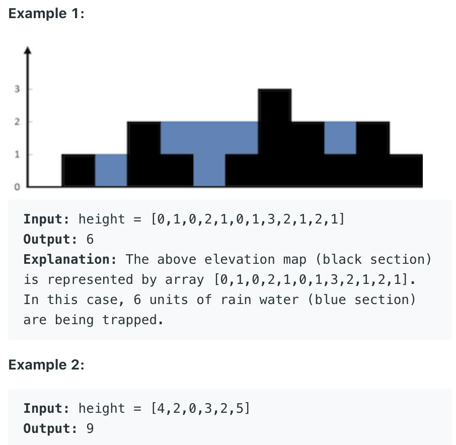
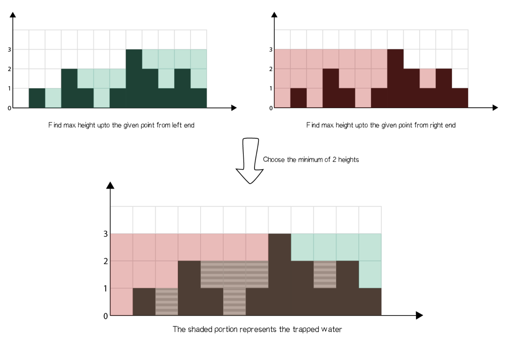
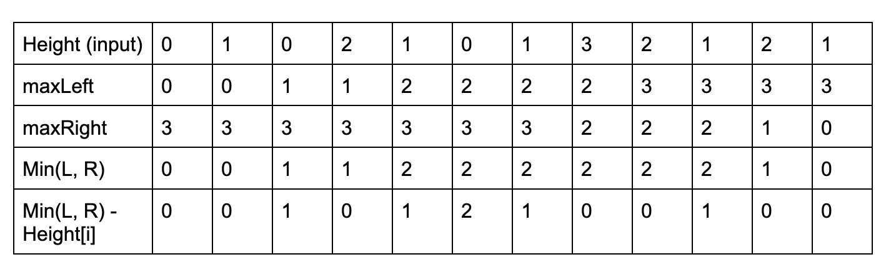
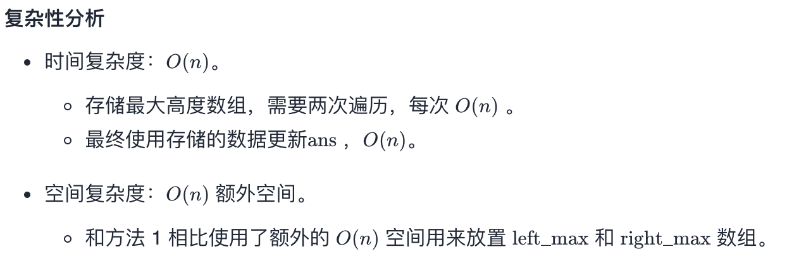
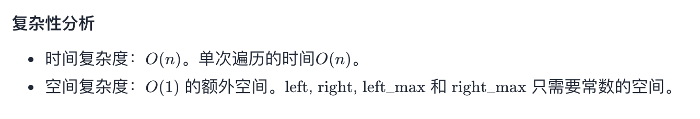

## 42. Trapping Rain Water

- Given `n` non-negative integers representing an elevation map where the width of each 
  bar is `1`, compute how much water it can trap after raining.


---

### Dynamic Programming



- Algorithm
  - Find maximum height of bar from the left end upto an index i in the array `left_max`.
  - Find maximum height of bar from the right end upto an index i in the array `right_max`.
    - Add `min(left_max[i], right_max[i]) - height[i]` to ans
  - `Min(leftMax, rightMax) - Height[i]` (we don't count negative, convert it to be 0)



```java
class Solution {
    public int trap(int[] height) {
        if (height == null || height.length == 0) {
            return 0;
        }
        int n = height.length;
        int leftMax = 0, rightMax = 0;
        int [] left = new int[n];
        int [] right = new int[n];
        int count = 0;
        
        for (int i = 1; i < n; i++) {
            leftMax = Math.max(leftMax, height[i - 1]);
            left[i] = leftMax;
        }
        for (int j = n - 2; j >= 0; j--) {
            rightMax = Math.max(rightMax, height[j + 1]);
            right[j] = rightMax;
        }
        
        for (int i = 0; i < n; i++) {
          count += 
            Math.max(0, Math.min(left[i], right[i])-height[i]);
        }
        return count;
    }
}
```
---

---

### Two points

```java
class Solution {
    public int trap(int[] height) {
        if (height == null || height.length == 0) {
            return 0;
        }
        int leftMax = 0, rightMax = 0;
        int left = 0;
        int right = height.length - 1;
        int count = 0;
        
        while (left < right) {
            leftMax = Math.max(leftMax, height[left]);
            rightMax = Math.max(rightMax, height[right]);
            // 取左右两边比较矮的bar
            if (leftMax < rightMax) {
                count += leftMax - height[left];
                left++;
            } else {
                count += rightMax - height[right];
                right--;
            }
        }
        return count;
    }
}
```

