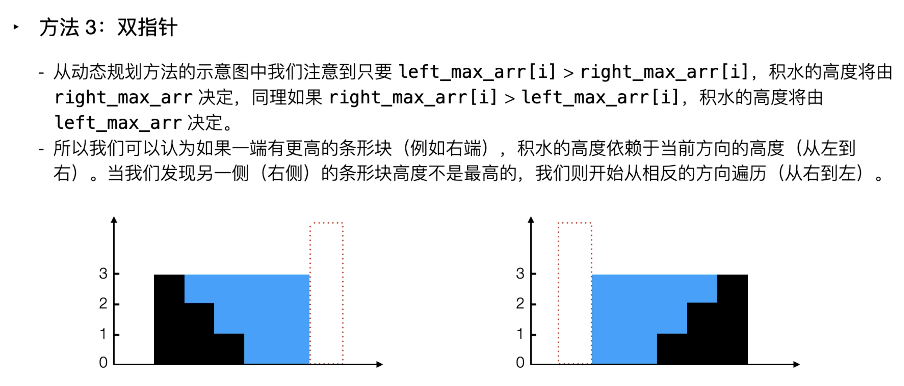
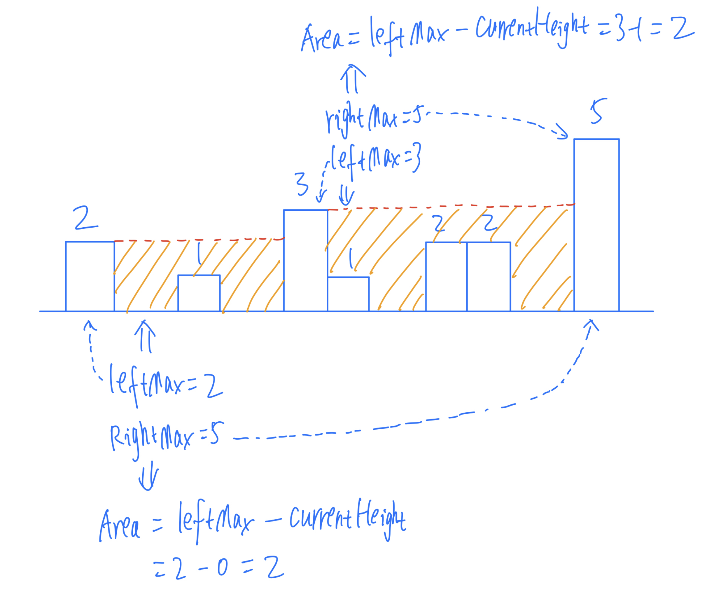

## 42. Trapping Rain Water

- Given `n` non-negative integers representing an elevation map where the width of each 
  bar is `1`, compute how much water it can trap after raining.


---

### Two points
- [leetcode discussion](https://leetcode.com/problems/trapping-rain-water/solutions/17391/share-my-short-solution/comments/185869)
- [官方video 15:12](https://leetcode.cn/problems/trapping-rain-water/solutions/692342/jie-yu-shui-by-leetcode-solution-tuvc/)
- [class 23 |  2:24:00]()




```java
class TrappingRainWater_twoPointers {
    public int trap(int[] height) {
        int left = 0, right = height.length - 1;
        int leftMax = 0, rightMax = 0;
        int res = 0;
        while (left < right) {
            leftMax = Math.max(leftMax, height[left]);
            rightMax = Math.max(rightMax, height[right]);
            if (leftMax < rightMax) {
                res += (leftMax - height[left]);
                left++;
            } else {
                res += (rightMax - height[right]);
                right--;
            }
        }
        return res;
    }
}

```


---


### Dynamic Programming


- Algorithm
  - Find maximum height of bar from the left end upto an index i in the array `left_max`.
  - Find maximum height of bar from the right end upto an index i in the array `right_max`.
    - Add `min(left_max[i], right_max[i]) - height[i]` to ans
  - `Min(leftMax, rightMax) - Height[i]` (we don't count negative, convert it to be 0)

- 注意：无论左右两边多高，都无法蓄水。都会从最左最右边界溢出，
  - 因此在比较左边高度，以及右边高度的时候，从 `index = 1`, 以及倒数第二个index 开始比较。


```java
class Solution {
    public int trap(int[] height) {
    /* 
    To check is if we get an array of size less than 3. 
    We immediately know that it cannot have any water trapped 
    so we can do an early return of 0.
    */
        if (height.length < 3) {
            return 0;
        }
        int n = height.length;
        int leftMax = 0, rightMax = 0;
        int [] left = new int[n];
        int [] right = new int[n];
        int count = 0;
        
        for (int i = 1; i < n; i++) {
            leftMax = Math.max(leftMax, height[i - 1]);
            left[i] = leftMax;
        }
        for (int j = n - 2; j >= 0; j--) {
            rightMax = Math.max(rightMax, height[j + 1]);
            right[j] = rightMax;
        }
        
        for (int i = 0; i < n; i++) {
          count += Math.max(0, Math.min(left[i], right[i])-height[i]);
        }
        return count;
    }
}
```
---


---

### Monotonic Stack

```ruby

    _____           _____
    |   |____3      |   |  
    |   |   |____2  |   |
    |   |   |   | 1 |   |
    —————————————————————


why (i - stack.peek() - 1) ?

If:
    _____                _____
    |   |____3           |   |  
    |   |   |____2       |   |
    |   |   |   | 1   1  |   |
    ———————————————————————————


why we need to check if (!stk.isEmpty()) 
        _____
    ____|   |
    |   |   | 
    —————————


why we need to check: minHeight = Math.min(height[stk.peek()], height[i]);

    _____           
    |   |____      
    |   |   |   _____
    |   |   |   |   |
    —————————————————

```

---

```java
class Solution {
    public int trap(int[] height) {
        if (height == null || height.length <= 2) {
            return 0;
        }
        Stack<Integer> stk = new Stack<>();
        int water = 0, i = 0;
        while (i < height.length) {
            if (stk.isEmpty() || height[i] <= height[stk.peek()]) {
                stk.push(i);
                i++;
            } else {
                int prev = stk.pop();
                if (!stk.isEmpty()) {
                    int minHeight = Math.min(height[stk.peek()], height[i]);
                    water += (minHeight - height[prev]) * (i - stk.peek() - 1);
                }
            }
        }
        return water;
    }
}
```