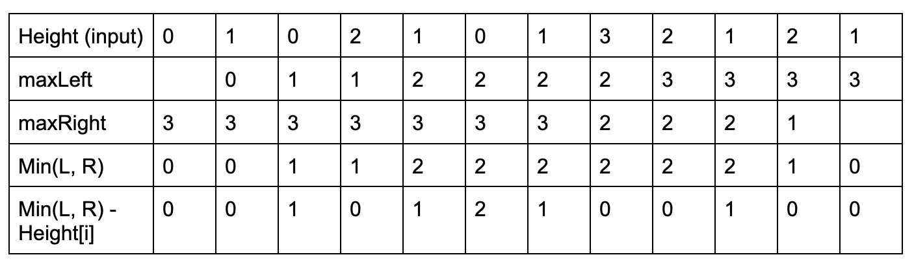

## 42. Trapping Rain Water

- Given `n` non-negative integers representing an elevation map where the width of each 
  bar is `1`, compute how much water it can trap after raining.


---

### Dynamic Programming


- Algorithm
  - Find maximum height of bar from the left end upto an index i in the array `left_max`.
  - Find maximum height of bar from the right end upto an index i in the array `right_max`.
    - Add `min(left_max[i], right_max[i]) - height[i]` to ans
  - `Min(leftMax, rightMax) - Height[i]` (we don't count negative, convert it to be 0)

- 注意：无论左右两边多高，都无法蓄水。都会从最左最右边界溢出，
  - 因此在比较左边高度，以及右边高度的时候，从 `index = 1`, 以及倒数第二个index 开始比较。



```java
class Solution {
    public int trap(int[] height) {
    /* 
    To check is if we get an array of size less than 3. 
    We immediately know that it cannot have any water trapped 
    so we can do an early return of 0.
    */
        if (height.length < 3) {
            return 0;
        }
        int n = height.length;
        int leftMax = 0, rightMax = 0;
        int [] left = new int[n];
        int [] right = new int[n];
        int count = 0;
        
        for (int i = 1; i < n; i++) {
            leftMax = Math.max(leftMax, height[i - 1]);
            left[i] = leftMax;
        }
        for (int j = n - 2; j >= 0; j--) {
            rightMax = Math.max(rightMax, height[j + 1]);
            right[j] = rightMax;
        }
        
        for (int i = 0; i < n; i++) {
          count += 
            Math.max(0, Math.min(left[i], right[i])-height[i]);
        }
        return count;
    }
}
```
---

---

### Two points

```java
class Solution {
  public int trap(int[] height) {
    if (height == null || height.length == 0) {
        return 0;
    }
    int left = 0; int right = height.length - 1; 
    // Pointers to both ends of the array.
    int maxLeft = 0; int maxRight = 0;

    int totalWater = 0;
    while (left < right) {
      // Water could, potentially, fill everything from left to right, 
      // if there is nothing in between.
      if (height[left] < height[right]) {
      // If the current elevation is greater than the previous maximum, 
      // water cannot occupy that point at all.
      // However, we do know that everything from maxLeft to the current index, 
      // has been optimally filled, as we've
      // been adding water to the brim of the last maxLeft.
        if (height[left] >= maxLeft) { 
        // So, we say we've found a new maximum, 
        // and look to see how much water we can fill from this point on.
            maxLeft = height[left]; 
            // If we've yet to find a maximum, we know that 
            // we can fill the current point with water up to the previous
            // maximum, as any more will overflow it. 
            // We also subtract the current height, 
            // as that is the elevation the ground will be at.
        } else { 
            totalWater += maxLeft - height[left]; 
        }
        // Increment left, we'll now look at the next point.
        left++;
        // If the height at the left is NOT greater than height at the right, 
        // we cannot fill from left to right without overflowing; 
        // however, we do know that we could potentially fill from right to left, 
        // if there is nothing in between.
      } else {
          // Similarly to above, 
          // we see that we've found a height greater than the max, 
          // and cannot fill it whatsoever, 
          // but everything before is optimally filled
          if (height[right] >= maxRight) { 
              // We can say we've found a new maximum and move on.  
              maxRight = height[right]; 
            // If we haven't found a greater elevation, 
            // we can fill the current elevation with 
            // maxRight - height[right] water.
          } else {
              totalWater += maxRight - height[right]; 
          }
          // Decrement left, we'll look at the next point.
          right--;
      }
    }
    // Return the sum we've been adding to.
    return totalWater;
  }
}
```


---

### Monotonic Stack

```ruby

    _____           _____
    |   |____3      |   |  
    |   |   |____2  |   |
    |   |   |   | 1 |   |
    —————————————————————


why (i - stack.peek() - 1) ?

If:
    _____                _____
    |   |____3           |   |  
    |   |   |____2       |   |
    |   |   |   | 1   1  |   |
    ———————————————————————————


why we need to check if (!stk.isEmpty()) 
        _____
    ____|   |
    |   |   | 
    —————————


why we need to check: minHeight = Math.min(height[stk.peek()], height[i]);

    _____           
    |   |____      
    |   |   |   _____
    |   |   |   |   |
    —————————————————

```

---

```java
class Solution {
    public int trap(int[] height) {
        if (height == null || height.length <= 2) {
            return 0;
        }
        Stack<Integer> stk = new Stack<>();
        int water = 0, i = 0;
        while (i < height.length) {
            if (stk.isEmpty() || height[i] <= height[stk.peek()]) {
                stk.push(i);
                i++;
            } else {
                int prev = stk.pop();
                if (!stk.isEmpty()) {
                    int minHeight = Math.min(height[stk.peek()], height[i]);
                    water += (minHeight - height[prev]) * (i - stk.peek() - 1);
                }
            }
        }
        return water;
    }
}
```