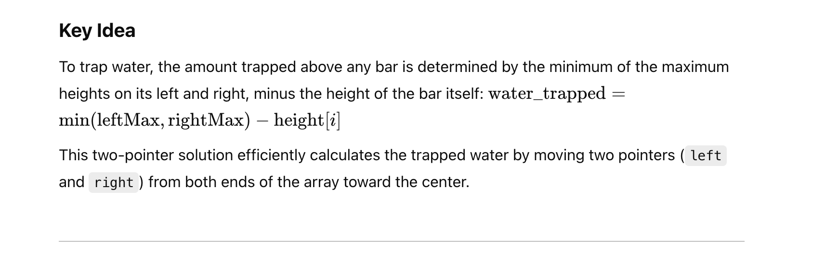
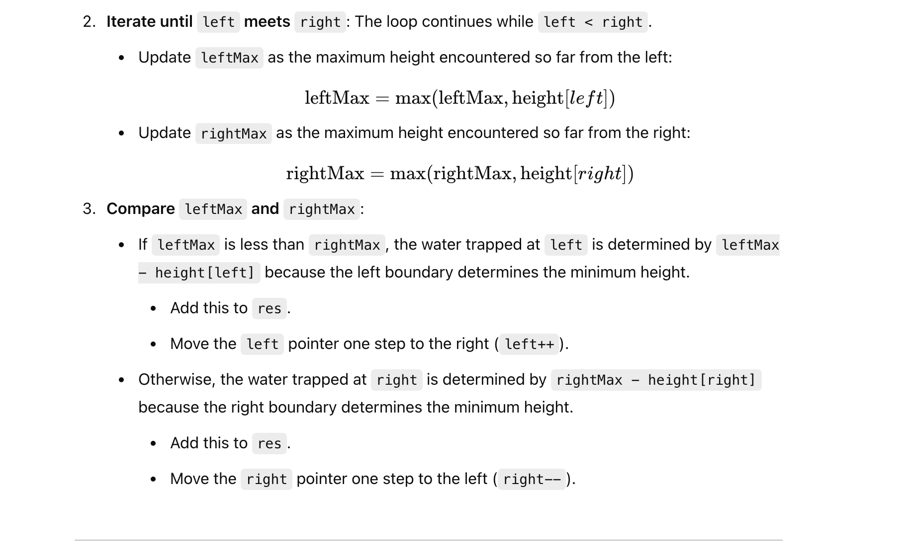
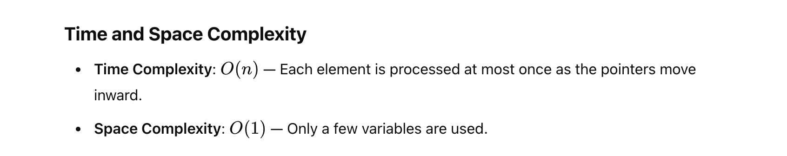

## 42. Trapping Rain Water

- Given `n` non-negative integers representing an elevation map where the width of each 
  bar is `1`, compute how much water it can trap after raining.


---

### Two points
- [leetcode discussion](https://leetcode.com/problems/trapping-rain-water/solutions/17391/share-my-short-solution/comments/185869)
- [官方video 15:12](https://leetcode.cn/problems/trapping-rain-water/solutions/692342/jie-yu-shui-by-leetcode-solution-tuvc/)


---





---
```java
class TrappingRainWater_twoPointers {
    public int trap(int[] height) {
        int left = 0, right = height.length - 1;
        int leftMax = 0, rightMax = 0;
        int res = 0;
        while (left < right) {
            leftMax = Math.max(leftMax, height[left]);
            rightMax = Math.max(rightMax, height[right]);
            if (leftMax < rightMax) {
                res += (leftMax - height[left]);
                left++;
            } else {
                res += (rightMax - height[right]);
                right--;
            }
        }
        return res;
    }
}

```


---
#### Python

```py
class Solution:
    def trap(self, height: List[int]) -> int:
        left, right = 0, len(height) - 1
        leftMax, rightMax = 0, 0
        res = 0
        
        while left < right:
            leftMax = max(leftMax, height[left])
            rightMax = max(rightMax, height[right])
            if leftMax < rightMax:
                res += leftMax - height[left]
                left += 1
            else:
                res += rightMax - height[right]
                right -= 1
        
        return res
```

---

### Monotonic Stack

```ruby

    _____           _____
    |   |____3      |   |  
    |   |   |____2  |   |
    |   |   |   | 1 |   |
    —————————————————————


why (i - stack.peek() - 1) ?

If:
    _____                _____
    |   |____3           |   |  
    |   |   |____2       |   |
    |   |   |   | 1   1  |   |
    ———————————————————————————


why we need to check if (!stk.isEmpty()) 
        _____
    ____|   |
    |   |   | 
    —————————


why we need to check: minHeight = Math.min(height[stk.peek()], height[i]);

    _____           
    |   |____      
    |   |   |   _____
    |   |   |   |   |
    —————————————————

```

---

```java
class Solution {
    public int trap(int[] height) {
        if (height == null || height.length <= 2) {
            return 0;
        }
        Stack<Integer> stk = new Stack<>();
        int water = 0, i = 0;
        while (i < height.length) {
            if (stk.isEmpty() || height[i] <= height[stk.peek()]) {
                stk.push(i);
                i++;
            } else {
                int prev = stk.pop();
                if (!stk.isEmpty()) {
                    int minHeight = Math.min(height[stk.peek()], height[i]);
                    water += (minHeight - height[prev]) * (i - stk.peek() - 1);
                }
            }
        }
        return water;
    }
}
```