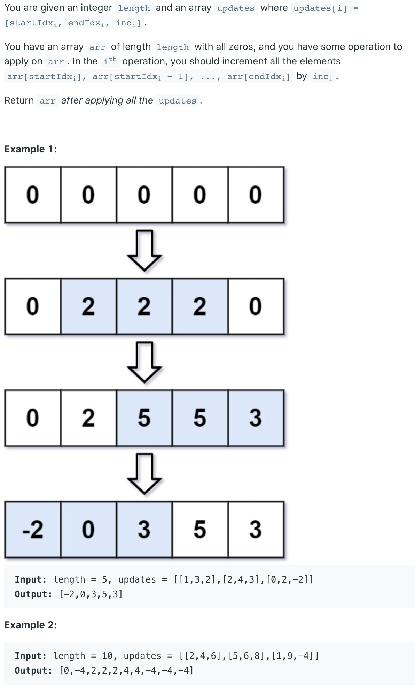
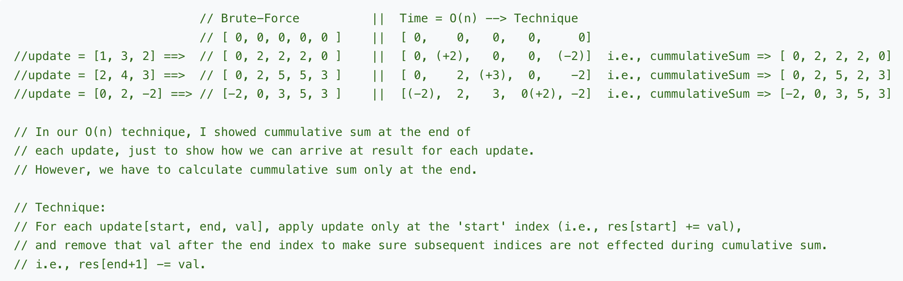

## 370. Range Addition



- Brute Force:

```java
class Solution {
    public int[] getModifiedArray(int length, int[][] updates) {
        int [] res = new int[length];
        for (int[] update : updates) {
            int value = update[2];
            int start = update[0];
            int end = update[1];
            
            for (int i = start; i <= end; i++) {
                res[i] += value;
            } 
        }
        return res;
    }
}
```



```java
class Solution {
    public int[] getModifiedArray(int length, int[][] updates) {
        if (updates == null || updates.length == 0) {
            return new int[length];
        }
        int [] res = new int[length];
        for (int[] update : updates) {
            int val = update[2];
            int start = update[0];
            int end = update[1];
            
            res[start] += val;
            
            if (end < length - 1) {
                res[end + 1] -= val;
            }
        }
        int sum = 0;
        for (int i = 0; i < length; i++) {
            sum += res[i];
            res[i] = sum;
        }
        return res;
    }
}
```