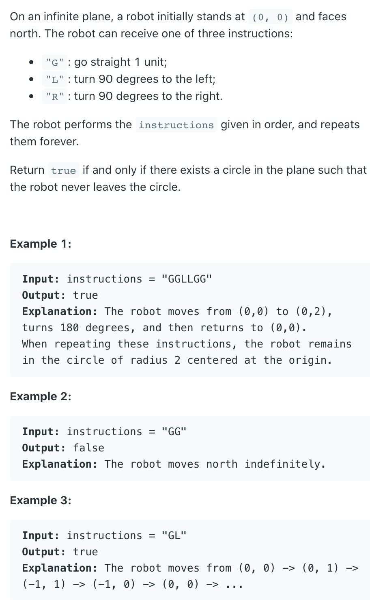

## 1041. Robot Bounded In Circle



```ruby
              N (0)
               |
       W (3) ------ E (1)
               |
            S (2)
```

- 四个方向, 这样定是为了满足 `d+1` 就是向左转 `d+3` 就是向右转

- 不用 `d -= 1` 是因为当d变成负数的时候，取mod会出错

- (x,y) is the location of robot
- d[i] is the direction he is facing.
- `i = (i + 1) % 4` will turn right
- `i = (i + 3) % 4` will turn left

- 如果最终 face 不是朝着north 方向，那结果也是回到原点，circle

- Time O(N)
- Space O(1)
  
---

```java
class Solution {
    public boolean isRobotBounded(String instructions) {
        if(instructions.length() <0 || instructions.length() >100){
            return false;
        }
        
        int[][] direction = {
            {0, 1}, // up
            {1, 0}, // right
            {0, -1}, //down
            {-1, 0} //left
        };
        int x = 0;
        int y = 0;
        int i = 0;
        for (int idx = 0; idx < instructions.length(); idx++) {
            if (instructions.charAt(idx) == 'R') {
                i = (i + 1) % 4;
            } else if (instructions.charAt(idx) == 'L') {
                i = (i + 3) % 4;
            } else {
                x += direction[i][0];
                y += direction[i][1];
            }
        }
        return (x == 0 && y == 0) || i > 0;
    }
}
```