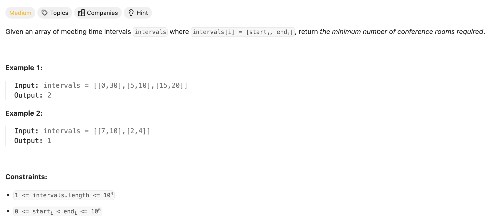

## 253. Meeting Rooms II


---

### Method 1

- [Approach 1: Priority Queues](https://leetcode.com/problems/meeting-rooms-ii/solutions/168762/meeting-rooms-ii/)

- **Example**:

```ruby

       Meetings = [2, 7], [3, 19], [8, 12], [1, 10], [10, 20]

       => Sorting:    [1, 10], [2, 7], [3, 19], [8, 12], [10, 20]
      
        
        
        [1, 10], [2, 7], [3, 19], [8, 12], [10, 20]     index = 0

        meetingRooms = [10]
        length = 1


        [1, 10], [2, 7], [3, 19], [8, 12], [10, 20]     index = 1
                                                        we check whether 2 is grater and equal than 10
        meetingRooms = [10, 7]                 
        length = 2


        [1, 10], [2, 7], [3, 19], [8, 12], [10, 20]     index = 2
                                                        we check whether 3 is grater and equal than 7
        meetingRooms = [10, 7, 19]                 
        length = 3


        [1, 10], [2, 7], [3, 19], [8, 12], [10, 20]     index = 3
                                                        we check whether 8 is grater and equal than 7, 
                                                        Now it is greater than 7, we removing 7 and replace it with 12
        meetingRooms = [10, 7, 19]                 

     => meetingRooms = [10, 12, 19]   
        length = 3


        [1, 10], [2, 7], [3, 19], [8, 12], [10, 20]     index = 4
                                                        we check whether 10 is grater and equal than 10, 
                                                        Now it is greater and equal than 10, we removing 10 and replace it with 20
        meetingRooms = [10, 12, 19]                 

     => meetingRooms = [20, 12, 19]   
        length = 3    
```
---

```py
'''
     [0, 30], [5, 10], [15, 20]
     
     
'''

class Solution:
    def minMeetingRooms(self, intervals: List[List[int]]) -> int:
        intervals.sort(key=lambda x: x[0])

        minHeap = []  # Stores end times of meetings
        for start, end in intervals:
            # If the earliest meeting in the heap has ended, remove it
            if minHeap and minHeap[0] <= start:
                heapq.heappop(minHeap)
            # Add the current meeting's end time to the heap
            heapq.heappush(minHeap, end)
        return len(minHeap)  # The size of the heap represents the number of rooms needed

```


---

---

### Method 2


- [youtube](https://www.youtube.com/watch?v=FdzJmTCVyJU)


- now it happens to be a `start time` so another meeting just started at `time 15`


- there are two meetings going on, that tells us increment our count to be `2`
 


- after `time 20` is ending, decrement our cout to be 1


- zero meeting going on.
- now we notice that the max value is **2**, so return **2**


- `[5, 10], [10, 15]` are always non-overlapping
- we always **visited end time 10** first, then we **visit begin time 10**

- le't look at an example:


- **visit the end time 10** if there is a tie first


- now we **compair begin time 10 with end time 15**


---


```py
class Solution:
    def minMeetingRooms(self, intervals: List[List[int]]) -> int:
        if not intervals:
            return 0

        start = [interval[0] for interval in intervals]
        end = [interval[1] for interval in intervals]
        start.sort()
        end.sort()
        res = 0
        room = 0
        start_index = 0
        end_index = 0
        
        while start_index < len(intervals):
            if start[start_index] < end[end_index]:
                start_index += 1
                room += 1
            else:
                end_index += 1
                room -= 1
            res = max(res, room)
        return res
```