## 253. Meeting Rooms II

- Given an array of meeting time intervals intervals where 
  `intervals[i] = [starti, endi]`, return the minimum number of conference rooms 
  required.


---

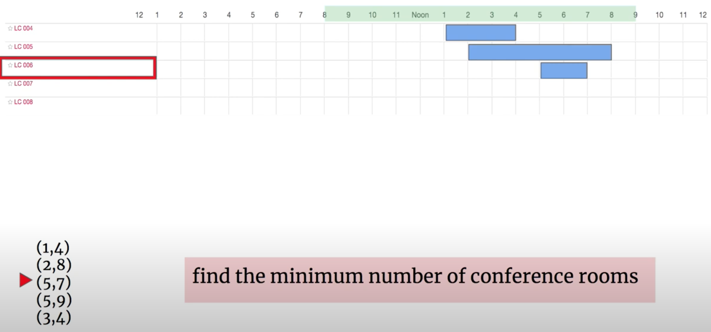

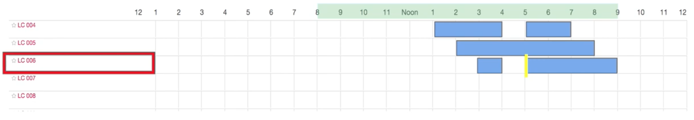

- **本题题意： 如果`(1, 4), (5, 7)` 可以共存，那么在这里只需要一个room**

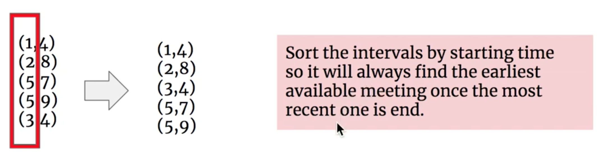

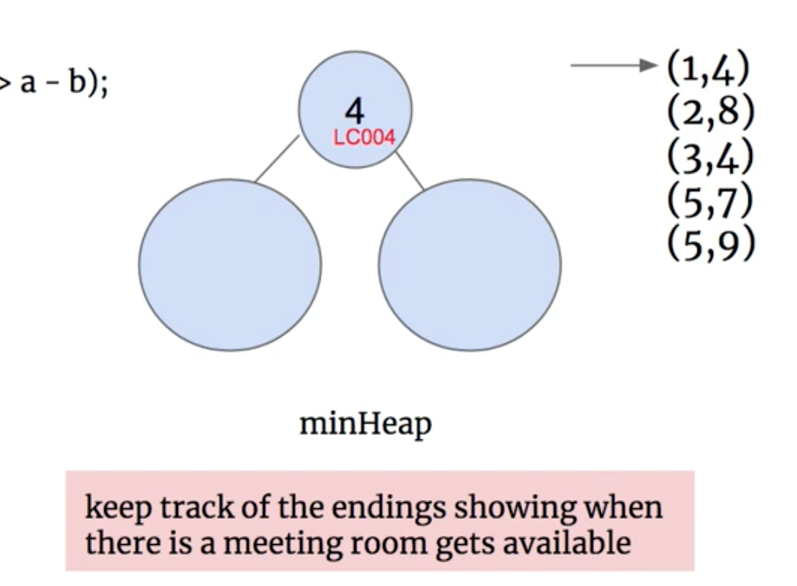

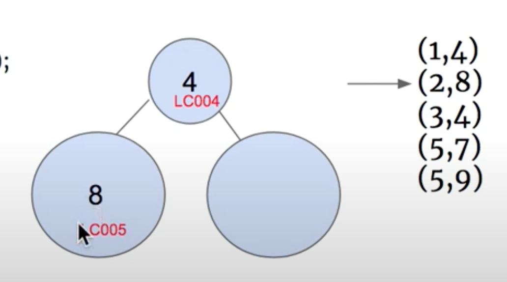

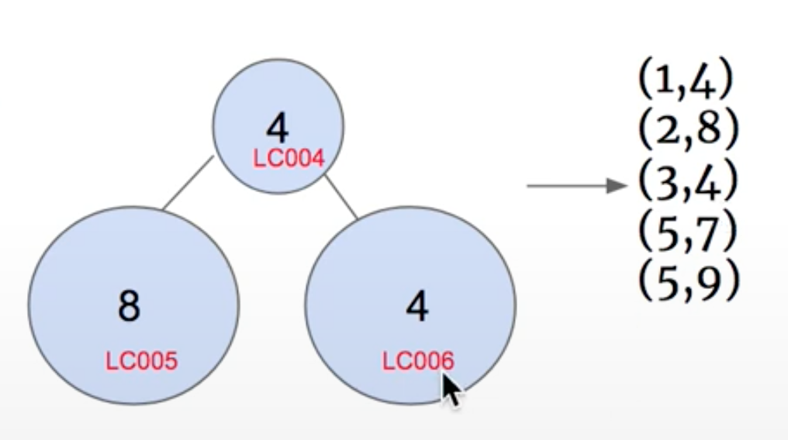

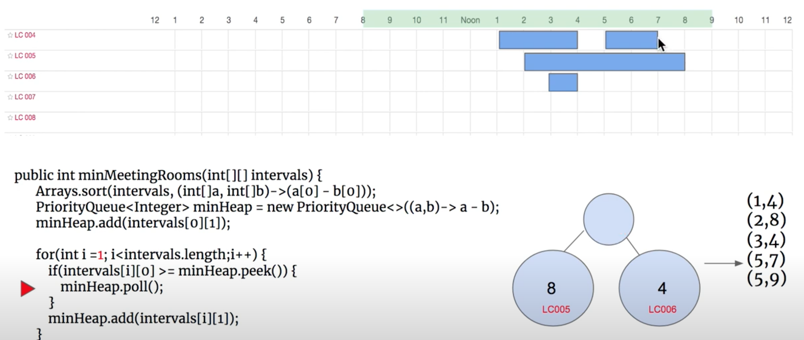

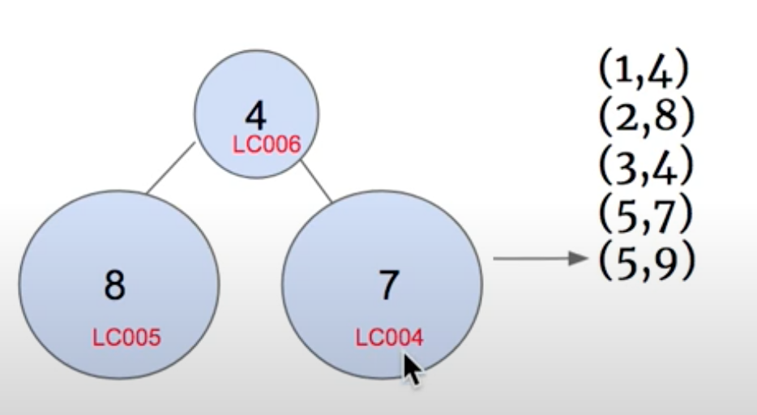

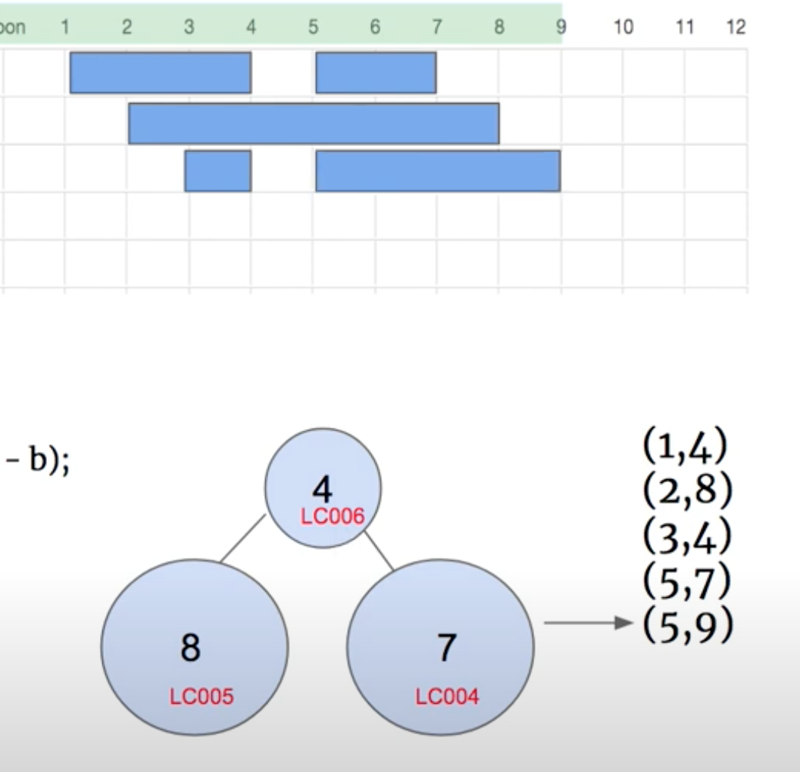

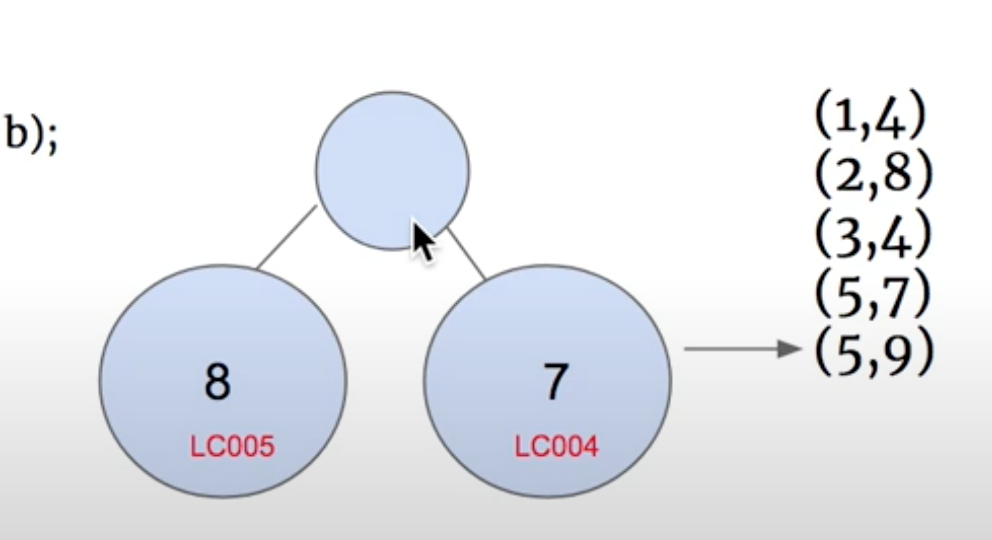

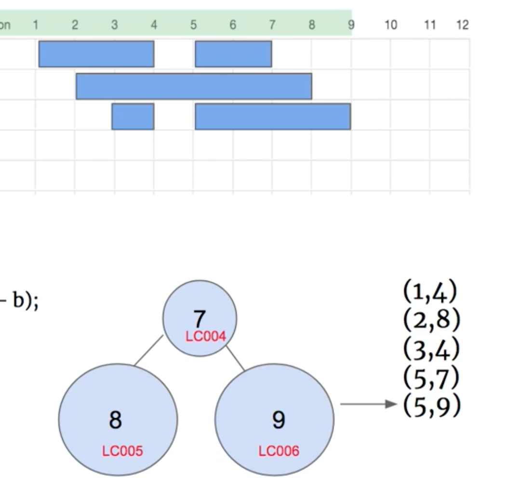

---

```java
class Solution {
    public int minMeetingRooms(int[][] intervals) {
        int n = intervals.length;
        Arrays.sort(intervals, (a, b) -> (a[0] - b[0]));
        PriorityQueue<Integer> minHeap = new PriorityQueue<>(
            new Comparator<Integer>() {
                @Override
                public int compare(Integer e1, Integer e2) {
                    if (e1 == e2) {
                        return 0;
                    }
                    return e1 < e2 ? -1 : 1;
                }                
            }
        );
        
        minHeap.offer(intervals[0][1]);
        for (int i = 1; i < n; i++) {
            if (intervals[i][0] >= minHeap.peek()) {
                minHeap.poll();
            }
            minHeap.offer(intervals[i][1]);
        }
        return minHeap.size();
    }
}
```