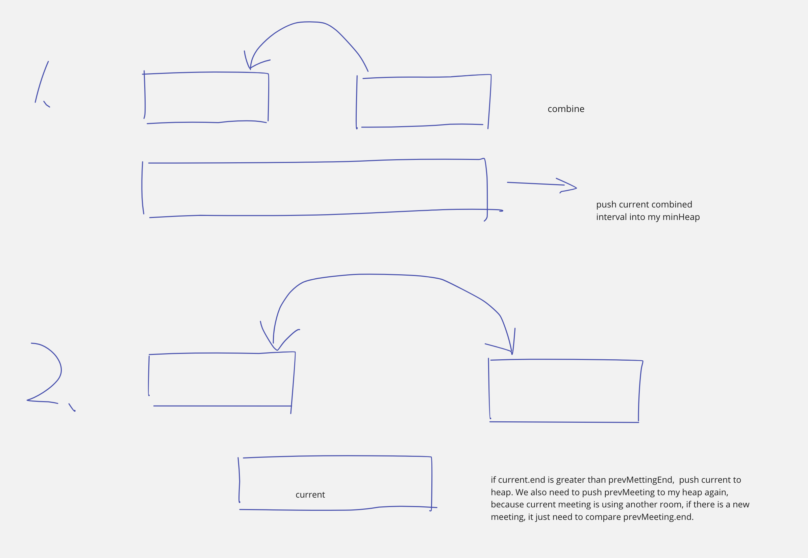

## 253. Meeting Rooms II

- Given an array of meeting time intervals intervals where 
  `intervals[i] = [starti, endi]`, return the minimum number of conference rooms 
  required.


---

- [中文教程](https://www.youtube.com/watch?v=3hOkj3IGFYk)


- **本题题意： 如果`(1, 4), (5, 7)` 可以共存，那么在这里只需要一个room**
  - `(2, 8)` 需要单独一个room
  - `(3, 4), (5, 9)` 可以用同一个room


---




```java
class meetingRooms_II {
    public int minMeetingRooms(int[][] intervals) {
        if (intervals == null || intervals.length == 0) return 0;

        Arrays.sort(intervals, (a, b) -> a[0] - b[0]);
        PriorityQueue<int[]> minHeap = new PriorityQueue<>((a, b) -> a[1] - b[1]);
        
        minHeap.offer(intervals[0]);
        int res = 1;
        for (int i = 1; i < intervals.length; i++) {
            int[] prevMeeting = minHeap.poll();
            int[] curMeeting = intervals[i];
            if (prevMeeting[1] <= curMeeting[0]) {
                prevMeeting[1] = curMeeting[1];
                minHeap.offer(prevMeeting);
            } else {
                res++;
                minHeap.offer(curMeeting);
                minHeap.offer(prevMeeting);
            }
        }
        return res;
//        return minHeap.size();
    }

    public static void main(String[] args) {
        int[][] intervals = new int[][]{{1, 4}, {2, 8}, {5, 7}, {5, 9}, {3, 4}};
        meetingRooms_II meetingRooms = new meetingRooms_II();
        int size = meetingRooms.minMeetingRooms(intervals);
        System.out.println(size);
    }
}
```

---

### Method 2

