## 253. Meeting Rooms II

- Given an array of meeting time intervals intervals where 
  `intervals[i] = [starti, endi]`, return the minimum number of conference rooms 
  required.

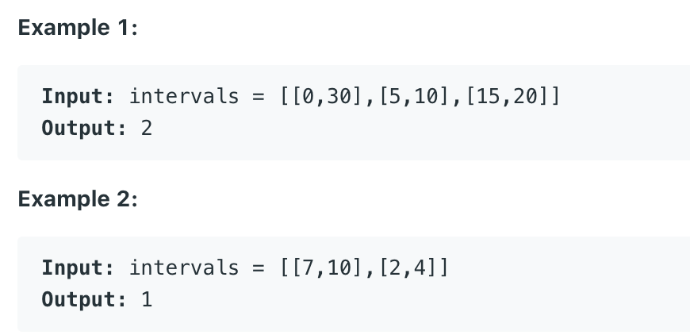

---
- [youtube](https://www.youtube.com/watch?v=FdzJmTCVyJU)

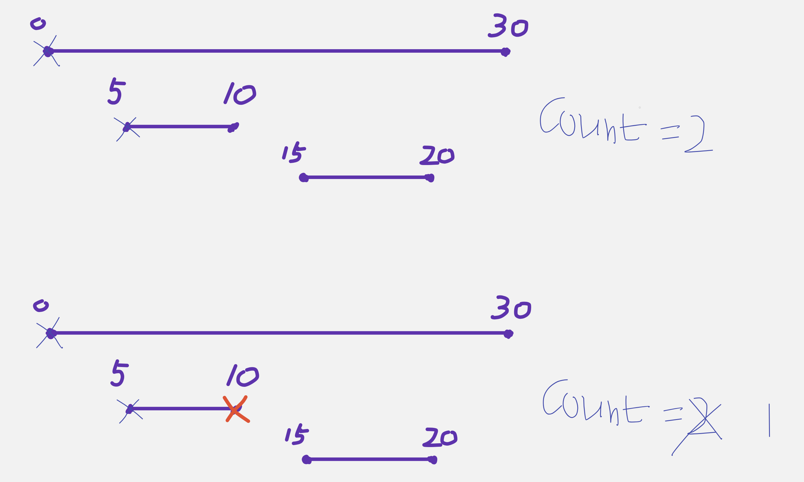

- now it happens to be a `start time` so another meeting just started at `time 15`

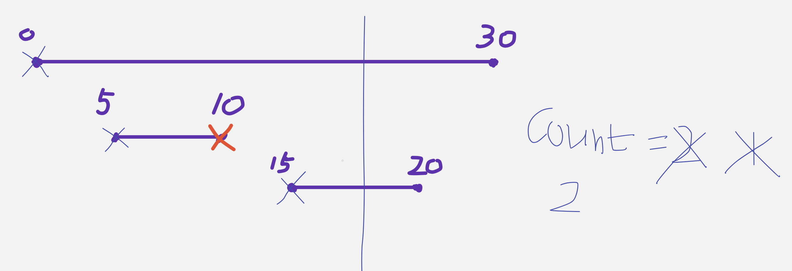

- there are two meetings going on, that tells us increment our count to be `2`
 
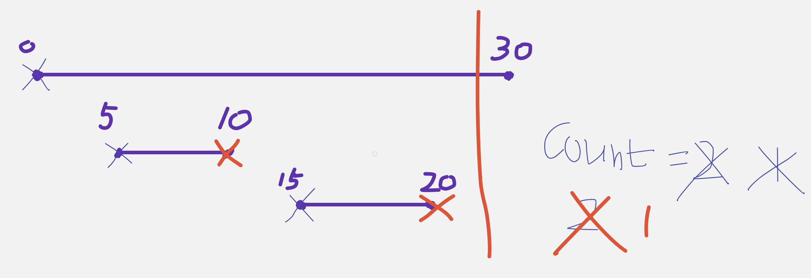

- after `time 20` is ending, decrement our cout to be 1

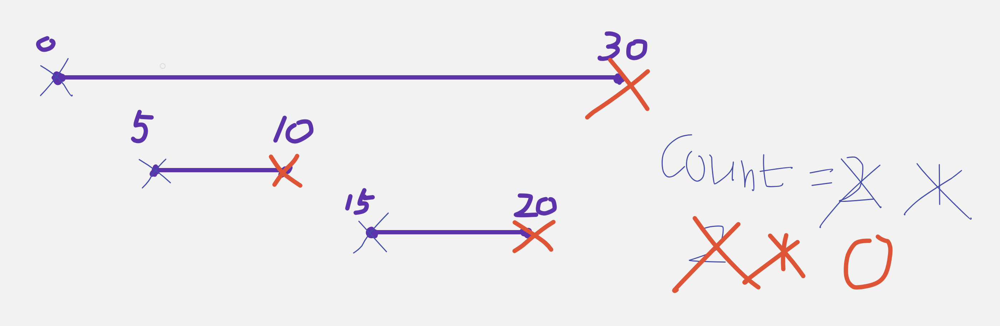

- zero meeting going on.
- now we notice that the max value is **2**, so return **2**

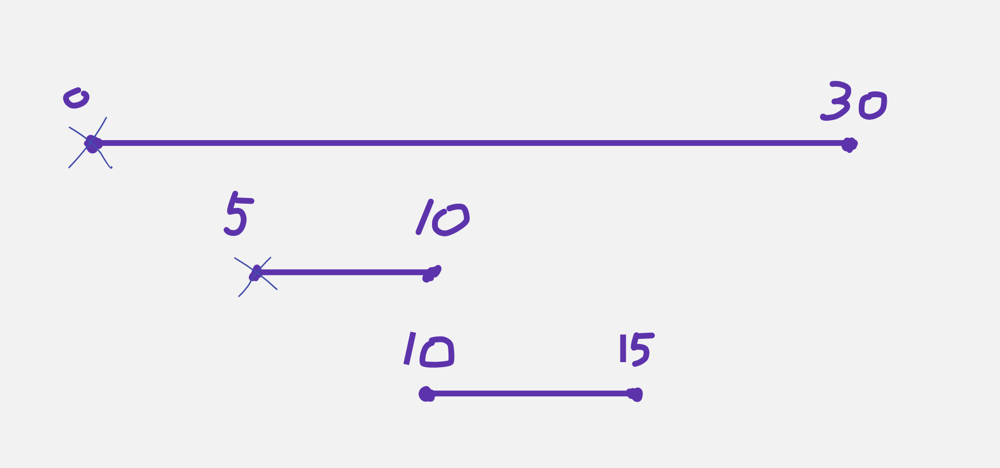
- `[5, 10], [10, 15]` are always non-overlapping
- we always **visited end time 10** first, then we **visit begin time 10**

- le't look at an example:

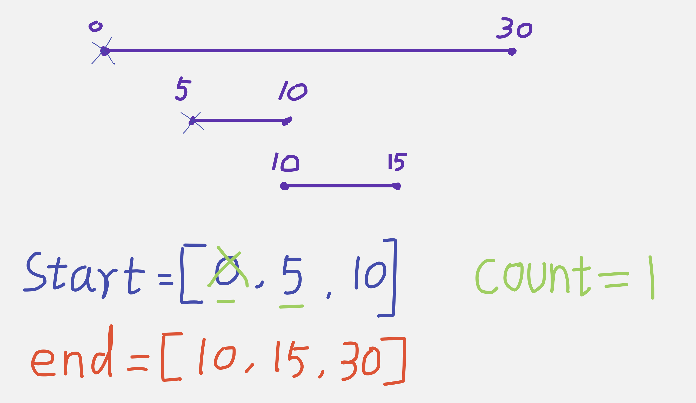

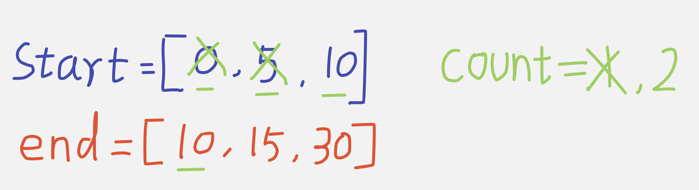

- **visit the end time 10** if there is a tie first


- now we **compair begin time 10 with end time 15**

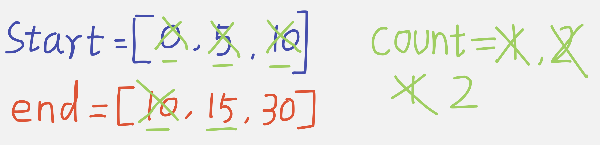

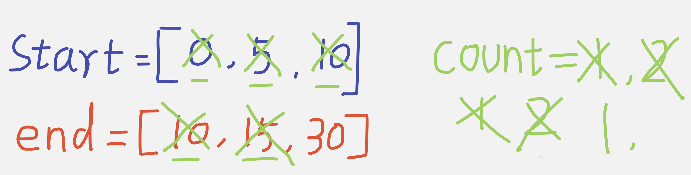

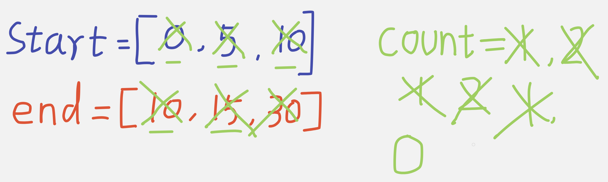

---

```java
class meetingRooms_II {
    public int minMeetingRooms(int[][] intervals) {
        int[] start = new int[intervals.length];
        int[] end = new int[intervals.length];
        for (int i = 0; i < intervals.length; i++) {
            start[i] = intervals[i][0];
            end[i] = intervals[i][1];
        }
        Arrays.sort(start);
        Arrays.sort(end);

        int res = 0, room = 0;
        int startIndex = 0, endIndex = 0;
        while (startIndex < intervals.length) {
            if (start[startIndex] < end[endIndex]) {
                startIndex++;
                room++;
            } else {
                endIndex++;
                room--;
            }
            res = Math.max(res, room);
        }
        return res;
    }
}
```

---

#### Python

```py
class Solution:
    def minMeetingRooms(self, intervals: List[List[int]]) -> int:
        if not intervals:
            return 0

        start = [interval[0] for interval in intervals]
        end = [interval[1] for interval in intervals]
        start.sort()
        end.sort()
        res = 0
        room = 0
        start_index = 0
        end_index = 0
        
        while start_index < len(intervals):
            if start[start_index] < end[end_index]:
                start_index += 1
                room += 1
            else:
                end_index += 1
                room -= 1
            res = max(res, room)
        return res
```