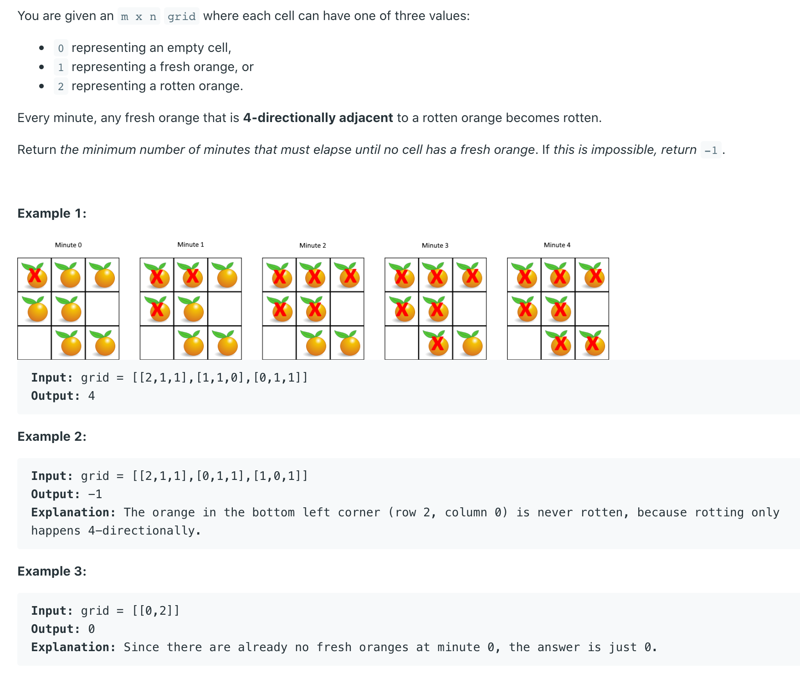

## 994. Rotting Oranges



- At the beginning, we find all rotten oranages, put them in a queue, as the 0th layer's node.
- BFS traversing, every node's adjacent node, may be up, down, left and right. 
  Note: be careful, determine the special case where the node is located on the grid boundary
- Since there many be oranages that cannot be rotten, we need to record the number of fresh oranages
  In BFS, every time an oranage is traversed(an oranage is rotting), the number of fresh oranages is 
  reduced by `1`. If the number has not been reduced to `0` when the BFS is ending, that means 
  there are oranages that cannot be rotten.

```ruby
Time Complexity：O(nm)
即进行一次广度优先搜索的时间，其中 n=grid.length, m=grid[0].length

Space Complexity：O(nm)
需要额外的 dis 数组记录每个新鲜橘子被腐烂的最短时间，大小为 O(nm)，且广度优先搜索中队列里存放的状态最多不会超过 nm 个，
最多需要 O(nm) 的空间，所以最后的空间复杂度为 O(nm)。
```


```java

class Solution {
    public int orangesRotting(int[][] grid) {
        // row column
        int m = grid.length;
        int n = grid[0].length;
        Queue<int[]> queue = new LinkedList<>();
        
        //count, represent all fresh oranages
        int count = 0;
        
        
        //traverse 2d array, find out all fresh and rotten oranges
        for (int r = 0; r < m; r++) {
            for (int c = 0; c <n; c++) {
                // count all fresh oranages
                if (grid[r][c] == 1) {
                    count++;
                    //push rotten oranages into queue 
                } else if (grid[r][c] == 2){
                    //store rotten oranages' coordinate 缓存腐烂橘子的坐标
                    queue.add(new int [] {r, c});
                }
            }
        }
        
        //minute, represent the number of minute
        int minute = 0;
        
        //if there are still fresh oranages left, and queue is not emepty
        //until up, down, left, right boundary or we have traversed all rotten oranages         
        while (count > 0 && !queue.isEmpty()) {
            
            // BFS layer + 1
            minute++;
            
            //get the current the number of rotten oranages, since we will update every queue from every laryer
            int size = queue.size();
            
            //traverse current layer's queue 
            for (int i = 0; i < size; i++) {
                //poll a rotten oranage from queue
                int [] orange = queue.poll();
                //recover oranage's coordinate
                int r = orange[0];
                int c = orange[1];
                
                //↑ 上邻点 判断是否边界 并且 上方是否是健康的橘子
                if (r - 1 >= 0 && grid[r - 1][c] == 1) {
                    // 感染它 
                    grid[r - 1][c] = 2;
                    // 好橘子 -1 
                    count--;
                    // 把被感染的橘子放进队列 并缓存
                    queue.add(new int[] {r - 1, c});
                }
                if (r + 1 < m && grid[r + 1][c] == 1) {
                    grid[r + 1][c] = 2;
                    count--;
                    queue.add(new int[]{r + 1, c});
                }            
                if (c - 1 >= 0 && grid[r][c - 1] == 1) {
                    grid[r][c - 1] = 2;
                    count--;
                    queue.add(new int[]{r, c - 1});
                }   
                if (c + 1 < n && grid[r][c + 1] == 1) {
                    grid[r][c + 1] = 2;
                    count--;
                    queue.add(new int[]{r, c + 1});
                }                   
            }
        }
        
        //if there is still fresh oranages, return -1
        //or return minutes
        if (count > 0) {
            return -1;
        }else {
            return minute;
        }
    }
}
```


