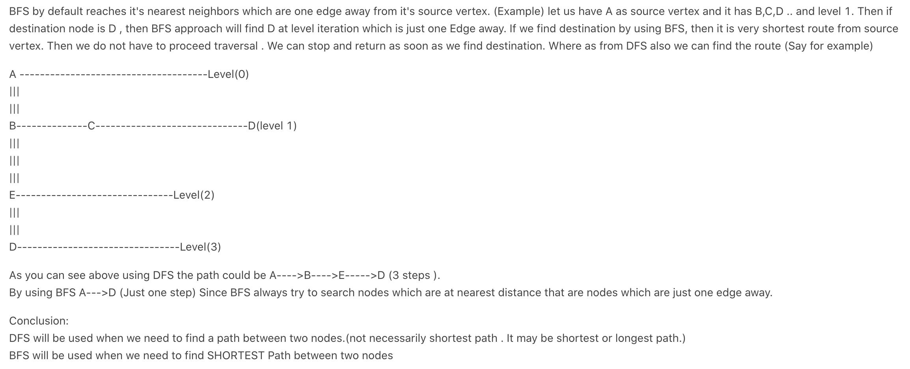

## 1730	Shortest Path to Get Food


- why Can't we apply DFS here?



```java
class Solution {
    int[][] dirs = {{1, 0}, {-1, 0}, {0, 1}, {0, -1}};
    
    public int getFood(char[][] grid) {
        if (grid == null || grid.length == 0) {
            return 0;
        }
        int m = grid.length;
        int n = grid[0].length;
        boolean [][] visited = new boolean[m][n];
        Queue<int[]> q = new LinkedList<>();
        q.offer(findStart(grid));
        int step = 0;
        while (!q.isEmpty()) {
            int len = q.size();
            for (int i = 0; i < len; i++) {
                int[] cell = q.poll();
                int x = cell[0];
                int y = cell[1];
                if (grid[x][y] == '#') {
                    return step;
                }
                for (int [] dir : dirs) {
                    int newX = x + dir[0];
                    int newY = y + dir[1];
                    if (isValid(newX, newY, grid) 
                              && !visited[newX][newY]) {
                        visited[newX][newY] = true;
                        q.offer(new int[]{newX, newY});                        
                    }
                }
            }
            step++;
        }
        return -1;
    }
    
    private int[] findStart(char[][] grid) {
        for (int i = 0; i < grid.length; i++) {
            for (int j = 0; j < grid[0].length; j++) {
                if (grid[i][j] == '*') {
                    return new int[] {i, j};
                }
            }
        }
        throw new RuntimeException();
    }
    
    private boolean isValid(int x, int y, char[][]grid){
        return (x >= 0 && x < grid.length && y >= 0 && 
              y < grid[0].length && grid[x][y] != 'X'); 
    }
}
```