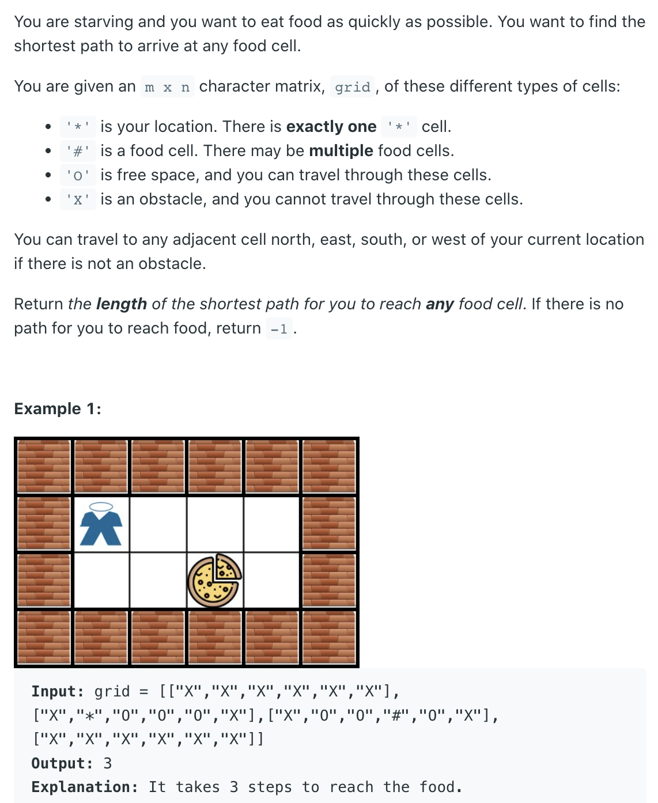
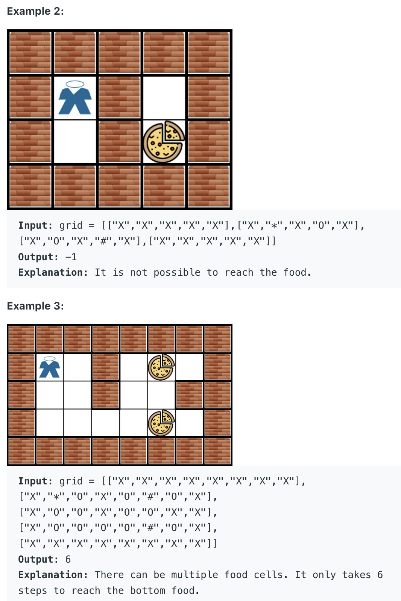

## 1730	Shortest Path to Get Food





- why Can't we apply DFS here?
  - BFS by default reaches it's nearest neighbors which are one edge away from it's 
    source vertex. (Example) let us have A as source vertex and it has B,C,D .. and 
    level 1. Then if destination node is D , then BFS approach will find D at level 
    iteration which is just one Edge away. If we find destination by using BFS, then 
    it is very shortest route from source vertex. Then we do not have to proceed 
    traversal . We can stop and return as soon as we find destination. Where as from 
    DFS also we can find the route (Say for example)
```ruby
A -------------------------------------Level(0)
|||
|||
B--------------C------------------------------D(level 1)
|||
|||
|||
E-------------------------------Level(2)
|||
|||
D--------------------------------Level(3)
```
- As you can see above using DFS the path could be 
  A---->B---->E----->D (3 steps ). By using BFS A--->D (Just one step) Since BFS 
  always try to search nodes which are at nearest distance that are nodes which are 
  just one edge away.

- Conclusion:
  - DFS will be used when we need to find a path between two nodes.(not necessarily
    shortest path . It may be shortest or longest path.)
    BFS will be used when we need to find SHORTEST Path between two nodes

```java
class Solution {
    int[][] dirs = {{1, 0}, {-1, 0}, {0, 1}, {0, -1}};
    
    public int getFood(char[][] grid) {
        if (grid == null || grid.length == 0) {
            return 0;
        }
        int m = grid.length;
        int n = grid[0].length;
        boolean [][] visited = new boolean[m][n];
        Queue<int[]> q = new LinkedList<>();
        q.offer(findStart(grid));
        int step = 0;
        while (!q.isEmpty()) {
            int len = q.size();
            for (int i = 0; i < len; i++) {
                int[] cell = q.poll();
                int x = cell[0];
                int y = cell[1];
                if (grid[x][y] == '#') {
                    return step;
                }
                for (int [] dir : dirs) {
                    int newX = x + dir[0];
                    int newY = y + dir[1];
                    if (isValid(newX, newY, grid) 
                              && !visited[newX][newY]) {
                        visited[newX][newY] = true;
                        q.offer(new int[]{newX, newY});                        
                    }
                }
            }
            step++;
        }
        return -1;
    }
    
    private int[] findStart(char[][] grid) {
        for (int i = 0; i < grid.length; i++) {
            for (int j = 0; j < grid[0].length; j++) {
                if (grid[i][j] == '*') {
                    return new int[] {i, j};
                }
            }
        }
        throw new RuntimeException();
    }
    
    private boolean isValid(int x, int y, char[][]grid){
        return (x >= 0 && x < grid.length && y >= 0 && 
              y < grid[0].length && grid[x][y] != 'X'); 
    }
}
```