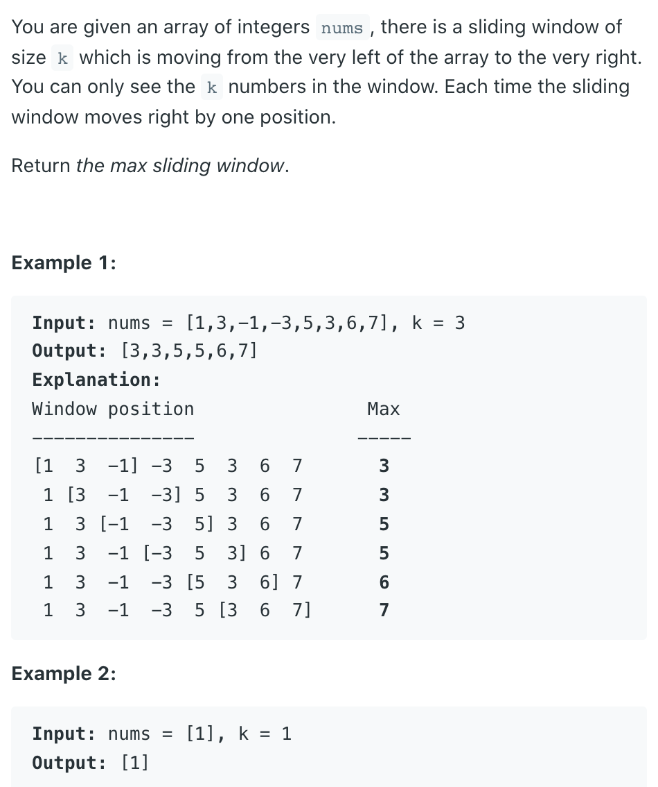
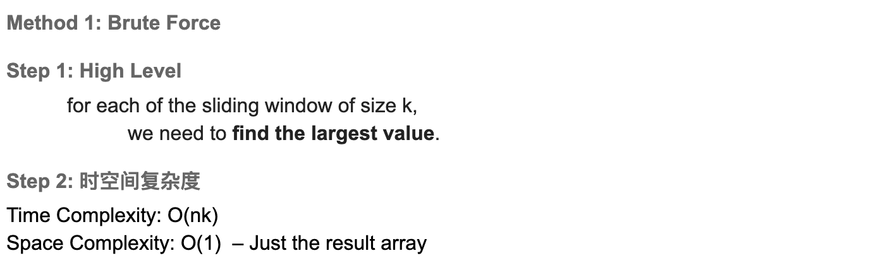
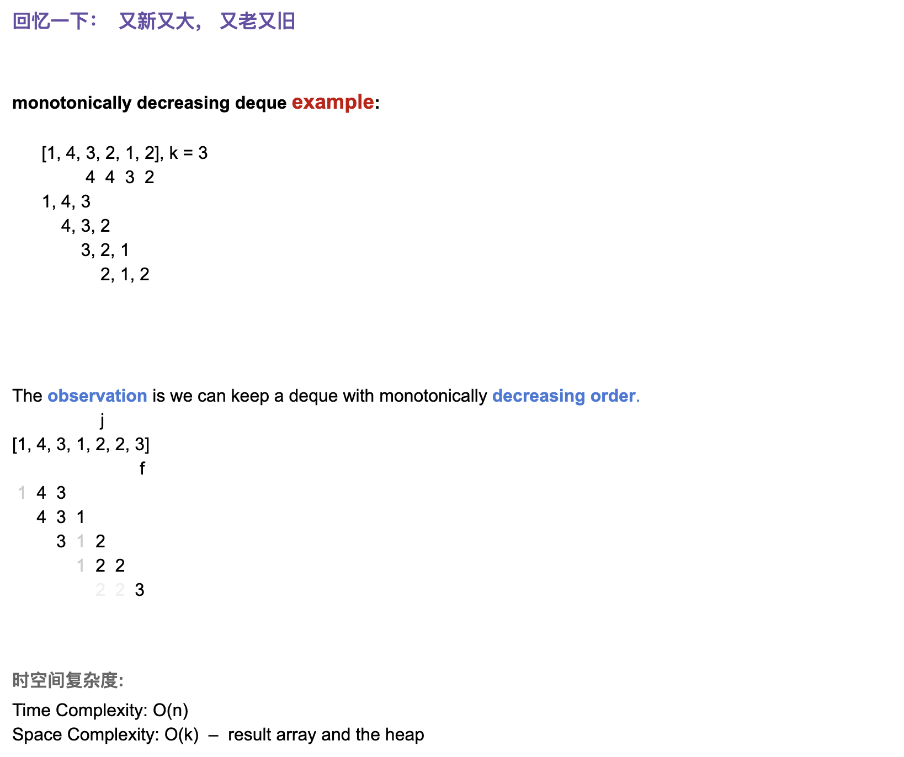

## 239. Sliding Window Maximum



### Brute Force


```java
class _239_SlidingWindowMaximum {
    public static int[] maxSlidingWindow_BruteForce(int[] nums, int k) {
        if (nums == null || nums.length == 0 || k == 0) return new int[0];

        List<Integer> res = new ArrayList<>();
        for (int i = k - 1; i < nums.length; i++) {
            int curMax = nums[i];
            for (int j = 0; j < k; j++) {
                curMax = Math.max(curMax, nums[i - j]);
            }
            res.add(curMax);
        }
        return res.stream().mapToInt(i -> i).toArray();
    }
}
```


---
- [YoutTuBe 1:47:10]()
- [neetcode video](https://youtu.be/DfljaUwZsOk?t=148)



```java
/*
k = 3
          0  1   2   3  4  5  6  7
         [1, 3, -1, -3, 5, 3, 6, 7]
    DQ:   0
    DQ:      1  
    DQ:      1   2                          List[3, ]  
    DQ:      1   2   3                      List[3, 3]  
    DQ:                                     List[3, 3]   # poll() <== 1, 2, 3  
    DQ:                 4                   List[3, 3, 5]     
    DQ:                 4  5                List[3, 3, 5, 5]     
    DQ:                       6             List[3, 3, 5, 5]  # poll() <== 4, 5   
    DQ:                       6             List[3, 3, 5, 5, 6]     
    DQ:                          7           List[3, 3, 5, 5, 6, 7]     


 */
class _239_SlidingWindowMaximum {
    public static int[] maxSlidingWindow(int[] nums, int k) {
        if (nums == null || nums.length == 0 || k == 0) return new int[0];

        List<Integer> res = new ArrayList<>();
        Deque<Integer> dq = new ArrayDeque<>();
        for (int i = 0; i < nums.length; i++) {
            while (!dq.isEmpty() && nums[dq.peekLast()] <= nums[i]) {
                dq.pollLast();
            }
            while (!dq.isEmpty() && dq.peekFirst() <= i - k) {
                dq.pollFirst();
            }

            dq.offerLast(i);

            if (i + 1 >= k) {
                res.add(nums[dq.peekFirst()]);
            }
        }
        return res.stream().mapToInt(Integer::intValue).toArray();
    }
}
```

---


