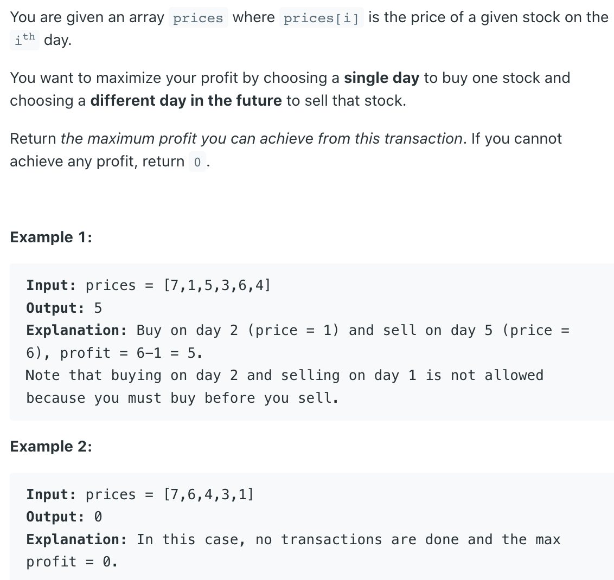

## 121. Best Time to Buy and Sell Stock


- The question is saying us to find the best day to buy and sell stock, 
  so we will get maiximum profit.

- Some body might think that we can find min and max number from the array 
  so that we can get the max profit. But here is one catch

```ruby
For Example:
prices=[3,4,1,6]
min=1
max=6
profit=max-min=5 which is correct 
in this Example:
prices = [7,6,4,3,1]
min = 1 price at day 6
max = 7 price at day 1
```

- `max_profit = 7-1 = 6` u can think like this but you can buy the stock at `day 6` 
  and sell it at `day 1`.
  - So what is the best way to  find the max profit lets see:

- let use initialize `Left` and `Right` pointer to 
  `first and second position of array` Here `Left is to buy stock` 
  and `Right is to sell stock`
  - Then we initialize our `max_profit as 0`
  - Now we will start our `while loop` and we will run till 
    our `Right` pointer `less then length of array`, For Example:

```ruby
prices=[7,1,5,3,6,4]
Note:
    prices[left] --> buy stock
    prices[right] --> sell stock

now we will check price at right and left pointer
step 1:
price[left]=7 price[right]=1 profit=-6
here price[left] is greater than price[right] 
# so we will move left pointer to the right position 
# and increment our right pointer by 1. 
# We always want our left point to be minimum
step 2:
price[left]=1 price[right]=5 profit=4
# here price[left] is less than price[right] 
# which means we will get profit 
# so we will update our max_profit and move our right pointer alone
step 3:
price[left]=1 price[right]=3 profit=2
# here price[left] is less than price[right] which means 
# we will get profit so we will check our max_profit previously it was 4 
# now our current profit is 2 so we will check which is maximum 
# and update our max_profit and move our right pointer alone
step 4:
price[left]=1 price[right]=6 profit=5
# here price[left] is less than price[right] which means 
# we will get profit so we will check our max_profit previously it was 4 
# now our current profit is 5 so we will check which is maximum 
# and update our max_profit and move our right pointer alone
step 5:
price[left]=1 price[right]=4 profit=3
same logic as above

	Big O :
n--> length of array
Time Complexity: O(n)
Space Complexity: O(1)
```

---

```java
class Solution {
    public int maxProfit(int[] prices) {
        if (prices == null || prices.length == 0) {
            return 0;
        }
        int left = 0; // buy 
        int right = 1; // sell
        int maxProfit = 0;
        while (right < prices.length) {
            if (prices[left] < prices[right]) {
                int profit = prices[right] - prices[left];
                // our current profit
                maxProfit = Math.max(maxProfit, profit);
            } else {
                left = right;
            }
            right++;
        }
        return maxProfit;
    }
}
```