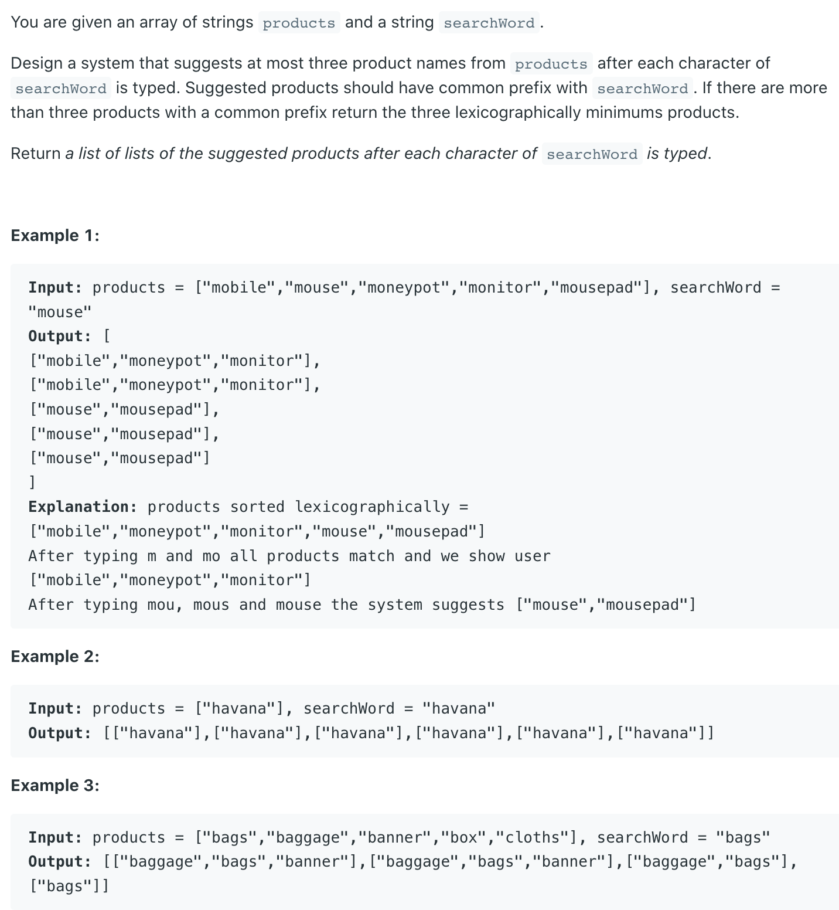
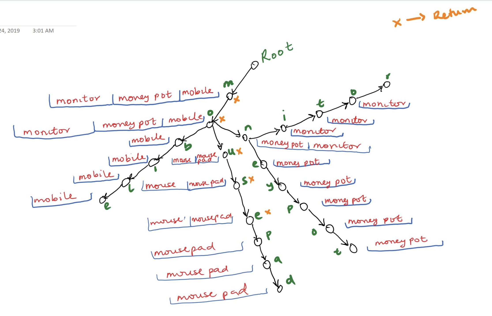

## 1268. Search Suggestions System



---



```java
class Solution {
    static class Trie {
        Trie[] children = new Trie[26];
        LinkedList<String> suggestion = new LinkedList<>();
    }

    public static List<List<String>> suggestedProducts(String[] products, String searchWord) {
        Trie root = new Trie();
        Arrays.sort(products);
        for (String product : products) { // build Trie.
            insert(product, root); // insert a product into Trie.
        }
        return search(searchWord, root);
    }

    private static void insert(String product, Trie root) {
        Trie cur = root;
        for (char c : product.toCharArray()) { // insert current product into Trie.
            if (cur.children[c - 'a'] == null) {
                cur.children[c - 'a'] = new Trie();
            }
            cur = cur.children[c - 'a'];
            if (cur.suggestion.size() < 3) {// maintain 3 lexicographically minimum strings.
                cur.suggestion.add(product); 
                // put products with same prefix into suggestion list.
            }
        }
    }

    private static List<List<String>> search(String searchWord, Trie root) {
        Trie cur = root;
        List<List<String>> ans = new ArrayList<>();
        for (char c : searchWord.toCharArray()) { // search product.
            if (cur != null) {// if there exist products with current prefix.
                cur = cur.children[c - 'a'];
            }
            ans.add(cur == null ? new ArrayList<>() : cur.suggestion);
            // add it if there exist products with current prefix.
        }
        return ans;
    }

    public static void main(String[] args) {
        String [] products = new String[]{"mobile","mouse","moneypot","monitor","mousepad"};
        String searchWord = "mouse";
        List<List<String>> res = suggestedProducts(products, searchWord);
        for (List<String> list : res) {
            System.out.println(list);
        }
    }
}
```