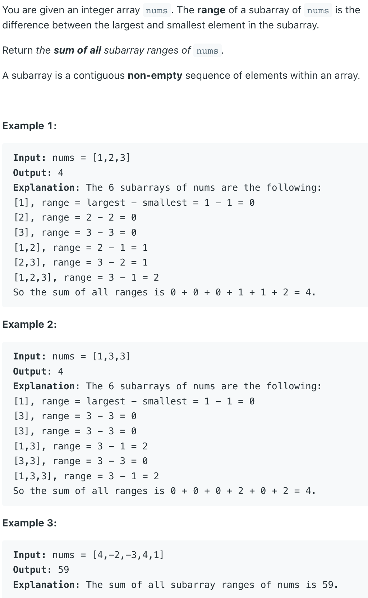

## 2104. Sum of Subarray Ranges



```java
class Solution {
    public long subArrayRanges(int[] nums) {
        if (nums == null || nums.length == 0) {
            return 0;
        }
        
        long res = 0;
        for (int i = 0; i < nums.length; i++) {
            int max = nums[i], min = nums[i];
            for (int j = i; j < nums.length; j++) {
                max = Math.max(max, nums[j]);
                min = Math.min(min, nums[j]);
                res += (max - min);
            }
        }
        return res;
    }
}
```