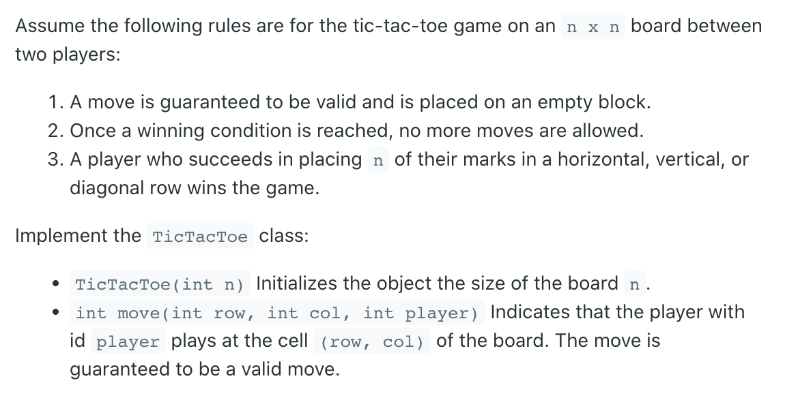

## 348. Design Tic-Tac-Toe



```ruby
Input
["TicTacToe", "move", "move", "move", "move", "move", "move", "move"]
[[3], 
    [0, 0, 1], [0, 2, 2], [2, 2, 1], 
    [1, 1, 2], [2, 0, 1], [1, 0, 2], [2, 1, 1]]
Output
[null, 0, 0, 0, 0, 0, 0, 1]

Explanation
TicTacToe ticTacToe = new TicTacToe(3);
Assume that player 1 is "X" and player 2 is "O" in the board.
ticTacToe.move(0, 0, 1); // return 0 (no one wins)
|X| | |
| | | |    // Player 1 makes a move at (0, 0).
| | | |

ticTacToe.move(0, 2, 2); // return 0 (no one wins)
|X| |O|
| | | |    // Player 2 makes a move at (0, 2).
| | | |

ticTacToe.move(2, 2, 1); // return 0 (no one wins)
|X| |O|
| | | |    // Player 1 makes a move at (2, 2).
| | |X|

ticTacToe.move(1, 1, 2); // return 0 (no one wins)
|X| |O|
| |O| |    // Player 2 makes a move at (1, 1).
| | |X|

ticTacToe.move(2, 0, 1); // return 0 (no one wins)
|X| |O|
| |O| |    // Player 1 makes a move at (2, 0).
|X| |X|

ticTacToe.move(1, 0, 2); // return 0 (no one wins)
|X| |O|
|O|O| |    // Player 2 makes a move at (1, 0).
|X| |X|

ticTacToe.move(2, 1, 1); // return 1 (player 1 wins)
|X| |O|
|O|O| |    // Player 1 makes a move at (2, 1).
|X|X|X|
```

- The key observation is that in order to win Tic-Tac-Toe you must have the 
  entire row or column. Thus, we don't need to keep track of an entire n^2 board. We 
  only need to keep a count for each row and column. If at any time a row or column 
  matches the size of the board then that player has won.

- To keep track of which player, I add `1` for Player1 and `-1` for Player2. There 
  are two additional variables to keep track of the count of the diagonals. Each time 
  a player places a piece we just need to check the count of that row, column, 
  diagonal and anti-diagonal.

```java
class TicTacToe {
    int n;
    int [] rows;
    int [] cols;
    int diagonal;
    int antiDiagonal;   

    public TicTacToe(int n) {
        this.n = n;
        rows = new int[n];
        cols = new int[n];
    }
    
    public int move(int row, int col, int player) {
        int playerId = player == 1 ? 1 : -1;
        if (row == col) {
            diagonal += playerId;
            if (diagonal == n || diagonal == -n) {
                return player;
            }            
        }
        if (row + col + 1 == n) {
            antiDiagonal += playerId;
            if (antiDiagonal == n || antiDiagonal == -n){
                return player;
            }
        }
        
        
        rows[row] += playerId;
        cols[col] += playerId;
        if (rows[row] == n || rows[row] == -n ||
                    cols[col] == n || cols[col] == -n) {
            return player;
        }
        
        return 0;
    }
}

/**
 * Your TicTacToe object will be instantiated and called as such:
 * TicTacToe obj = new TicTacToe(n);
 * int param_1 = obj.move(row,col,player);
 */
```