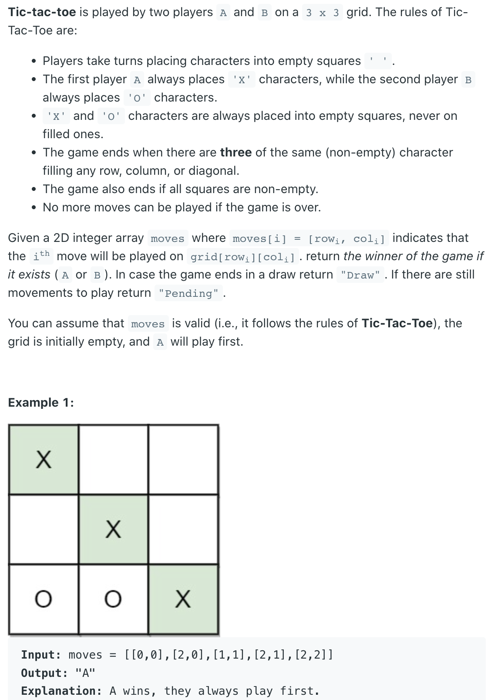
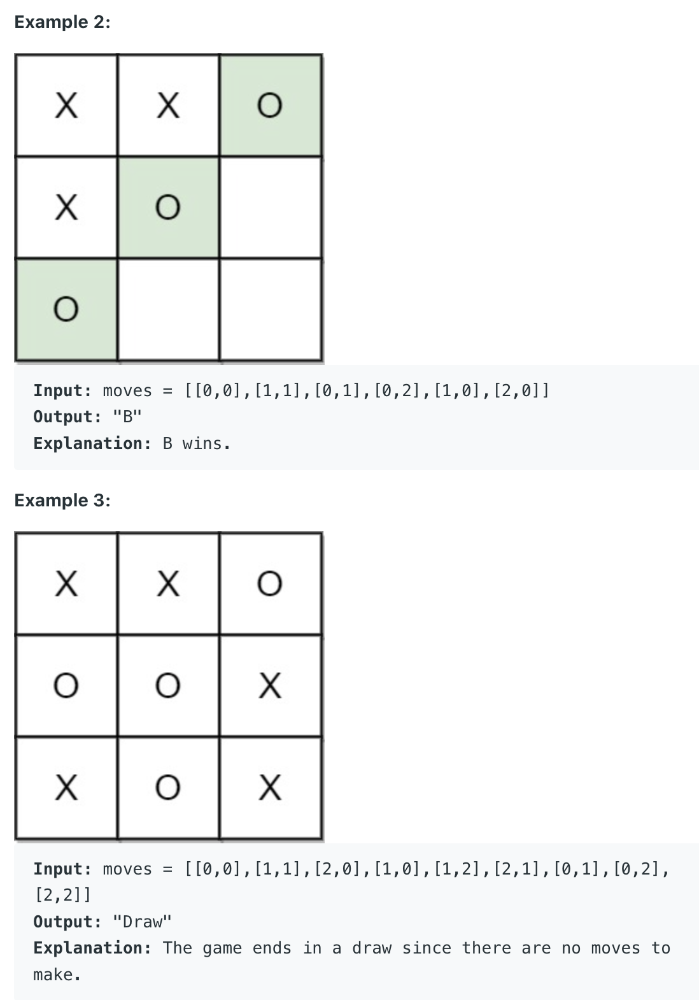

## 1275. Find Winner on a Tic Tac Toe Game





```java
/**
 * Space Optimized solution. Here the score of each row, column 
 * and diagonal is stored in an int. 
 * For Player1 add 1 and for Player2 add -1.
 *
 * Time Complexity: O(M) or O(N^2) or O(1)
 *
 * Space Complexity: O(N) = O(1)
 *
 *  M = Number of Moves. 
 *  N = Board Size (3 -> Number of Rows or Number of Columns)
 */
class Solution {
    public String tictactoe(int[][] moves) {
        int n = 3;
        int diagonal = 0;
        int antiDiagonal = 0;
        int [] rows = new int[n];
        int [] cols = new int[n];
        
        for (int i = 0; i < moves.length; i++) {
            int row = moves[i][0];
            int col = moves[i][1];
            int playerId = i % 2 == 0 ? 1 : -1;
            if (row == col) {
                diagonal += playerId;
            }
            
            if (row + col + 1 == n) {
                antiDiagonal += playerId;
            }
            rows[row] += playerId;
            cols[col] += playerId;
            
            if (Math.abs(diagonal) ==n || Math.abs(antiDiagonal) ==n 
            ||Math.abs(rows[row]) == n || Math.abs(cols[col]) == n){
                return playerId == 1 ? "A" : "B";
            }
        }
        return moves.length == 9 ? "Draw" : "Pending";
    }
}
```